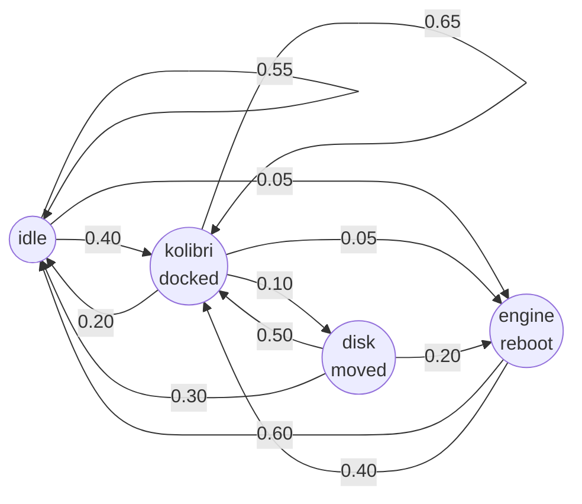

# Design: Markov-Model Duration Tests

**Status:** Proposed  
**Author:** Axle  
**Date:** 2026-04-11  

---

## Problem

Unit and integration tests prove isolated behaviours at a point in time. They don't catch emergent failures that only appear after sustained real-world use: stores diverging under repeated resync, instances ending up in incorrect states after a sequence of dock-undock-reboot events, or CRDT conflicts accumulating over a day of school activity.

A real school day involves ~6–8 hours of unpredictable events across 2–4 engines:
- Engines rebooting (power cut, deliberate restart)
- App Disks being docked and undocked by teachers or students
- Disks moving between engines
- Apps running, being stopped, running again

We need tests that model this over time and verify that the system remains consistent throughout.

---

## Approach: Markov-Model Duration Tests

### Core idea

A **Markov chain** defines the system's possible states and the probabilistic transitions between them. Each transition triggers one or more Engine/fleet actions. After each transition settles, the test system verifies that the logical state of all engines matches expected invariants, and that all Automerge stores have converged.

The Markov model is loaded from a **YAML file** (the "scenario file"), making it easy to define different school-day profiles without modifying test code.

---

## State diagram

The diagram below shows the states and transitions for the default `school-day` scenario.
Numbers on arrows are transition probabilities (weights normalised to 1.0).
Self-loops model dwell time — the system often stays in the same state across ticks.



---

## Architecture

### 1. Scenario file (YAML)

```yaml
# scenarios/school-day.yaml
name: Typical school day
duration_minutes: 480   # 8 hours simulated; real time ~minutes via time compression
seed: 42                # optional RNG seed for reproducibility

states:
  idle:
    description: All engines up, no disks docked
    transitions:
      - to: kolibri_docked
        weight: 40
      - to: engine_reboot
        weight: 5
      - to: idle
        weight: 55

  kolibri_docked:
    description: Kolibri disk docked on primary engine
    transitions:
      - to: idle
        weight: 20
      - to: disk_moved
        weight: 10
      - to: kolibri_docked
        weight: 65
      - to: engine_reboot
        weight: 5

  disk_moved:
    description: Disk physically moved to a different engine
    transitions:
      - to: kolibri_docked
        weight: 50
      - to: idle
        weight: 30
      - to: engine_reboot
        weight: 20

  engine_reboot:
    description: One engine reboots
    transitions:
      - to: idle
        weight: 60
      - to: kolibri_docked
        weight: 40

initial_state: idle
```

**Weights** are relative probabilities — the runner normalises them. States map to **actions** (below) and **invariants** that must hold after settling.

---

### 2. State actions

Each state entry carries implicit or explicit actions. The runner calls them when entering the state:

| State | Action |
|-------|--------|
| `idle` | Undock all disks; verify all instances Undocked |
| `kolibri_docked` | Dock a fixture disk on a chosen engine |
| `disk_moved` | Undock from current engine; re-dock on a different engine |
| `engine_reboot` | SSH `sudo reboot` (or `sudo pm2 restart engine` for fast mode) on a chosen engine |

Actions are implemented in TypeScript as async functions in `test/duration/actions.ts`. The YAML references action names; the runner resolves them.

---

### 3. Invariant verification

After each transition, the runner waits for the system to **settle** (CRDT convergence) and then verifies a set of invariants. Invariants are defined per-state in the scenario file or globally.

**Global invariants** (checked after every transition):

- **Store convergence:** all fleet engines' `instanceDB`, `diskDB`, and `engineDB` are identical (bitwise CRDT equivalence)
- **No phantom docks:** no disk shows `dockedTo` pointing to an engine that no longer has the sentinel
- **No zombie instances:** no instance shows `Running` on a disk that is `Undocked`
- **Engine liveness:** all engines that haven't been rebooted respond on their WS within timeout

**State-specific invariants:**

```yaml
kolibri_docked:
  invariants:
    - type: instance_status
      instance: kolibri-main
      expected: Running
    - type: disk_docked
      disk: test-app-disk
      engine: any
```

---

### 4. CRDT convergence check

After every transition, before invariant verification, the runner calls:

```ts
await waitForConvergence(fleetStores, timeoutMs)
```

`waitForConvergence` polls all store handles until:
- All stores' serialised `instanceDB` + `diskDB` are equal, OR
- Timeout exceeded (logged as a convergence failure, not a hard error)

This is the primary test for Automerge's eventual consistency guarantee.

---

### 5. Test runner

```
pnpm test:duration [--scenario school-day] [--iterations 200] [--fast]
```

- `--scenario`: loads `scenarios/<name>.yaml`
- `--iterations`: number of transitions before stopping (default: from YAML duration × avg dwell time)
- `--fast`: uses `pm2 restart` instead of actual reboot; compresses dwell times to seconds

The runner:
1. Parses YAML scenario
2. Connects to all fleet engines via `localStoreHandle` + WS (same as cross-engine tests)
3. Walks the Markov chain, executing actions and checking invariants
4. Writes a structured log of every transition, action result, invariant check, and convergence measurement
5. On failure: logs the exact state, store snapshots from all engines, and the failing invariant

---

### 6. Output

```
[14:02:31] TRANSITION #47: kolibri_docked → disk_moved (p=0.10)
[14:02:31] ACTION: undock sdz1 from wizardly-hugle, dock on idea03
[14:02:34] CONVERGENCE: 4 engines converged in 2.8s ✓
[14:02:34] INVARIANT: disk test-app-disk docked on any engine ✓
[14:02:34] INVARIANT: instance kolibri-main Running ✓
[14:02:34] INVARIANT: stores equal ✓

[14:02:41] TRANSITION #48: disk_moved → engine_reboot (p=0.20)
[14:02:41] ACTION: reboot idea02
[14:02:55] CONVERGENCE: 4 engines converged in 12.1s ✓
[14:02:55] INVARIANT: engine idea02 online ✓
[14:02:55] INVARIANT: stores equal ✓
```

Summary at end:

```
Duration test complete: 200 transitions in 38 minutes
Convergence failures: 0
Invariant failures: 0
Mean convergence time: 2.4s
Max convergence time: 14.1s (after engine_reboot)
```

---

### 7. Stability monitoring (between transitions)

During the dwell time between transitions, a background probe runs every 30s:
- Pings all engine WS connections
- Checks that `Running` instances have their containers actually running (`docker ps`)
- Checks that no unexpected status transitions occurred

Probes are logged but don't fail the test unless they exceed a threshold (e.g. 3 consecutive failures).

---

## File layout

```
test/
  duration/
    runner.ts           ← Markov walker + action dispatcher + invariant checker
    actions.ts          ← dock, undock, reboot, etc.
    convergence.ts      ← waitForConvergence + store equality checks
    invariants.ts       ← invariant type registry + evaluation
    scenarios/
      school-day.yaml   ← default school-day scenario
      stress.yaml       ← high-churn scenario (many reboots + disk moves)
      minimal.yaml      ← 2-engine, minimal state space for CI
```

---

## Scenarios to ship

| Scenario | Description | States | Duration |
|----------|-------------|--------|----------|
| `school-day` | Typical day, Kolibri + Nextcloud, 3 engines | 8 | 8h simulated |
| `stress` | High reboot rate, fast disk swaps | 6 | 2h simulated |
| `minimal` | 2 engines, 3 states, for CI gate | 3 | 10 min |

---

## Implementation phases

**Phase 1:** Runner + YAML loader + basic dock/undock/restart actions + convergence check  
**Phase 2:** Invariant registry + state-specific invariants + structured log output  
**Phase 3:** Stability monitoring between transitions + multiple scenario files  
**Phase 4:** Stress scenario + CI integration for `minimal`

---

## Open questions

1. **Time compression ratio**: should transitions have real dwell times (minutes) or compressed (seconds)? Compressed is faster but may miss timing-related bugs. Suggest: `--fast` for development, real times for weekly runs.

2. **Multi-disk scenarios**: should the Markov model support multiple disks in flight simultaneously? Increases realism but complicates state tracking. Phase 2.

3. **Engine-aware state**: should the model track which engine a disk is on, or treat "kolibri docked somewhere" as a single state? Single-state is simpler; engine-aware is more realistic. Start with single-state.
