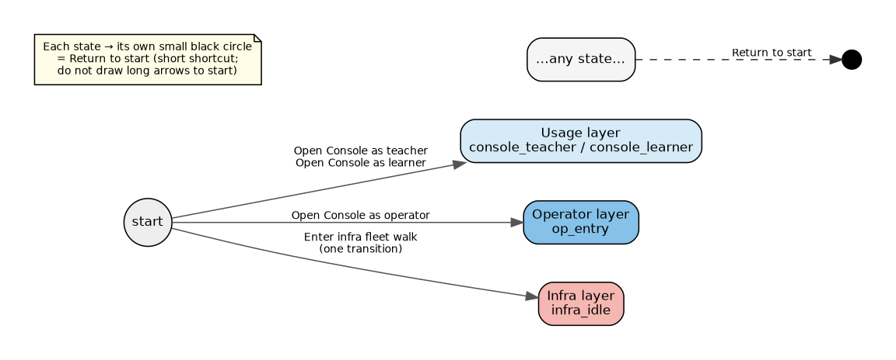
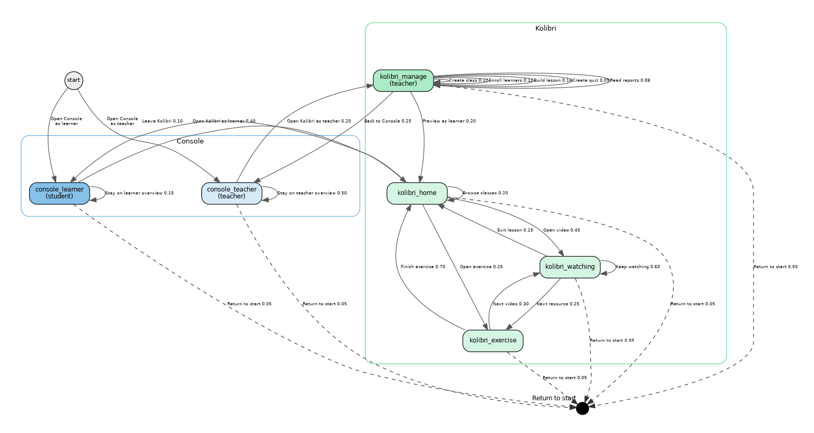
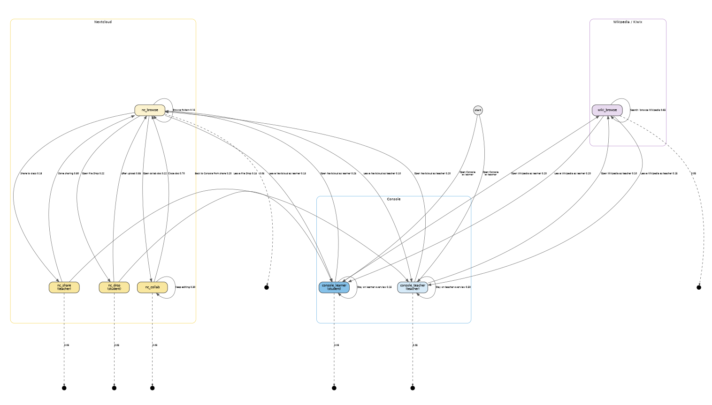
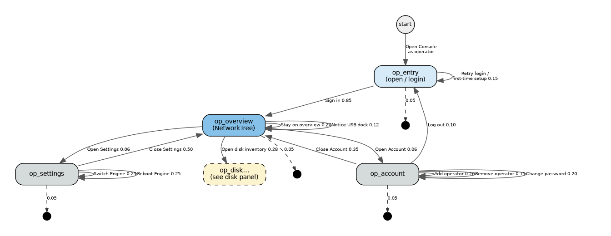
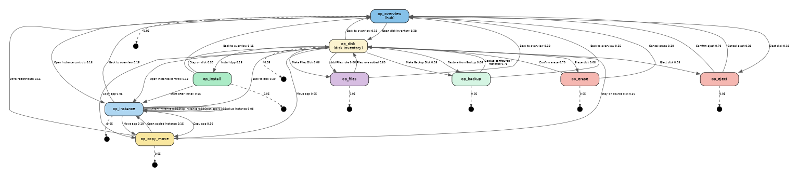
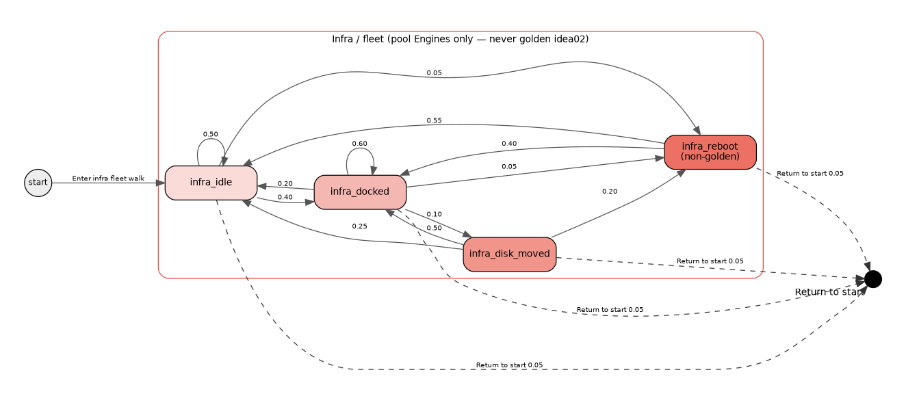

# Proposal: Duration Tests (unified Markov)

**Status:** Proposed — unified source of truth (absorbs classroom usage + operator Console + infra/fleet execution)  
**Authors:** Axle (infra/runner foundation); Steve (Lead Bot) (usage + operator Markov); unified 2026-09-30 per Koen + Steve agreement  
**Revision:** 2026-10-01b — Koen: drop 2-Pi product mode; `--scenario` = `random` | deterministic walk name (not alternate Markov graphs)  
**Audience:** Koen / IDEA leads  
**Companion capacity issue:** [idea#159](https://github.com/koenswings/idea/issues/159) — measure safe concurrent Kolibri video streams per instance  
**Backups (SUPERSEDED, content retained):** [`duration-tests-infra-backup.md`](./duration-tests-infra-backup.md), [`multi-engine-classroom.md`](./multi-engine-classroom.md), [`multi-engine-operator.md`](./multi-engine-operator.md)

---

## Purpose

**Duration tests** keep running to ensure **continuous school operation** over long time. Unit and integration tests prove isolated behaviours at a point in time; they do not catch emergent failures that only appear after sustained real-world use: stores diverging under repeated resync, instances in incorrect states after dock–undock–reboot sequences, CRDT conflicts accumulating over a day of school activity, or classroom/operator flows that only break after many hours.

A real school day involves ~6–8 hours of unpredictable events across 1–N Engines: teachers and learners using apps, operators managing disks/instances, and infra events (dock, move, reboot) with Automerge invariants checked throughout.

This proposal is the **single canonical** Markov model and execution design for those continuous tests. Prior separate drafts are backups only.

---

## Conceptual model (Koen + Steve agreed)

### One unified graph / one runner — three layers

| Layer | What it covers | Entry from `start` |
|---|---|---|
| **Usage** | Classroom teacher / learner + apps (Kolibri, Nextcloud, Wikipedia/Kiwix) | Open Console as teacher / learner |
| **Operator** | Console manage/alter (dock/eject, install, start/stop, copy/move, backup/erase, operators, settings) | Open Console as operator → `op_entry` |
| **Infra / fleet** | Dock, move, reboot + Automerge invariants (YAML actions / runner) | **One** transition from `start` into the infra subgraph root (`infra_idle`) |

Layers share one Markov walker and one Intent-style action naming convention. Usage and operator keep H2 state sections, actions unique to the departing state, and a UI Interactions chapter. The overall Markov graph is modeled as **YAML for all layers** (usage, operator, infra). Invariant specs are primarily for infra (optional light checks for usage/operator). Runner / stability / file-layout conclusions live in the **Implementation** chapter.

### Return to start (every state)

**Every** state has a **Return to start** action so one walker can cover all three layer types in a single long run (leave usage → start → enter operator or infra, etc.).

**Graphviz convention:** do **not** draw large arrows from every state back to `start`, and do **not** use one shared black sink for all returns. Each state that returns gets its **own small dedicated filled black circle**, with a **short dashed shortcut arrow** from that state to its circle (edge label ≈`0.05`). Semantically the edge returns the walker to `start`; visually the per-state black circle cuts clutter versus long spokes into a common hub.

Placeholder ≈probability for Return to start on each state: **0.05** (runner renormalises weights). Adjust when field frequencies exist.

### Wiring rules (unchanged from prior drafts)

- **Actions are unique to the state they depart from** — you only take actions listed on the current state.
- **Arrival / entry UI** (login, open app, land on home) belongs on the **outgoing action of the state you leave**, not as content of the destination.
- Action name = edge label = UI Interaction name (Intent-style; no cryptic IDs; no `*` wildcards on the graph).
- A **real test** = a **random walk** for some duration or step count (optionally preceded by a **deterministic cover walk** that hits all / as many graph actions as possible); each action expands into its UI Interaction (usage/operator) or infra action function (fleet).

---

## Shared-store policy

Duration tests (and test/review deploys) must respect how Automerge documents and mDNS discovery interact with fleet isolation:

| Context | Store document | Discovery (mDNS) | Notes |
|---|---|---|---|
| **Single-Pi test / review** | **Unique** doc (isolated `store-url.txt` / own store ID) | **Off** (`IDEA_MDNS_DISABLE` or equivalent) | Avoids contaminating peers; matches isolated Engine behaviour (`AGENTS.md` / idea#120, idea#155) |
| **Multi-Engine test / review** | **Shared** fleet doc | **On** | Exercises peer sync + NetworkTree mesh; Automerge convergence is a first-class invariant |
| **Production (school)** | **Shared** doc | **On** | Vision: Appdockers autofind; integrated catalog |

**Golden `idea02`:** protected from destructive churn. Never reboot, erase, or claim golden for duration-test actions. Infra actions that pick an Engine exclude `role: golden` (today `idea02`). See `docs/PI_FLEET.md`, `idea` fleet scripts, `hw-roundtrip` golden refusal.

Do **not** assume every fleet Pi always shares one live store during single-Pi work — that was a stale assumption in early duration-test drafts.

---

## Vision cite

> All Appdockers on the same LAN will automatically find one another and when a new Appdocker device is added, the catalog of available apps is automatically extended with the apps docked onto the new device.  
> Performance is optimized by adding Appdockers and redistributing the apps over the Appdockers.

**Source:** [`solution-description.md`](./solution-description.md)

## Why multi-engine (Koen's three reasons)

### 1. Distribute apps / load across Engines

The physical act is simple: **add an Engine** and **plug a demanding app into it**.

- Engines **autofind and connect** on the school LAN (vision: Appdockers find one another).
- The **integrated app list** looks the same whether the school has 1 Engine or N Engines.
- Users **never need to know** which Engine serves which app, or which Console they opened — any Console on any Engine can see the full picture.

This is the same physical metaphor as the rest of IDEA: capacity is improved by adding hardware and redistributing disks, not by asking teachers to become sysadmins.

### 2. Scale one app across Engines

Some apps hit a **per-instance / per-Pi limit**. Example: concurrent Kolibri video streams.

When one Kolibri instance cannot safely serve the whole class:

- Start a **second Kolibri instance** on another Engine.
- **Assign students** across instances (class A → instance 1, class B or half the cohort → instance 2).
- Same pattern later for Nextcloud video / heavy media.

Capacity baseline for Kolibri (**[idea#159](https://github.com/koenswings/idea/issues/159)**, idea01 Pi 5 / 4 GB). Multi-quality **planning** streams per instance (LAN measured SAFE ≥128 for all four; planning leaves Wi‑Fi / browser / Pi‑4 headroom):

| Quality | Resolution | Planning streams / instance |
|---|---|---:|
| low | 360p (640×360) | **64** |
| medium | 480p (854×480) | **32** |
| prior / typical lesson | 720p (1280×720) | **32** |
| high | 1080p (1920×1080) | **12** |

Default classroom planning figure remains **32 @ ~720p**; use 64 / 12 when content is known low / high. Load-test tooling: [agent-app-dev#9](https://github.com/koenswings/agent-app-dev/pull/9).

### 3. Per-class Engine with own instances — Console manages everything from anywhere

Each class (or teaching block) can have **its own Engine** hosting **class-only** app instances — e.g. Class 5A Nextcloud, Class 5A Kolibri content — without isolating operators.

**Any Console on any Engine** can manage **all apps across all Engines** simply. Teachers and operators are not trapped on “their” Pi’s Console; the mesh presents one school.

---

## Initial 3-engine setup (concrete sketch)

Design target first: a **named three-Engine school**, then generalise to N.

| Name | Role (story) | Typical disks / instances |
|---|---|---|
| **idea-A** | Shared / school golden hub | Shared apps everyone uses lightly: offline Wikipedia (Kiwix), school-wide Nextcloud “School Files”, maybe a small shared Kolibri channel library. Stable reference Engine. |
| **idea-B** | Class Engine — Grade 5A | Class-only Kolibri (Grade 5A lessons/quizzes), class Nextcloud (Group “Grade 5A”: view-only shares, File Drop, collaborative docs). |
| **idea-C** | Class Engine — Form 3 | Class-only Kolibri (Form 3), class Nextcloud (Group “Form 3”). When Grade 5A video load overflows idea-B, a second Kolibri instance for 5A can also land here (reason 2). |

**Classroom story:** Monde Primary (or any Marco site) starts with one Engine in the room. When video buffering and “limit to one group at a time” become the norm (field troubleshooting already warns about many devices), the school adds **idea-B** and **idea-C** as classroom Engines. Teachers still open any Console; students still join `appnet` and pick apps from one list. Operators dock demanding class disks onto B/C and leave shared services on A.

### Generalising to N

The three-Engine model is the **design target first**. N Engines later means:

- More class Engines (idea-D…), and/or
- More replicas of a hot app (extra Kolibri / Nextcloud instances) assigned by cohort.

Discovery, Console overview, and “users don’t pick an Engine” stay the same rules; only inventory and assignment grow.

---


---

## Unified graph overview

Diagrams are split into panels so Intent labels stay readable. Combined / panel sources:

| Panel | File stem | Content |
|---|---|---|
| Hub | `duration-tests-hub` | `start` → usage / operator / infra roots; per-state Return black-circle convention legend |
| Usage A | `duration-tests-usage-kolibri` | Console + Kolibri (+ per-state Return shortcuts) |
| Usage B | `duration-tests-usage-files` | Console + Nextcloud + Wikipedia (+ per-state Return shortcuts) |
| Operator A | `duration-tests-operator-hub` | Auth, school hub, Account, Settings (+ per-state Return) |
| Operator B | `duration-tests-operator-disk` | Disk inventory and deep actions (+ per-state Return) |
| Infra | `duration-tests-infra` | Fleet dock / move / reboot subgraph (+ per-state Return) |



---

## Layer: Usage (classroom)

Classroom learner/teacher **usage** of Kolibri / Nextcloud / Wikipedia. Operator manage/alter is the next layer — not mixed into usage states.

### Idea

- **States** = usage places (what a person is doing in an app or Console), not disk-dock hardware states alone.
- **Actions** = labeled transitions with probabilities (initial guesses until field frequencies exist).
- Test instances ship with **preloaded content**; legal actions derive from that content.
- Incorporate Marco’s file-sharing and Kolibri classroom management, plus content-access for Kolibri, Nextcloud, and offline Wikipedia (Kiwix on idea-A).

### States

| State | Who | Colour | Meaning |
|---|---|---|---|
| `console_teacher` | Teacher | blue | School-wide Engine/app overview; opens apps as coach |
| `console_learner` | Student | mid-blue | Same unified app list; student opens an app to work |
| `kolibri_home` | Student or teacher | green | Kolibri signed in, Learn |
| `kolibri_watching` | Student | green | Playing an assigned lesson video |
| `kolibri_exercise` | Student | green | Doing an exercise in a lesson |
| `kolibri_manage` | Teacher | green (dark) | Classes, lessons, quizzes, Reports |
| `nc_browse` | Student or teacher | yellow | Nextcloud Files browse |
| `nc_share` | Teacher | yellow (dark) | View-only share to a class group |
| `nc_drop` | Student | yellow (dark) | Uploading to a File Drop |
| `nc_collab` | Student | yellow (dark) | Editing a shared collaborative doc |
| `wiki_browse` | Student or teacher | purple | Kiwix / offline Wikipedia on idea-A |

### Graphs

**Diagram A — Console + Kolibri** ([`duration-tests-usage-kolibri.dot`](./duration-tests-usage-kolibri.dot)):



**Diagram B — Console + Nextcloud + Wikipedia** ([`duration-tests-usage-files.dot`](./duration-tests-usage-files.dot)):




## State: `console_teacher`

The teacher is on the **Engine / apps overview**: Engines present, apps docked, status. They are inspecting what is available on the network, not choosing a “home” Pi. **Operator-specific Console actions** (dock/eject disks, start/stop instances, install/move/backup/erase, operators/settings) are **not** on this usage graph — see [Layer: Operator](#layer-operator-console).

**While here:** scan the integrated app list (Running, etc.) and Engine rows; optionally refresh / wait while students work.

**Actions from this state:**

| Action | ≈p | Destination | UI Interaction |
|---|---:|---|---|
| **Open Kolibri as teacher** | 0.20 | `kolibri_manage` | [Open Kolibri as teacher](#open-kolibri-as-teacher) |
| **Open Nextcloud as teacher** | 0.20 | `nc_browse` | [Open Nextcloud as teacher](#open-nextcloud-as-teacher) |
| **Open Wikipedia as teacher** | 0.10 | `wiki_browse` | [Open Wikipedia as teacher](#open-wikipedia-as-teacher) |
| **Stay on teacher overview** | 0.50 | `console_teacher` | [Stay on teacher overview](#stay-on-teacher-overview) |
| **Return to start** | 0.05 | `start` (via dedicated black-circle shortcut) | [Return to start](#return-to-start) |

---

## State: `console_learner`

A student is on Console with the **same unified app list** as teachers (reason 1). They are not managing Engines — just picking Kolibri, Nextcloud, or Wikipedia.

**While here:** see integrated app list (class Kolibri/Nextcloud, Kiwix on idea-A, …); choose an app or dwell.

**Actions from this state:**

| Action | ≈p | Destination | UI Interaction |
|---|---:|---|---|
| **Open Kolibri as learner** | 0.40 | `kolibri_home` | [Open Kolibri as learner](#open-kolibri-as-learner) |
| **Open Nextcloud as learner** | 0.25 | `nc_browse` | [Open Nextcloud as learner](#open-nextcloud-as-learner) |
| **Open Wikipedia as learner** | 0.20 | `wiki_browse` | [Open Wikipedia as learner](#open-wikipedia-as-learner) |
| **Stay on learner overview** | 0.15 | `console_learner` | [Stay on learner overview](#stay-on-learner-overview) |
| **Return to start** | 0.05 | `start` (via dedicated black-circle shortcut) | [Return to start](#return-to-start) |

---

## State: `kolibri_manage`

The teacher is on Kolibri’s **facility / coaching** side (Classes, Lessons, Quizzes, Reports) — not the learner Learn tab. Coaching Intents are **actions inside this state** (self-loops or leave).

**While here:** left sidebar visible; coach classes / lessons / quizzes / reports, or preview Learn / leave to Console.

**Actions from this state:**

| Action | ≈p | Destination | UI Interaction |
|---|---:|---|---|
| **Create class** | 0.12 | `kolibri_manage` | [Create class](#create-class) |
| **Enroll learners** | 0.12 | `kolibri_manage` | [Enroll learners](#enroll-learners) |
| **Build lesson** | 0.14 | `kolibri_manage` | [Build lesson](#build-lesson) |
| **Create quiz** | 0.09 | `kolibri_manage` | [Create quiz](#create-quiz) |
| **Read reports** | 0.08 | `kolibri_manage` | [Read reports](#read-reports) |
| **Preview as learner** | 0.20 | `kolibri_home` | [Preview as learner](#preview-as-learner) |
| **Back to Console** | 0.25 | `console_teacher` | [Back to Console](#back-to-console) |
| **Return to start** | 0.05 | `start` (via dedicated black-circle shortcut) | [Return to start](#return-to-start) |

Composite walks (Teacher prepares Grade 5A lesson, Quiz and reports) chain several of these — see [Composite walks](#composite-walks).

---

## State: `kolibri_home`

A student (or teacher previewing) is on the **learner** side after login — Learn tab, enrolled classes, assigned lessons.

**While here:** browse classes / lessons / quizzes; open a video or exercise; or leave Kolibri.

**Actions from this state:**

| Action | ≈p | Destination | UI Interaction |
|---|---:|---|---|
| **Open video** | 0.45 | `kolibri_watching` | [Open video](#open-video) |
| **Open exercise** | 0.25 | `kolibri_exercise` | [Open exercise](#open-exercise) |
| **Browse classes** | 0.20 | `kolibri_home` | [Browse classes](#browse-classes) |
| **Leave Kolibri** | 0.10 | `console_learner` | [Leave Kolibri](#leave-kolibri) |
| **Return to start** | 0.05 | `start` (via dedicated black-circle shortcut) | [Return to start](#return-to-start) |

---

## State: `kolibri_watching`

Capacity-sensitive state (reason 2 / idea#159). Many concurrent walkers here is what forces a second Kolibri instance. Planning N depends on video quality: **64 @ 360p / 32 @ 480p–720p / 12 @ 1080p** (idea01 Pi 5 / 4 GB).

**While here:** video playing in-browser (no download); student may pause/seek; Kolibri records progress in the background.

**Actions from this state:**

| Action | ≈p | Destination | UI Interaction |
|---|---:|---|---|
| **Keep watching** | 0.60 | `kolibri_watching` | [Keep watching](#keep-watching) |
| **Next resource** | 0.25 | `kolibri_exercise` | [Next resource](#next-resource) |
| **Exit lesson** | 0.15 | `kolibri_home` | [Exit lesson](#exit-lesson) |
| **Return to start** | 0.05 | `start` (via dedicated black-circle shortcut) | [Return to start](#return-to-start) |

---

## State: `kolibri_exercise`

**While here:** exercise questions with immediate feedback; student answers and submits; Kolibri records started / completed / score.

**Actions from this state:**

| Action | ≈p | Destination | UI Interaction |
|---|---:|---|---|
| **Finish exercise** | 0.70 | `kolibri_home` | [Finish exercise](#finish-exercise) |
| **Next video** | 0.30 | `kolibri_watching` | [Next video](#next-video) |
| **Return to start** | 0.05 | `start` (via dedicated black-circle shortcut) | [Return to start](#return-to-start) |

*(Quiz-taking can reuse exercise-like clicks under Learn → Quizzes, or stay under `kolibri_home` until a distinct load profile justifies a `kolibri_quiz` state. See [Composite walks](#composite-walks).)*

---

## State: `nc_browse`

Hub for Marco’s classroom file workflow. **Files** app is the central UI (manual p.12 in Marco’s deck).

**While here:** browse folders (class materials, Drop Zone, school shares); start share / File Drop / collab; or leave to Console.

**Actions from this state:**

| Action | ≈p | Destination | UI Interaction |
|---|---:|---|---|
| **Share to class** | 0.18 | `nc_share` | [Share to class](#share-to-class) |
| **Open File Drop** | 0.22 | `nc_drop` | [Open File Drop](#open-file-drop) |
| **Open collab doc** | 0.22 | `nc_collab` | [Open collab doc](#open-collab-doc) |
| **Browse folders** | 0.15 | `nc_browse` | [Browse folders](#browse-folders) |
| **Leave Nextcloud as learner** | 0.13 | `console_learner` | [Leave Nextcloud as learner](#leave-nextcloud-as-learner) |
| **Leave Nextcloud as teacher** | 0.10 | `console_teacher` | [Leave Nextcloud as teacher](#leave-nextcloud-as-teacher) |
| **Return to start** | 0.05 | `start` (via dedicated black-circle shortcut) | [Return to start](#return-to-start) |

---

## State: `nc_share`

**While here:** Share dialog open on a folder; set internal group share to View only; finish or leave.

**Actions from this state:**

| Action | ≈p | Destination | UI Interaction |
|---|---:|---|---|
| **Done sharing** | 0.80 | `nc_browse` | [Done sharing](#done-sharing) |
| **Back to Console from share** | 0.20 | `console_teacher` | [Back to Console from share](#back-to-console-from-share) |
| **Return to start** | 0.05 | `start` (via dedicated black-circle shortcut) | [Return to start](#return-to-start) |

---

## State: `nc_drop`

**While here:** File Drop / file-request page open; upload file(s); then return to Files or leave to Console.

**Actions from this state:**

| Action | ≈p | Destination | UI Interaction |
|---|---:|---|---|
| **After upload** | 0.85 | `nc_browse` | [After upload](#after-upload) |
| **Leave File Drop** | 0.15 | `console_learner` | [Leave File Drop](#leave-file-drop) |
| **Return to start** | 0.05 | `start` (via dedicated black-circle shortcut) | [Return to start](#return-to-start) |

---

## State: `nc_collab`

**While here:** collaborative editor open on a shared doc; peer avatars / live cursors; edit or close.

**Actions from this state:**

| Action | ≈p | Destination | UI Interaction |
|---|---:|---|---|
| **Close doc** | 0.70 | `nc_browse` | [Close doc](#close-doc) |
| **Keep editing** | 0.30 | `nc_collab` | [Keep editing](#keep-editing) |
| **Return to start** | 0.05 | `start` (via dedicated black-circle shortcut) | [Return to start](#return-to-start) |

---

## State: `wiki_browse`

Shared service on **idea-A** (school golden hub). Light load relative to Kolibri video — still a first-class classroom usage state.

**While here:** Kiwix library / Wikipedia ZIM open; search or browse articles; leave to matching Console.

**Actions from this state:**

| Action | ≈p | Destination | UI Interaction |
|---|---:|---|---|
| **Search / browse Wikipedia** | 0.65 | `wiki_browse` | [Search / browse Wikipedia](#search--browse-wikipedia) |
| **Leave Wikipedia as learner** | 0.20 | `console_learner` | [Leave Wikipedia as learner](#leave-wikipedia-as-learner) |
| **Leave Wikipedia as teacher** | 0.15 | `console_teacher` | [Leave Wikipedia as teacher](#leave-wikipedia-as-teacher) |
| **Return to start** | 0.05 | `start` (via dedicated black-circle shortcut) | [Return to start](#return-to-start) |

---


## Layer: Operator (Console)

Authenticated operator **manage/alter** flows only. Classroom learner/teacher usage stays in the Usage layer.

### Feature inventory (research — do not invent)

Inventoried from local clones `/workspace/agent-console-dev` and `/workspace/agent-engine-dev` (commands, components, docs). Only these land on the graph.

### Console dual mode

| Mode | Who | Login? | UI |
|---|---|---|---|
| User | students, teachers | No | `AppBrowser` — open running apps |
| **Operator** | IT / ops | Yes | `NetworkTree` + disk/instance management |

Sources: `agent-console-dev/README.md`, `docs/ARCHITECTURE.md`, `proposals/console-user-management.md`.

### Auth / operators (shipped)

| Feature | UI | Notes |
|---|---|---|
| First-time setup | `FirstTimeSetup` | When `userDB` empty — create first admin |
| Log in | `LoginForm` / Account 👤 | Username + password (bcrypt in `userDB`) |
| Log out | Account screen | Returns to user mode |
| Add / remove operators | `OperatorManagement` | Via Account → Manage Operators |
| Change password | Account / Settings → Account | Min 8 characters |

### School / multi-Engine overview (shipped)

| Feature | UI | Notes |
|---|---|---|
| Network tree | `NetworkTree` | Engines + docked disks; role badges app / backup / files / empty / upgrade |
| Select Engine / disk | tree selection | Filters `InstanceList` / shows `DiskView` or `EmptyDiskPanel` |
| Engine discovery / connect | `ConnectionManagement` / Settings | Auto-discover hostnames; manual hostname; switch connected Engine |
| Reboot Engine | NetworkTree reboot control | Sends `reboot` |
| Operation progress / cancel | `OperationProgress` | `cancelOperation` |
| History / command log | `HistoryPanel` / `CommandHistory` | Observe traces |

### Disk roles & actions (shipped)

| Disk role | Configure / act | Commands |
|---|---|---|
| **Empty** | Make Files Disk; Make Backup Disk; Install App; Erase | `createFilesDisk`, `createBackupDisk`, `installApp`, `summariseDisk`/`eraseDisk` |
| **App** | Start/Stop/Open instances; Backup; Copy/Move; Add Files; Erase; Eject | `startInstance`, `stopInstance`, `backupApp`, `copyApp`, `moveApp`, `createFilesDisk`, `eraseDisk`, `ejectDisk` |
| **Backup** | Restore panel; (pure backup: no eject) | `restoreApp`; `createBackupDisk` already done |
| **Files** | Share name / availability text; eject rules | `createFilesDisk` (add role); mount into opted-in apps is Engine-side |
| **Upgrade** | Badge only in tree | Upgrade ops appear in `operationDB` when an Upgrade Disk is processed — **no separate Console “Upgrade” button** inventoried |
| **System** | No eject / no erase | Protected |

### Instance actions (shipped — `InstanceRow`)

- **Start** / **Stop** / **Open ↗**
- **Backup** (picker when Backup Disks exist) → `backupApp`
- **Copy** / **Move** (drag-drop desktop; `MobileCopyMoveSheet` on mobile) → `copyApp` / `moveApp`

### Dock / eject (shipped + physical)

| Action | Where | Notes |
|---|---|---|
| **Physical dock** | USB plug into Engine | Disk appears in shared store / NetworkTree — **not a Console click** |
| **Eject** | NetworkTree / disk → `EjectConfirm` | `ejectDisk <diskId>` — stops instances, unmounts; then operator unplugs |
| Undock (store) | Result of eject / physical removal | No separate “Undock” button beyond Eject |

### Explicitly **not** Console UI today (flagged)

| Item | Status |
|---|---|
| **Claim Engine / pool claim** | **Not** a Console feature. Fleet claim scripts are test/Ops infra (`PI_FLEET.md`); classroom doc already lists them out of scope. **Omitted from graph.** |
| Dedicated **uninstall / removeApp** button | **No** Console command helper. Removing an app’s instances is via **erase disk** (or stop + leave Stopped). Do not invent a remove-app state. |
| **buildEngine** provisioning | Engine CLI / Ops — not daily Console Markov. |
| Automatic “redistribute wizard” | Vision text only; Console redistribution = **moveApp / copyApp** + physical re-dock. |

**Confidence:** High for commands in `src/store/commands.ts` and panels under `src/components/` listed above. Medium for Upgrade Disk operator *workflow* (badge + operation kinds exist; no dedicated upgrade click script). Low/N/A for claim — confirmed absent from Console.

---


### Idea

- **States** = coarse operator places in the Console (not one state per click).
- **Actions** = manage transitions with placeholder probabilities. Intent-style explaining names only.
- Each action expands into a **UI Interaction** with the same Intent name.
- **Arrival UI rule:** open / confirm / land-on sequences belong on the **outgoing action of the state you leave**.
- **Actions are unique to the state they depart from.**

### States

| State | Meaning |
|---|---|
| `op_entry` | Open Console, connect/discover, Log in or first-time setup |
| `op_overview` | Operator NetworkTree — idea-A/B/C, disks, status (hub) |
| `op_disk` | Selected disk — EmptyDiskPanel or DiskView inventory |
| `op_eject` | Eject confirm dialog |
| `op_instance` | Start / Stop / Open / on-demand Backup on an instance |
| `op_install` | Install App onto a disk |
| `op_copy_move` | Copy or Move app to another disk (possibly other Engine) |
| `op_files` | Make / Add Files Disk role |
| `op_backup` | Configure Backup Disk; Restore from Backup Disk |
| `op_erase` | Summarise + typed confirm erase |
| `op_account` | Operators list / add / remove / change password / logout |
| `op_settings` | Settings: Engine Connection, reboot, About |

### Graphs

**Diagram A — Auth, school hub, Account, Settings** ([`duration-tests-operator-hub.dot`](./duration-tests-operator-hub.dot)):



**Diagram B — Disk inventory and deep actions** ([`duration-tests-operator-disk.dot`](./duration-tests-operator-disk.dot)):



Multi-Engine story: operator may open Console on **any** of idea-A / idea-B / idea-C; after login the NetworkTree shows the **school mesh** when shared-store + discovery are on. Commands go to the Engine that owns the target disk (`dockedTo`).

## State: `op_entry`

Operator is elevating into operator mode (or finishing first-time setup). Browser may already show user-mode AppBrowser.

**While here:** connect/discover if needed; enter credentials or create first admin; retry on failure.

**Actions from this state:**

| Action | ≈p | Destination | UI Interaction |
|---|---:|---|---|
| **Sign in** | 0.85 | `op_overview` | [Sign in](#sign-in) |
| **Retry login / first-time setup** | 0.15 | `op_entry` | [Retry login / first-time setup](#retry-login--first-time-setup) |
| **Return to start** | 0.05 | `start` (via dedicated black-circle shortcut) | [Return to start](#return-to-start) |

---

## State: `op_overview`

Hub state. Operator sees Engines (idea-A / B / C), disks with role badges, instance status. Dwells, refreshes mentally as CRDT updates arrive, or reacts when a USB disk is docked.

**While here:** expand Engines in NetworkTree; note badges and status dots; open a surface (disk / instance / eject / Account / Settings) or dwell / notice USB dock.

**Actions from this state** (open surfaces only — not Install / Erase / Files / Backup):

| Action | ≈p | Destination | UI Interaction |
|---|---:|---|---|
| **Open disk inventory** | 0.28 | `op_disk` | [Open disk inventory](#open-disk-inventory) |
| **Open instance controls** | 0.18 | `op_instance` | [Open instance controls](#open-instance-controls) |
| **Eject disk** | 0.10 | `op_eject` | [Eject disk](#eject-disk) |
| **Open Account** | 0.06 | `op_account` | [Open Account](#open-account) |
| **Open Settings** | 0.06 | `op_settings` | [Open Settings](#open-settings) |
| **Stay on overview** | 0.20 | `op_overview` | [Stay on overview](#stay-on-overview) |
| **Notice USB dock** | 0.12 | `op_overview` | [Notice USB dock](#notice-usb-dock) |
| **Return to start** | 0.05 | `start` (via dedicated black-circle shortcut) | [Return to start](#return-to-start) |

---

## State: `op_disk`

Empty disk → `EmptyDiskPanel` cards. App/Backup/Files disk → `DiskView` sections (Apps, Backups, Files). **Deep actions belong here.**

**While here:** choose Install / Files / Backup / instance / Copy-Move / Erase / Eject, or return to overview.

**Actions from this state:**

| Action | ≈p | Destination | UI Interaction |
|---|---:|---|---|
| **Install App** | 0.18 | `op_install` | [Install App](#install-app) |
| **Make Files Disk** | 0.08 | `op_files` | [Make Files Disk](#make-files-disk) |
| **Add Files role** | 0.06 | `op_files` | [Add Files role](#add-files-role) |
| **Make Backup Disk** | 0.08 | `op_backup` | [Make Backup Disk](#make-backup-disk) |
| **Restore from Backup** | 0.06 | `op_backup` | [Restore from Backup](#restore-from-backup) |
| **Open instance controls** | 0.18 | `op_instance` | [Open instance controls](#open-instance-controls) |
| **Copy app** | 0.05 | `op_copy_move` | [Copy app](#copy-app) |
| **Move app** | 0.05 | `op_copy_move` | [Move app](#move-app) |
| **Erase disk** | 0.08 | `op_erase` | [Erase disk](#erase-disk) |
| **Eject disk** | 0.08 | `op_eject` | [Eject disk](#eject-disk) |
| **Back to overview** | 0.10 | `op_overview` | [Back to overview](#back-to-overview) |
| **Return to start** | 0.05 | `start` (via dedicated black-circle shortcut) | [Return to start](#return-to-start) |

---

## State: `op_eject`

**While here:** `EjectConfirm` dialog is open; confirm or cancel.

**Actions from this state:**

| Action | ≈p | Destination | UI Interaction |
|---|---:|---|---|
| **Confirm eject** | 0.70 | `op_overview` | [Confirm eject](#confirm-eject) |
| **Cancel eject** | 0.30 | `op_overview` | [Cancel eject](#cancel-eject) |
| **Return to start** | 0.05 | `start` (via dedicated black-circle shortcut) | [Return to start](#return-to-start) |

---

## State: `op_instance`

On `InstanceRow`: Start, Stop, Open ↗, Backup (disk picker). Stay in-state for several toggles; leave to copy/move, disk, or overview.

**While here:** operate on the selected instance row.

**Actions from this state:**

| Action | ≈p | Destination | UI Interaction |
|---|---:|---|---|
| **Start instance** | 0.15 | `op_instance` | [Start instance](#start-instance) |
| **Stop instance** | 0.12 | `op_instance` | [Stop instance](#stop-instance) |
| **Open app** | 0.10 | `op_instance` | [Open app](#open-app) |
| **Backup instance** | 0.08 | `op_instance` | [Backup instance](#backup-instance) |
| **Copy app** | 0.10 | `op_copy_move` | [Copy app](#copy-app) |
| **Move app** | 0.10 | `op_copy_move` | [Move app](#move-app) |
| **Back to disk** | 0.20 | `op_disk` | [Back to disk](#back-to-disk) |
| **Back to overview** | 0.15 | `op_overview` | [Back to overview](#back-to-overview) |
| **Return to start** | 0.05 | `start` (via dedicated black-circle shortcut) | [Return to start](#return-to-start) |

---

## State: `op_install`

**While here:** Install App flow in progress or just finished (catalog pick, OperationProgress); then start instance, stay on disk, or leave overview.

**Actions from this state:**

| Action | ≈p | Destination | UI Interaction |
|---|---:|---|---|
| **Start after install** | 0.55 | `op_instance` | [Start after install](#start-after-install) |
| **Stay on disk** | 0.30 | `op_disk` | [Stay on disk](#stay-on-disk) |
| **Back to overview** | 0.15 | `op_overview` | [Back to overview](#back-to-overview) |
| **Return to start** | 0.05 | `start` (via dedicated black-circle shortcut) | [Return to start](#return-to-start) |

---

## State: `op_copy_move`

Vision “redistribute apps over Appdockers” = **Copy app** / **Move app** (+ eject/dock). Target disk must be docked to the Engine that receives the command.

**While here:** copy/move operation running or just finished; then overview, source disk, or open the new instance.

**Actions from this state:**

| Action | ≈p | Destination | UI Interaction |
|---|---:|---|---|
| **Done redistribute** | 0.55 | `op_overview` | [Done redistribute](#done-redistribute) |
| **Stay on source disk** | 0.30 | `op_disk` | [Stay on source disk](#stay-on-source-disk) |
| **Open copied instance** | 0.15 | `op_instance` | [Open copied instance](#open-copied-instance) |
| **Return to start** | 0.05 | `start` (via dedicated black-circle shortcut) | [Return to start](#return-to-start) |

---

## State: `op_files`

**While here:** Make Files Disk / Add Files form (share name) submitted or in progress; then return to disk inventory or overview.

**Actions from this state:**

| Action | ≈p | Destination | UI Interaction |
|---|---:|---|---|
| **Files role added** | 0.80 | `op_disk` | [Files role added](#files-role-added) |
| **Back to overview** | 0.20 | `op_overview` | [Back to overview](#back-to-overview) |
| **Return to start** | 0.05 | `start` (via dedicated black-circle shortcut) | [Return to start](#return-to-start) |

---

## State: `op_backup`

**While here:** Backup Disk configure form or Restore panel active; then return to disk or overview. On-demand `backupApp` from an instance stays under `op_instance` (**Backup instance**).

**Actions from this state:**

| Action | ≈p | Destination | UI Interaction |
|---|---:|---|---|
| **Backup configured / restored** | 0.75 | `op_disk` | [Backup configured / restored](#backup-configured--restored) |
| **Back to overview** | 0.25 | `op_overview` | [Back to overview](#back-to-overview) |
| **Return to start** | 0.05 | `start` (via dedicated black-circle shortcut) | [Return to start](#return-to-start) |

---

## State: `op_erase`

**While here:** `EraseDialog` open (summary shown); type exact label and confirm, or cancel.

**Actions from this state:**

| Action | ≈p | Destination | UI Interaction |
|---|---:|---|---|
| **Confirm erase** | 0.70 | `op_disk` | [Confirm erase](#confirm-erase) |
| **Cancel erase** | 0.30 | `op_overview` | [Cancel erase](#cancel-erase) |
| **Return to start** | 0.05 | `start` (via dedicated black-circle shortcut) | [Return to start](#return-to-start) |

---

## State: `op_account`

**While here:** Account / Manage Operators screen open.

**Actions from this state:**

| Action | ≈p | Destination | UI Interaction |
|---|---:|---|---|
| **Add operator** | 0.20 | `op_account` | [Add operator](#add-operator) |
| **Remove operator** | 0.15 | `op_account` | [Remove operator](#remove-operator) |
| **Change password** | 0.20 | `op_account` | [Change password](#change-password) |
| **Close Account** | 0.35 | `op_overview` | [Close Account](#close-account) |
| **Log out** | 0.10 | `op_entry` | [Log out](#log-out) |
| **Return to start** | 0.05 | `start` (via dedicated black-circle shortcut) | [Return to start](#return-to-start) |

---

## State: `op_settings`

**While here:** Settings panel open (Engine Connection / Account / About). Reboot may be modelled as a self-loop after `reboot`.

**Actions from this state:**

| Action | ≈p | Destination | UI Interaction |
|---|---:|---|---|
| **Close Settings** | 0.50 | `op_overview` | [Close Settings](#close-settings) |
| **Switch Engine** | 0.25 | `op_settings` | [Switch Engine](#switch-engine) |
| **Reboot Engine** | 0.25 | `op_settings` | [Reboot Engine](#reboot-engine) |
| **Return to start** | 0.05 | `start` (via dedicated black-circle shortcut) | [Return to start](#return-to-start) |

---


---

## Layer: Infra / fleet (execution)

Fleet / harness actions that stress docking, disk moves, reboots, and **Automerge invariants**. Entered from `start` by **one** transition into the infra subgraph root `infra_idle` (Intent: **Enter infra fleet walk**). Scenario YAML and the walker cover **all** layers (see Scenario file below and [Implementation](#implementation)); this layer’s states/actions/invariants are the infra portion. Absorbs the former standalone duration-tests design ([`duration-tests-infra-backup.md`](./duration-tests-infra-backup.md)).

### Infra graph



| State | Meaning | Action on entry |
|---|---|---|
| `infra_idle` | Engines up; no test disks docked (or undocked) | Undock fixture disks; verify instances Undocked |
| `infra_docked` | Fixture App Disk docked on a chosen **non-golden** Engine | Dock fixture disk; wait settle |
| `infra_disk_moved` | Disk moved to a different Engine | Undock; re-dock on another pool Engine |
| `infra_reboot` | One **non-golden** Engine reboots / restarts | SSH reboot or `pm2 restart engine` (`--fast`) |

**Fleet isolation (current):**

- Never target **golden `idea02`** for dock churn, erase, or reboot.
- Pool Engines only: `idea01` / `idea03` / `idea04` (or claimed spare/review roles).
- **Single-Pi** runs: unique store + discovery off — skip multi-Engine convergence asserts; still check local invariants.
- **Multi-Engine** runs: shared store + discovery on — require store convergence across participants.

### Scenario file (YAML) — all layers

The **overall** Markov graph is modeled in YAML for **all** layers (usage, operator, infra) — not infra-only. One scenario file can mix layer entries from `start`. Intent names on transitions match UI Interactions (usage/operator) or infra action functions.

```yaml
# scenarios/school-day.yaml
name: Typical school day
duration_minutes: 480   # 8 hours simulated; real time ~minutes via time compression
seed: 42                # optional RNG seed for reproducibility
exclude_engines: [idea02]  # golden — never reboot / destructive infra

states:
  start:
    description: Neutral hub — sample layer entry
    transitions:
      - to: console_teacher
        weight: 25
        action: open_console_as_teacher
      - to: console_learner
        weight: 35
        action: open_console_as_learner
      - to: op_entry
        weight: 25
        action: open_console_as_operator
      - to: infra_idle
        weight: 15
        action: enter_infra_fleet_walk

  # --- Usage (excerpt) ---
  console_learner:
    layer: usage
    transitions:
      - to: kolibri_home
        weight: 40
        action: open_kolibri_as_learner
      - to: nc_browse
        weight: 25
        action: open_nextcloud_as_learner
      - to: wiki_browse
        weight: 20
        action: open_wikipedia_as_learner
      - to: console_learner
        weight: 15
        action: stay_on_learner_overview
      - to: start
        weight: 5
        action: return_to_start

  kolibri_watching:
    layer: usage
    transitions:
      - to: kolibri_watching
        weight: 60
        action: keep_watching
      - to: kolibri_exercise
        weight: 25
        action: next_resource
      - to: kolibri_home
        weight: 15
        action: exit_lesson
      - to: start
        weight: 5
        action: return_to_start

  # --- Operator (excerpt) ---
  op_overview:
    layer: operator
    transitions:
      - to: op_disk
        weight: 28
        action: open_disk_inventory
      - to: op_instance
        weight: 18
        action: open_instance_controls
      - to: op_eject
        weight: 10
        action: eject_disk
      - to: op_overview
        weight: 20
        action: stay_on_overview
      - to: start
        weight: 5
        action: return_to_start

  # --- Infra ---
  infra_idle:
    layer: infra
    description: All participating engines up, fixture disks undocked
    transitions:
      - to: infra_docked
        weight: 40
      - to: infra_reboot
        weight: 5
      - to: infra_idle
        weight: 50
      - to: start
        weight: 5
        action: return_to_start

  infra_docked:
    layer: infra
    description: Fixture disk docked on a pool engine
    transitions:
      - to: infra_idle
        weight: 20
      - to: infra_disk_moved
        weight: 10
      - to: infra_docked
        weight: 60
      - to: infra_reboot
        weight: 5
      - to: start
        weight: 5
        action: return_to_start

  infra_disk_moved:
    layer: infra
    description: Disk physically moved to a different pool engine
    transitions:
      - to: infra_docked
        weight: 50
      - to: infra_idle
        weight: 25
      - to: infra_reboot
        weight: 20
      - to: start
        weight: 5
        action: return_to_start

  infra_reboot:
    layer: infra
    description: One non-golden pool engine reboots
    transitions:
      - to: infra_idle
        weight: 55
      - to: infra_docked
        weight: 40
      - to: start
        weight: 5
        action: return_to_start

initial_state: start
```

**Weights** are relative — the runner normalises them. Full state tables in this document are the design source; YAML mirrors them for the walker. States map to **actions** (UI Interaction or infra function) and optional **invariants** after settling.

**Invariant specs** are **primarily for infra** (store convergence, phantom docks, zombie instances, golden untouched). Usage/operator may optionally declare light smoke asserts (e.g. catalog visible, NetworkTree present) — not required for every UI transition.

### State actions (TypeScript)

| State / Intent | Action |
|---|---|
| `infra_idle` | Undock fixture disks; verify instances Undocked |
| `infra_docked` | Dock fixture disk on chosen **pool** engine |
| `infra_disk_moved` | Undock from current; re-dock on a different **pool** engine |
| `infra_reboot` | SSH `sudo reboot` or `sudo pm2 restart engine` (`--fast`) on a **non-golden** engine |
| **Return to start** | Clear walker layer context; next step samples from `start` |

Implemented as async functions in `test/duration/actions.ts`. YAML references action names; the runner resolves them.

### Invariant verification

After each transition, wait for the system to **settle** (CRDT convergence when multi-Engine shared store) then verify invariants. **Primary focus: infra layer.** Usage/operator invariants are optional smoke checks only.

**Global invariants** (multi-Engine shared-store runs, after every infra transition):

- **Store convergence:** participating engines' `instanceDB`, `diskDB`, and `engineDB` match (CRDT equivalence)
- **No phantom docks:** no disk shows `dockedTo` pointing to an engine that no longer has the sentinel
- **No zombie instances:** no instance shows `Running` on a disk that is `Undocked`
- **Engine liveness:** engines that have not just been rebooted respond on WS within timeout
- **Golden untouched:** idea02 (golden) not selected for destructive infra actions

**Single-Pi / unique-doc runs:** local variants of the above only (no cross-engine equality).

**State-specific example:**

```yaml
infra_docked:
  invariants:
    - type: instance_status
      instance: kolibri-main
      expected: Running
    - type: disk_docked
      disk: test-app-disk
      engine: any_pool
```

### CRDT convergence check

```ts
await waitForConvergence(fleetStores, timeoutMs)
```

Polls until serialised stores are equal or timeout (logged as convergence failure). Primary Automerge eventual-consistency check for multi-Engine runs.

---

## Composite walks

Optional multi-action stories for discussion (not extra graph edges). Each step is a named UI Interaction (usage or operator) or infra Intent. Applies across **all** graphs / layers.

### Usage

| Walk | Chain |
|---|---|
| Teacher prepares Grade 5A lesson | Open Kolibri as teacher → Create class *(skip if preloaded)* → Enroll learners → Build lesson → optional Read reports → Preview as learner or Back to Console |
| Student completes assigned lesson | Open Console as learner → Open Kolibri as learner → Open video → Keep watching → Next resource → Finish exercise → Leave Kolibri |
| Quiz and reports | Create quiz → *(students: Learn → Quizzes → Start → answer)* → Read reports |
| Teacher share File Drop and collab | Open Nextcloud as teacher → Share to class → *(prep File Drop / create collab, often preload)* → students: Open File Drop / Open collab doc |
| Class hits stream ceiling | N × (Open Kolibri as learner → Open video → Keep watching); second instance start is operator |

### Operator

| Walk | Story | Chain |
|---|---|---|
| Add capacity | New empty disk on idea-C → install Kolibri → start | Notice USB dock → Open disk inventory → Install App → Start after install |
| Redistribute load | Move heavy instance idea-B → idea-C | Open disk inventory → Move app → Done redistribute |
| Safe disk carry | Eject on idea-B → (unplug) → dock on idea-A | Eject disk → Confirm eject → Notice USB dock → Open disk inventory |
| Files for Nextcloud | Make Files Disk on idea-A → start Nextcloud | Make Files Disk → Files role added → Open instance controls → Start instance |
| Backup drill | Make Backup Disk → backupApp → restore elsewhere | Make Backup Disk → Backup configured / restored → Backup instance → Restore from Backup → Backup configured / restored |

### Infra (illustrative)

| Walk | Chain |
|---|---|
| Dock–settle–undock | Enter infra fleet walk → (dock weights) → Return to start |
| Disk move across pool Engines | `infra_docked` → `infra_disk_moved` → `infra_docked` / `infra_idle` |
| Non-golden reboot drill | `infra_reboot` → `infra_idle` (assert golden untouched) |

---

## How a walk becomes a test

Applies to **all** layers — usage UI, operator UI, and infra actions — driven by the same Markov walker and scenario YAML.

1. Preload Kolibri with a class, enrolled learners, and a lesson that includes at least one video and one exercise (Marco Week 1–2 content shape).
2. Preload Nextcloud with class groups, a view-only materials folder, a File Drop folder, and one collaborative document (Marco classroom-use shape).
3. Preload / confirm Kiwix ZIM available on idea-A.
4. Sample a walk: e.g. `console_learner → kolibri_home → … → kolibri_watching` (N concurrent walkers = N “students” hitting video — bounded by idea#159 quality table), or `console_teacher → kolibri_manage` for coaching scripts.
5. Multi-Engine walks assign walkers to instances on idea-B vs idea-C when testing reason 2; Console actions may start on any Engine’s Console (reason 3).

6. Operator walks preload three Engines in store (idea-A/B/C), an empty USB disk, an App Disk with a Stopped instance, and a Backup Disk when testing restore; each step expands to an Operator UI Interaction.
7. Infra walks use pool Engines only (never golden `idea02`); after each transition run infra invariants (and convergence when shared-store multi-Engine).
8. Any state may **Return to start** (dedicated black-circle shortcut) so one long run can leave usage, enter operator or infra, and continue.

Implementation of the walker, YAML loader, and action dispatch is in [Implementation](#implementation).

---

## Implementation

Follow-up implementation conclusions for the **unified** walker. Assessed: **yes — generalisation to all graphs is possible and intended.** One YAML schema, one runner, one action registry keyed by Intent name; usage/operator resolve to Playwright (or equivalent) UI Interactions, infra resolves to fleet harness functions. Layer tags on states (`usage` / `operator` / `infra`) select the dispatcher and which invariant suite runs. Return-to-start and shared-store / unique-doc mode switches are cross-cutting, not per-layer forks.

### Test runner


```
pnpm test:duration [--scenario random|<walk-name>] [--iterations 200] [--fast]
```

- `--scenario`: either **`random`** (Markov simulation on the single canonical graph `scenarios/unified.yaml`) **or** the name of a **deterministic walk file** that lists an explicit action sequence covering all (or as many as possible) graph actions before a long random duration run. At least one cover-all walk file will ship (Axle implementing on [#145](https://github.com/koenswings/agent-engine-dev/pull/145)). `--scenario` does **not** select alternate Markov graphs.
- `--iterations`: transition count (default from YAML duration × avg dwell); applies to the random-duration portion
- `--fast`: `pm2 restart` instead of reboot; compresses dwell to seconds
- Hosts / store / weight presets (stress, CI minimal) are **CLI run modes** on that same YAML — not peer scenario files. Live host pool is **idea01+idea03+idea04**; golden **idea02** never. Unique-store / Running-fixture are live **caveats** only — **not** a 2-Pi-only product mode.

Runner steps: parse YAML → connect to participating engines (`localStoreHandle` + WS, same idea as cross-engine tests) → walk Markov chain (usage UI / operator UI / infra actions) → structured log → on failure dump state + store snapshots + failing invariant.

### Stability monitoring


During dwell, background probe ~every 30s: ping WS, `docker ps` for Running instances, unexpected status transitions. Logged; fail only after threshold (e.g. 3 consecutive failures).

### File layout


```
test/
  duration/
    runner.ts           ← Markov walker + action dispatcher + invariant checker
    actions.ts          ← infra dock/undock/reboot (pool-only) + return_to_start
    ui/                 ← Playwright (or equiv.) adapters for usage + operator Intents
    convergence.ts      ← waitForConvergence + store equality checks
    invariants.ts       ← invariant type registry + evaluation
    scenarios/
      unified.yaml      ← sole Markov graph (full school-day; all layers from start)
    walks/              ← deterministic cover sequences (`--scenario <walk-name>`; Axle #145)
    README.md           ← CLI run-mode / preset flags (not alternate graphs)
```

Stress / minimal are **not** shipped as peer YAMLs. Document them as flags in the duration README (see Run modes below). Do **not** ship a 2-Pi-only product mode or alternate Markov graph.

### Run modes (CLI)


| Mode | How to invoke (same `unified.yaml` graph) | Focus | Duration |
|---|---|---|---|
| Random duration (canonical) | `--scenario random` (multi-hour / high `--iterations`; optional `--seed`) | 3 layers | 8h simulated — multi-hour random walk is the proof |
| Cover-then-random | `--scenario <walk-name>` (deterministic cover-all sequence, then long random run) | Hit all / max actions, then soak | cover + multi-hour random |
| Stress | `--preset stress` or infra-biased weights + higher `--iterations` | Infra | ~2h simulated |
| CI minimal | `--scenario random --iterations 40 --fast` (+ optional `--layer infra` if added) | Infra (+ optional smoke usage) | ~10 min |

### Implementation phases


**Phase 1:** Runner + YAML loader + infra dock/undock/restart (pool-only) + convergence check + Return to start  
**Phase 2:** Invariant registry + structured logs + shared-store / unique-doc mode switch  
**Phase 3:** Wire usage + operator UI Interactions (Playwright) into the same walker  
**Phase 4:** Stability monitoring + stress-as-preset + CI minimal **run mode** on FakeFleetOps

**Generalisation note:** Phase 1–2 may exercise infra-heavy **CLI run modes** on the one YAML; Phase 3 adds usage + operator Intent dispatch into the **same** schema without a second runner. Do not maintain parallel walkers or alternate Markov graphs per layer/mode.

---

## UI Interactions

Usage and operator **ordered UI click sequences**. Each name matches a graph action Intent. Markov actions link **forward** only; this chapter does not re-describe the graph.

**Hierarchy:** this section is the parent; **Usage UI Interactions** and **Operator UI Interactions** are the two subsections. Infra fleet steps are action functions (see Layer: Infra), not UI clicks here.

Usage and operator **ordered UI click sequences**. Each name matches a graph action Intent. Markov actions link **forward** only; this chapter does not re-describe the graph.

### Return to start

**Role:** any walker · **From:** any state · **To:** `start` (via dedicated black-circle shortcut).

1. End the current UI / infra context (close dialogs if needed; do not leave the system dirty beyond what the departing state's invariants already allow).
2. Clear layer-specific walker context (signed-in app session may end; operator may remain elevated only if the next sampled entry expects it — default: return to neutral `start`).
3. Next transition is sampled from `start` (usage teacher/learner, operator entry, or **Enter infra fleet walk**).

### Usage UI Interactions

Classroom teacher/learner UI click sequences. Intent-style names only (no cryptic IDs). Preload content so every click target exists.

#### Open Console as teacher

**Role:** teacher · **Engines:** any Console (idea-A / B / C equivalent).

1. Open Chromium (or any browser) on the school LAN → Console for any Engine (field habit today: hostname like `engine-1.local`; multi-Engine story: idea-A / idea-B / idea-C Consoles must be equivalent).
2. Land on Engine / apps overview (Running apps, Engine rows).

#### Open Console as learner

**Role:** student · **Engines:** any Console.

1. Open browser on school LAN → any Engine’s Console.
2. Land on unified app list (same catalog as teachers).

#### Stay on teacher overview

**Role:** teacher · Dwell on school-wide Console overview; refresh while students work; assert catalog visible without opening an app.

#### Stay on learner overview

**Role:** student · Dwell on unified app list without opening an app yet.

#### Open Kolibri as teacher

**Role:** teacher · Arrives in `kolibri_manage`.

1. From Console overview → click Kolibri (Running).
2. Kolibri login → type **teacher username** / **password** → Sign in.
3. Land on teacher home / facility UI (left sidebar visible) — ready for coaching actions.

#### Open Kolibri as learner

**Role:** student · Arrives in `kolibri_home`.

1. From Console overview → click Kolibri (Running).
2. Kolibri login → **learner username** / **password** → Sign in.
3. Top menu **Learn** → see enrolled classes / assigned Lessons (and Quizzes if active).

#### Open Nextcloud as teacher

**Role:** teacher · Arrives in `nc_browse`.

1. From Console overview → click Nextcloud (Running).
2. Nextcloud login → teacher username / password.
3. Open **Files** (default home) → ready to browse / share.

#### Open Nextcloud as learner

**Role:** student · Arrives in `nc_browse`.

1. From Console overview → click Nextcloud (Running).
2. Nextcloud login → student username / password.
3. Open **Files** → class materials / Drop Zone / shared docs.

#### Open Wikipedia as teacher

**Role:** teacher · Arrives in `wiki_browse`.

1. From Console overview → click **Kiwix** / Wikipedia app (Running on idea-A).
2. Kiwix library / Wikipedia ZIM opens in the browser.

#### Open Wikipedia as learner

**Role:** student · Arrives in `wiki_browse`.

1. From Console overview → click **Kiwix** / Wikipedia app (Running on idea-A).
2. Kiwix library / Wikipedia ZIM opens in the browser.

#### Create class

**Role:** teacher · *Requires already in `kolibri_manage`.*

1. Left sidebar **Classes** → **+ New class** → type name (e.g. `Grade 5A`) → **Save**.

#### Enroll learners

**Role:** teacher · *Requires class (preload or Create class).*

1. Open class → **Learners** tab → **Enroll learners** → tick students → **Confirm**.

#### Build lesson

**Role:** teacher

1. Class → **Lessons** → **+ New lesson** (or open existing) → name (e.g. `Week 1: Fractions Introduction`).
2. **Add resources** → Library/Channels → select **1 video** + **1 exercise** → **Save**.
3. Confirm **Recipients** = class → toggle lesson **Visible**.

#### Create quiz

**Role:** teacher

1. Class → **Quizzes** → **+ New quiz** → **Add questions** from exercise channel → set count (e.g. 5–10) → **Finish** → toggle **Active**.

#### Read reports

**Role:** teacher

1. Left sidebar **Reports** → **Classes** → class → **Lessons** or **Quizzes** → open item → scan learner table (scores / completion).

#### Preview as learner

**Role:** teacher · Leaves coaching for Learn (`kolibri_home`).

1. From coaching UI, open learner view / Learn (or sign in as a test learner).
2. See assigned lessons as a student would.

#### Back to Console

**Role:** teacher · Leaves Kolibri coaching for `console_teacher`.

1. Close / navigate away from Kolibri → Console overview visible again.

#### Open video

**Role:** student · From Learn / lesson list.

1. Open class → open assigned lesson.
2. Click video resource → player starts (enters `kolibri_watching`).

#### Open exercise

**Role:** student

1. Open class → open assigned lesson (or from lesson list).
2. Click exercise resource → exercise UI loads (enters `kolibri_exercise`).

#### Browse classes

**Role:** student · Stay in `kolibri_home`.

1. On Learn, open / close classes, scan assigned Lessons and Quizzes without starting a resource.

#### Leave Kolibri

**Role:** student · Returns to `console_learner`.

1. Leave Kolibri (close tab / navigate back) → Console unified app list.

#### Keep watching

**Role:** student · Self-loop in `kolibri_watching`.

1. Continue playing / pause / seek; Kolibri records progress.
2. *Concurrency note (S4):* N walkers dwelling here = N streams; if N > planning N for that quality on idea-B, second Kolibri on idea-C is an **operator** action.

#### Next resource

**Role:** student · Video → exercise in the same lesson.

1. Finish or leave video player → open the exercise resource in the lesson → `kolibri_exercise`.

#### Exit lesson

**Role:** student · Returns to `kolibri_home`.

1. Exit lesson / back to Learn or class list.

#### Finish exercise

**Role:** student · Returns to `kolibri_home`.

1. Answer remaining items → submit → return to Learn / class.

#### Next video

**Role:** student · Exercise → another video.

1. From exercise (or lesson list) open the next video resource → `kolibri_watching`.

#### Share to class

**Role:** teacher · Enters `nc_share`.

1. In Files, hover the folder (e.g. `Videos to watch`).
2. Click **Share** (person + icon).
3. Under **Internal shares**, type class group name (e.g. `Grade 5A`) → select group.
4. Set permission **View only**.

*(Group must already exist — Accounts → Groups → **+** — often a preload step.)*

#### Done sharing

**Role:** teacher · Returns to `nc_browse`.

1. Close Share dialog → back in Files browse.

#### Back to Console from share

**Role:** teacher · Leaves Nextcloud for `console_teacher`.

1. From Share / Files, leave Nextcloud → Console overview.

#### Open File Drop

**Role:** student (teacher prep optional) · Enters `nc_drop`.

1. *(Teacher prep / preload, often outside the walk:)* `Drop Zone` → Share → public link **+** → **File request** → copy link.
2. Student: open the File Drop / file-request link.
3. See empty “Click or drop to upload” UI (cannot see others’ files).

#### After upload

**Role:** student · Returns to `nc_browse`.

1. Choose file(s) / drop → upload completes → return to Files browse.

#### Leave File Drop

**Role:** student · Returns to `console_learner`.

1. Leave File Drop page → Console.

#### Open collab doc

**Role:** student (teacher create often preload) · Enters `nc_collab`.

1. *(Teacher create / preload:)* Files → **+ New** → **New Document** → name → pick template → Share with group → **Allow editing**.
2. Student: open shared file from Files → editor loads; peer **avatars** top-right.

#### Close doc

**Role:** student · Returns to `nc_browse`.

1. Close editor → Files browse.

#### Keep editing

**Role:** student · Self-loop in `nc_collab`.

1. Continue typing / collaborating; cursors move live.

#### Browse folders

**Role:** student or teacher · Self-loop in `nc_browse`.

1. Navigate folders (class materials, Drop Zone, school shares) without starting share / drop / collab.

#### Leave Nextcloud as learner

**Role:** student · Returns to `console_learner`.

1. Leave Nextcloud → Console unified app list.

#### Leave Nextcloud as teacher

**Role:** teacher · Returns to `console_teacher`.

1. Leave Nextcloud → Console overview.

#### Search / browse Wikipedia

**Role:** learner or teacher · Self-loop in `wiki_browse`.

1. Search box: type a topic → open an article.
2. Follow internal links / browse categories; dwell reading.

#### Leave Wikipedia as learner

**Role:** student · Returns to `console_learner`.

1. Leave Kiwix → Console.

#### Leave Wikipedia as teacher

**Role:** teacher · Returns to `console_teacher`.

1. Leave Kiwix → Console.


### Operator UI Interactions

Authenticated operator Console UI click sequences. Intent-style names only. Preload: three Engines visible in store (idea-A/B/C), at least one empty USB disk, one App Disk with a Stopped instance, one Backup Disk when testing restore.

#### Open Console as operator

**Role:** operator · **Engines:** any Console (idea-A / B / C).

1. Browser → Console URL on school LAN (or Chrome extension).
2. If needed: Settings → discover / Connect to an Engine (hostname).
3. Land in user-mode AppBrowser if not yet elevated — ready for **Sign in**.

#### Sign in

**Role:** operator · Enters `op_overview`.

1. Status bar **👤 Account** (or Log in) → Username / Password → **Log in**.
2. UI switches to operator layout: **NetworkTree** (left) + instances/disk detail.
3. Assert: NetworkTree visible with multiple Engines when mesh is up.

#### Retry login / first-time setup

**Role:** operator · Stays in / returns to `op_entry`.

1. If `userDB` empty → **First-time setup**: create admin username + password (min 8).
2. Or: failed login → correct credentials and retry Log in.
3. On success the next walk step is usually **Sign in** landing in overview (or setup completes into operator mode).

#### Stay on overview

1. Expand idea-A, idea-B, idea-C in NetworkTree.
2. Note disk badges (app / backup / files / empty) and instance status dots.
3. Dwell (CRDT updates) without changing selection.

#### Notice USB dock

1. From overview, note disk list.
2. *(Hardware / fleet harness)* Plug formatted or unformatted SSD into idea-C (or B).
3. Wait until new disk row appears under that Engine (still in `op_overview`; next step often **Open disk inventory**).

#### Open disk inventory

1. Click an empty disk under idea-B → EmptyDiskPanel cards visible.
2. Or click an App Disk → DiskView Apps / Files / etc.
3. Arrives in `op_disk`.

#### Open instance controls

1. From overview or disk inventory, select an instance row (`InstanceRow` visible with Start / Stop / Open / Backup).
2. Arrives in `op_instance`.

#### Eject disk

**Enters `op_eject`.**

1. On a non-system, non-pure-backup disk with device: click **Eject**.
2. `EjectConfirm` dialog opens.

#### Confirm eject

1. Confirm in `EjectConfirm`.
2. Assert: disk undocked / removed from that Engine’s docked list; instances stopped → back to `op_overview`.

#### Cancel eject

1. Cancel in `EjectConfirm` → back to `op_overview` (disk still docked).

#### Open Account

1. 👤 → Account / Manage Operators screen → `op_account`.

#### Open Settings

1. ⚙ → Settings panel (Engine Connection / Account / About) → `op_settings`.

#### Install App

**Enters `op_install`.**

1. Empty (or eligible) disk → **Install App** → pick app from catalog (e.g. Kolibri) → optional name → Install.
2. Wait `OperationProgress`.

#### Start after install

1. After install succeeds → **Start** → enter `op_instance` controls on the new instance.
2. Assert (reason 1): instance appears in every Console’s catalog.

#### Stay on disk

1. After install (or from install state) remain on DiskView / EmptyDiskPanel without starting → `op_disk`.

#### Make Files Disk

**Enters `op_files`.**

1. Empty disk → **Make this a Files Disk** → share name (default `School Files`) → submit `createFilesDisk`.

#### Add Files role

**Enters `op_files`.**

1. App (or backup) Disk → **Add Files** → share name → submit.

#### Files role added

1. Assert: `files` badge; availability text updates when opted-in apps run → return to `op_disk`.

#### Make Backup Disk

**Enters `op_backup`.**

1. Empty disk → **Make this a Backup Disk** → mode on-demand / immediate / scheduled → select instance(s) → Configure.

#### Restore from Backup

**Enters `op_backup`.**

1. Select Backup Disk → Restore panel → pick instance archive → target App Disk → confirm Restore.
2. Assert: a `restoreApp` operation ended Done, and the restored instance is Running on the target disk with a container on that Engine. Needs an archive from **Backup instance** first.

#### Backup configured / restored

1. Assert: `backup` badge (make) or restored instance present (restore) → return to `op_disk`.

#### Copy app

**Enters `op_copy_move`.**

1. From disk inventory or instance row on idea-B, **Copy** to App Disk on idea-C (drag or mobile sheet).
2. Wait `copyApp` operation → new InstanceID on target.

#### Move app

**Enters `op_copy_move`.**

1. **Move** demanding Kolibri from idea-A disk to idea-B disk (same InstanceID).
2. Wait `moveApp`; assert backup links intact; source cleaned; catalog still unified.
3. Precondition: source and target disk are docked on the **same** Engine. `moveApp` refuses cross-engine targets; use **Copy app** for that. The harness re-reads both hosts from the store and fails loud before the Intent.

#### Done redistribute

1. After copy/move completes → focus NetworkTree / school overview → `op_overview`.

#### Stay on source disk

1. After copy/move → remain on source DiskView → `op_disk`.

#### Open copied instance

1. Select the new (or moved) instance on the target disk → `op_instance`.

#### Erase disk

**Enters `op_erase`.**

1. From disk inventory: **Erase this disk…** → `EraseDialog` → wait `summariseDisk` summary.

#### Confirm erase

1. Type exact label → confirm `eraseDisk`.
2. Assert: disk `empty`; prior instances gone → `op_disk` EmptyDiskPanel.

#### Cancel erase

1. Cancel `EraseDialog` → `op_overview` (or leave erase without wiping).

#### Start instance

1. Select Stopped instance on idea-B App Disk.
2. **Start** → wait until Running (or Error + History).

#### Stop instance

1. On Running instance → **Stop** → Stopped / Docked as applicable.

#### Open app

1. Running instance → **Open ↗** → app URL loads (smoke only; deep app use is classroom graph).

#### Backup instance

1. Running (or eligible) instance → **Backup** → pick Backup Disk → `backupApp`.
2. Watch OperationProgress; cancel only if testing cancel path.
3. Assert: the `backupApp` operation for that instance ended Done. The Backup Disk now holds an archive for it: BACKUP.yaml `lastBackup` is bumped above its previous value (> 0), and `backups/<InstanceID>/` holds a Borg repo. **Restore from Backup** depends on this.

#### Back to disk

1. From instance controls, clear instance focus / select parent disk → `op_disk`.

#### Back to overview

1. Clear disk/instance selection or click school hub → NetworkTree overview → `op_overview`.

#### Add operator

1. Manage Operators → Add operator (username + password) → stay in `op_account`.

#### Remove operator

1. Manage Operators → Remove selected operator → stay in `op_account`.

#### Change password

1. Account → Change password (min 8) → stay in `op_account`.

#### Close Account

1. Close Account screen → `op_overview`.

#### Log out

1. Account → **Log out** → back to `op_entry` / user mode.

#### Close Settings

1. Close Settings panel → `op_overview`.

#### Switch Engine

1. ⚙ → Engine Connection → Connect to another discovered Engine (or manual hostname) → stay in `op_settings` (tree refreshes for connected Engine).

#### Reboot Engine

1. NetworkTree **Reboot** on a selected Engine (modelled from settings/hub) → wait reconnect → stay in `op_settings` until **Close Settings**.

---


---

## Proposal revisions

*(idea#168 / Axle executor — logical consistency only; Steve may accept or rewrite.)*

1. **Implementation phase renumber (Steve/Koen greenlight vs original §):**
   - Original: Phase 3 = stability monitoring + multiple scenario files; Phase 4 = stress + CI `minimal`.
   - **Active interpretation (idea#168 + Koen 2026-10-01):** Phase 3 = Playwright UI Intent dispatch from the ONE YAML walker (`test/duration/ui/` → Pixel `e2e/intents`); Phase 4 = dwell stability probes + **stress-as-preset** + CI **minimal run mode** on FakeFleetOps.
   - Success is **one** canonical graph exercised via CLI run modes — **not** “multiple scenario files already shipped.” Phase 4 focuses on **probes + CI green** on that one graph.

2. **YAML transition shape:** early examples in this doc omit `action:` keys. Design Review locked `{ to, weight, action }` for **all** layers — treat example YAML without `action` as superseded.

3. **Open question #2** ("Multi-disk … Phase 2"): Phase 2 is complete; multi-disk simultaneous flight remains optional/future — strike the "Phase 2" schedule tag.

4. **Stability probe §7:** keep as Phase 4 dwell behaviour (30s interval, fail after 3 consecutive). `--fast` compresses dwell so CI still exercises ≥1 probe per gap without wall-clock 30s.

5. **File layout:** add `test/duration/ui/` (Playwright/Stub drivers), `test/duration/stability.ts`, and Intent contract `ACTIONS.md`. Sole Markov file: `scenarios/unified.yaml`. No second runner; no peer alternate graphs.

6. **Intent rename (Pixel#134 @9502201):** `add_files` → `add_files_role`. Engine YAML/ACTIONS must use `add_files_role`. Engine UI driver calls `runDurationIntent` / `hasDurationIntent` from `idea-console/duration-intents` (sibling path fallback) — do not re-implement Console selectors.
7. **Live Console URL for duration `--ui` / Playwright:** use the Engine-served Console on port **8080** (for example, `http://idea01:8080`), not port 80. Fleet Pis serve Console on :8080; docs/CLI examples using `:80` or bare `http://idea01` without a port are superseded.

8. **Live host-pool / store caveats (not a product mode):** pool Engines are **idea01+idea03+idea04**; golden **idea02** never. Unique-store and Running-fixture constraints remain live-run **caveats** only — they do **not** justify a 2-Pi-only product mode or an alternate Markov graph. Do **not** ship `school-day-2engine.yaml` (or any peer YAML) as an alternate graph.
9. **App-open / Running-fixture live caveat (idea#168 FAIL @5e253d3):** live `--ui` timed out on `open_nextcloud_as_learner` waiting `[data-testid="instance-nextcloud-grade5a-001"]` because the pool had no Running Kid fixture instances. `infra_dock_fixture` / RealFleetOps dock defaults to **dock-only** (strips `instances/`; no auto-start). Console App-open Intents (`open_kolibri_*` / `open_nextcloud_*` / `open_video` / `open_exercise`) require a visible Running instance card + Open button. Until fixtures are Running (`startInstances` + images, or provisioned), live runs may skip or gate App-open edges — still on the **one** unified graph, not a trimmed alternate YAML. FakeFleetOps stub path unchanged.
10. **Koen 2026-10-01 course correction — one graph only:** ship **one** canonical Markov YAML (`unified.yaml` / full school-day). Stress and minimal are **CLI run modes / presets**, not alternate scenario files. The proof is a **multi-hour random walk** on that single graph. Scenario files must not encode alternate Markov graphs. Shipped on main via [#145](https://github.com/koenswings/agent-engine-dev/pull/145): `test/duration/scenarios/unified.yaml` (28 states) is the only Markov file; former `school-day*.yaml` / `minimal*.yaml` / `stress.yaml` removed as graphs; deprecated CLI names (`minimal*`, `stress`, `school-day`) alias → `unified`.
11. **Koen 2026-10-01 — drop 2-Pi special setup; `--scenario` = `random` | deterministic walk name:** Do not treat 2-Pi-only live setups as a product mode. Pool is idea01+idea03+idea04 (golden idea02 never). `--scenario` is either `random` (Markov simulation on the single `unified.yaml` graph) or the name of a deterministic walk file (explicit action sequence covering all / as many graph actions as possible, then a long random duration run). At least one cover-all walk ships (Axle on [#145](https://github.com/koenswings/agent-engine-dev/pull/145)). Not alternate Markov graphs.

## Sources consulted

| Source | Use |
|---|---|
| [`solution-description.md`](./solution-description.md) | Vision: autofind Appdockers; redistribute for performance |
| [`duration-tests-infra-backup.md`](./duration-tests-infra-backup.md) | Pre-unification infra YAML/runner (SUPERSEDED backup) |
| [`multi-engine-classroom.md`](./multi-engine-classroom.md) | Pre-unification usage Markov (SUPERSEDED backup) |
| [`multi-engine-operator.md`](./multi-engine-operator.md) | Pre-unification operator Markov (SUPERSEDED backup) |
| [`multi-engine-classroom-scenarios.md`](./multi-engine-classroom-scenarios.md) | Older implementation-heavy draft (historical) |
| Marco presentations / quick-reference cards | Usage Intent / UI wording |
| `agent-console-dev` commands + components | Operator feature inventory |
| `docs/PI_FLEET.md`, idea fleet / golden rules | Fleet isolation; never churn idea02 |
| idea#159 | Kolibri concurrent stream capacity planning |

---

## Ask of Koen

1. Confirm **one** `duration-tests.md` as canonical; classroom/operator files remain backups only.  
2. Confirm **Return to start** on every state via a **dedicated per-state black-circle** Graphviz shortcut (not one shared sink).  
3. Confirm **shared-store policy** table (single-Pi unique+discovery off; multi-Engine/production shared+discovery on; golden protected).  
4. Confirm infra entry is **one** transition from `start` into `infra_idle`.  
5. Confirm scenario **YAML models all layers**; invariants primarily infra (optional usage/operator smoke).  
6. Prioritise which layer / composite walks to deepen first for implementation (idea#85 lineage).
