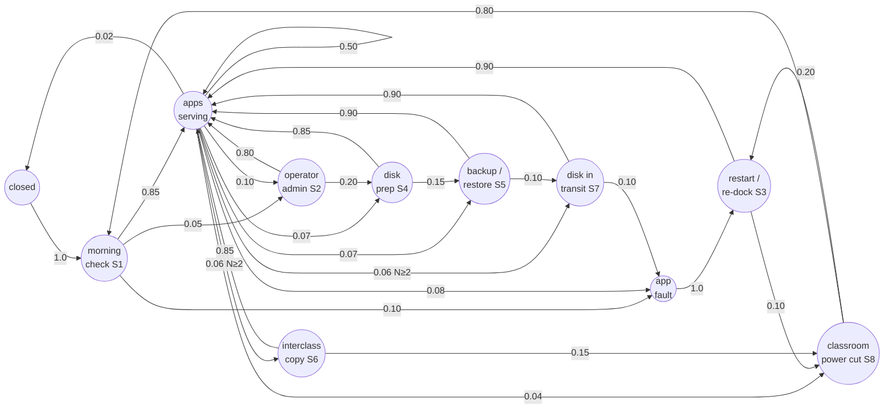

> **SUPERSEDED** 2026-09-29 by [`multi-engine-classroom.md`](./multi-engine-classroom.md). Keep this file for historical research only; do not treat as current proposal.

# Proposal: Multi-Engine Classroom Scenarios, driven through the Console UI, and a Regular Scenario Batch

**Status:** Draft for Koen. Design research only: nothing is implemented, no PR or issue exists, no Pi was touched.
**Author:** Steve (Lead Bot), 2026-09-28
**Sources read at:** idea `6a901b0`, agent-engine-dev `2ed7891`, agent-console-dev `d780c7e`, agent-programme-manager `883d71b` (all `main`)

---

## 0. TL;DR

- Marco's field documents describe **one** IDEA server per site (three sites) that teachers and students reach at `engine-1.local` over the `appnet` Wi-Fi. They say **nothing** about several Pis in one school, one Pi per classroom, or disks carried between classrooms. The multi-classroom model below is therefore an **assumption** built on the Engine design (Automerge shared store, mDNS mesh, `duration-tests.md` "2–4 engines"). It is labelled as an assumption wherever it goes beyond what the docs say.
- The Console UI can already cover most classroom operator actions: start and stop an app, eject a disk, reboot an Engine, Install App on an empty disk, make a Backup Disk, back up and restore, copy or move an app by drag and drop (across Engines too), cancel an operation, first-time operator setup, and opening apps from the App Browser.
- Three things cannot be done through the UI today and have to stay scripted (or need an Engine change): **(1)** claiming Pis and forming a school network (discovery is mDNS-only, and every pool Pi is deliberately isolated with `mdns:false` and its own store), **(2)** physically docking, undocking or carrying a disk, and **(3)** a power cut (as opposed to a UI reboot).
- Proposed shape: a Playwright scenario suite (Console repo) that drives one browser context per "classroom Console". An Ops orchestrator (Atlas's box, next to the 30-min health check) wraps it. At run time it finds the idle non-golden Pis and scales the scenario set to **N = 1, 2 or 3+**. On any N it starts short-lived **classroom Engines** in a separate test directory (`testMode`, private disk dirs, fixture disks, a per-run store ID, and static peers instead of mDNS). Real hardware scenarios run on each Pi's deployed Engine, one Pi at a time.
- Three small Engine changes unlock N=1 multi-classroom and safe N≥2: an engine id/hostname override for testMode, static peers (`host:port`), and store-scoped discovery. The Console needs `data-testid` hooks and an instance-name field in Install App.
- The Markov model goes into the existing `agent-engine-dev/proposals/duration-tests.md` as a new section, "Classroom profile and UI driver" (text in §6.3).

---

## 1. Sources

### 1.1 Marco's documents (repo `koenswings/agent-programme-manager`)

All of these are in Marco's workspace. Git authorship varies: Marco is shown where Marco committed. Koen or Atlas wrote some files that Marco maintains (README: "maintained by Marco").

| File | First author → last editor (git) | Used for |
|---|---|---|
| `field/programme.md` (v2.1, Mar 2026) | Koen → **Marco** 2026-03-23 | Sites, team, 6-week curriculum, visit structure, usage tracking |
| `field/troubleshooting-guide.md` | Atlas 2026-03-25/26 | Disk docking, app status, restart by undock/re-dock, power cycle, load |
| `field/visit-checklist.md` | Koen | Technical check steps |
| `field/report-template.md` | Koen | Per-site reporting |
| `field/attendance-register.md` | **Marco** 2026-03-24 | Register form (5 teacher rows, 20 student rows) |
| `field/tapiwa-misheck-briefing.md` | Atlas 2026-03-27 | Programme goals, "local server in the room" |
| `field/tailscale-debug-upgrade-tapiwa.md` | **Marco** 2026-03-29 | USB-stick field upgrade, phone USB tethering |
| `presentations/kolibri-classroom-setup/…md` | Koen | Kolibri class, learners, lesson workflow |
| `presentations/kolibri-lessons-and-quizzes/…md` | Koen → **Marco** 2026-03-22 | Lessons, quizzes, Reports |
| `presentations/nextcloud-user-registration/…md` | **Marco** 2026-03-24 | Accounts, class groups ("Class 2B") |
| `presentations/nextcloud-classroom-use/…md` | **Marco** 2026-03-24 | View-only share, File Drop, collaborative docs, Talk |
| `presentations/wikipedia-offline/…md` | Atlas | Kiwix/Wikipedia use; "dock the Wikipedia disk" |
| `reference-cards/*.md` (4) | Atlas | Student login flow (`appnet` → `engine-1.local` → app) |
| `README.md`, `presentations/README.md` | Atlas / Koen | Index |

Also checked: the idea repo standup `standups/2026-04-11.md` (in git history, commit `05072bb`, programme-manager section: the board was dormant and teacher guides were waiting for a "field-ready baseline"), the Marco bot description in `idea/docs/grok-bot-setup.md` §8, and `idea/proposals/{app-dev-agent,kit-data-storage}.md` (Marco's presentations get pre-seeded into Nextcloud). No GitHub issues with the `field-feedback` or `new-app-proposal` labels exist, and no issue mentions Marco.

### 1.2 Markov doc

`koenswings/agent-engine-dev/proposals/duration-tests.md`: "Proposal: Markov-Model Duration Tests", Status **Proposed**, Axle, 2026-04-11, merged as a design at `237bcf7` (engine PR #56). Tracked by **idea#85** (open, "approach still to be agreed"). **Nothing is implemented**: there is no `test/duration/`, no `test:duration` script, and no scenario YAML.

Structure: Problem → Approach (a Markov chain loaded from YAML) → mermaid state diagram (`idle`, `kolibri_docked`, `disk_moved`, `engine_reboot`, with weights and self-loops for dwell time) → YAML scenario format → state actions (dock / undock / move / `sudo reboot` or `pm2 restart`) → global invariants (store convergence, no phantom docks, no zombie instances, engine liveness) plus per-state invariants → `waitForConvergence` → runner CLI `pnpm test:duration [--scenario] [--iterations] [--fast]` → log format → stability probes → file layout → scenarios `school-day` / `stress` / `minimal` → 4 phases → open questions (time compression, multi-disk, engine-aware state).

**Stale assumptions in that doc (to fix when extending it):** it assumes every fleet Engine shares one store (no longer true since idea#118: each pool Pi has `mdns:false` and its own store). Its sample log reboots `idea02`, which is now golden and must never be used. Its actions dock disks over SSH on live Engines, which conflicts with the isolation rules in idea#105.

### 1.3 Code and ops docs read

- Engine: `docs/ARCHITECTURE.md`, `docs/COMMANDS.md`, `src/data/Network.ts`, `src/monitors/mdnsMonitor.ts`, `src/data/Config.ts`, `src/data/Engine.ts`, `src/data/CopyMoveApp.ts`, `script/hw-roundtrip.ts`, `script/test-run.sh`, `test/harness/diskSim.ts`, `test/cross-engine/*`, `proposals/{cross-engine-tests,test-policy,copy-move-app}.md`.
- Console: `src/store/commands.ts`, `src/components/*` (NetworkTree, InstanceRow, EmptyDiskPanel, RestorePanel, OperationProgress, AppBrowser, FirstTimeSetup, ConnectionManagement), `src/store/{discovery,engine}.ts`, `src/mock/mockStore.ts`, `e2e/*.spec.ts`, `playwright.config.ts`, `docs/ARCHITECTURE.md`.
- Ops: `idea/fleet-state.json`, `idea/docs/grok-bot-setup.md` §2.3–2.4, §4.1–4.6, `idea/tools/fleet/{check-fleet-health.sh,find-available-pi.sh}`, `idea/CONTEXT.md`, `idea/proposals/files-disk.md`, issues idea#84, #85, #107, #118.

---

## 2. What the field documents actually say

| Topic | What the docs say | Source |
|---|---|---|
| Sites | Three: Monde Primary School, Ndlovu Secondary School, Umhambi Orphanage | `field/programme.md` "Sites"; `field/tapiwa-misheck-briefing.md` |
| Server per site | "offline computer systems at three sites… everything works from a local server in the room"; one address `engine-1.local`; "the Appdocker" (singular) | `tapiwa-misheck-briefing.md`; `troubleshooting-guide.md` §1–2; `reference-cards/student-login-guide.md` |
| Apps | Kolibri (lessons/quizzes), Nextcloud (files, groups, File Drop, collaborative docs, Talk), offline Wikipedia (Kiwix). **MilkWise is not mentioned** in any field doc | `programme.md`; all presentations |
| Access path | Device joins Wi-Fi `appnet` (no password) → Chromium → `engine-1.local` → app list with status (Running / Starting / Stopped / Error / Undocked) → click app → log in | `student-login-guide.md`; `troubleshooting-guide.md` §2 |
| Roles | Tapiwa (technical lead/trainer), Misheck (organiser/observer), a **teacher administrator** per site who creates Nextcloud/Kolibri accounts; teachers; students; a school contact | `programme.md` Team + Goals |
| Class organisation | Classes exist **inside the apps**: a Kolibri class ("Grade 5A", "Form 3") and Nextcloud groups ("Grade 5A", "Class 2A", "Class 2B") | `kolibri-classroom-setup.md`; `nextcloud-user-registration.md` |
| Class size | **Not stated.** Only hints: goal "at least 5 students have logged in" (Week 3); the register form has 20 student rows and 5 teacher rows; "share a file 30 times (once for each student)" is an illustration | `programme.md` Week 3; `attendance-register.md`; `nextcloud-user-registration.md` |
| Session length | First student session "15 min max"; training 20–40 min; visit technical check 10 min | `programme.md` Visit Structure, Week 3 |
| Weekly workflow | Week 1 accounts/classes → Week 2 lesson + view-only share → Week 3 student login → Week 4 quiz, File Drop, Talk → Week 5 Reports, collaborative doc → Week 6 troubleshooting | `programme.md` curriculum |
| Load | "If many devices are on the network at the same time, performance may drop… limit to one group of students at a time" | `troubleshooting-guide.md` §6 |
| Disks | App Disks are docked "into the Appdocker"; an app starts automatically on dock; "most common cause of an app not being available is that the disk is not docked"; restart Kolibri by **undocking and re-docking** its disk; the Wikipedia disk must be docked | `troubleshooting-guide.md` §2, §6; `wikipedia-offline.md` |
| Moving disks between classrooms | **Not mentioned anywhere** | — |
| Backup / Files Disks | **Not mentioned** in field docs. They come from the Engine/Console design (`idea/CONTEXT.md`, `idea/proposals/files-disk.md`: "School Files", "move that store to another Pi by moving the disk") | — |
| Power | "unplug and replug… wait 3 minutes"; `CONTEXT.md`: "limited electricity". Nothing on solar or UPS | `troubleshooting-guide.md` §1 |
| Connectivity | Fully offline; remote support only through Tailscale over **phone USB tethering** during a visit | `field/tailscale-debug-upgrade-tapiwa.md` |
| Devices | "any device" on the Wi-Fi; phones/tablets via the Nextcloud mobile app; a "classroom screen" | `nextcloud-user-registration.md`; `wikipedia-offline.md` |

---

## 3. Multi-class school model

### 3.1 Grounded core (from the docs)

- A site has teachers, one teacher administrator, students grouped into classes, and the apps Kolibri, Nextcloud and Wikipedia served from docked App Disks.
- Users reach apps through the status page, which is today's Console **User mode** App Browser. An operator (Tapiwa, or the teacher administrator) manages disks and apps.
- The operator's field toolkit: check that apps are Running, dock or re-dock disks, power-cycle the Pi.

### 3.2 Assumptions (not in Marco's docs; flag for Koen)

| # | Assumption | Basis |
|---|---|---|
| A1 | A larger school has **one Engine (Pi) per classroom** (or per block), all on one school LAN, sharing one Automerge store over mDNS | Engine `ARCHITECTURE.md` §2C; `duration-tests.md` "2–4 engines" |
| A2 | Each classroom Engine carries its own App Disks (e.g. Class 5A's Kolibri, Wikipedia in the library) | Engine design; Console App Browser lists instances network-wide |
| A3 | Disks are **carried between classrooms** (e.g. a single Wikipedia disk shared by rotation, a Backup Disk moved to the staff room) | `duration-tests.md` "Disks moving between engines"; `files-disk.md` |
| A4 | A Backup Disk and a "School Files" Files Disk exist per school | `CONTEXT.md`; `files-disk.md` (Files Disk not implemented yet: idea#131/#132 open) |
| A5 | Any Console, connected to any classroom Engine, can operate every classroom (the operator walks around with a phone) | `ARCHITECTURE.md` Scenario B; Console `MobileLayout` |
| A6 | Power cuts hit one classroom (one Pi) at a time | `CONTEXT.md` "limited electricity"; `duration-tests.md` |

### 3.3 Model used for tests

```
School network (one run-specific store)
├── Classroom A  (Engine A)  — App Disk "kolibri-5A", App Disk "wikipedia"
├── Classroom B  (Engine B)  — App Disk "nextcloud", (empty disk for prep)
├── Classroom C  (Engine C)  — Backup Disk (on-demand, linked to nextcloud)
└── Consoles: operator (logged in) per classroom; user-mode "student" session per classroom
```

Classroom Engines map to real Pis when N≥2. On N=1 they map to extra classroom Engine processes on the same Pi (§8, needs change E3).

---

## 4. What exists today

### 4.1 Console UI actions (source: `agent-console-dev/src`)

| UI action | Where | Engine command |
|---|---|---|
| First-time operator setup / login / manage operators | `FirstTimeSetup`, `LoginForm`, `OperatorManagement` | store write (users) |
| Open an app (User mode) | `AppBrowser`/`AppCard .app-card__open-btn` | — (HTTP to `<engine-host>:<port>`) |
| Start / stop an instance | `InstanceRow`, `MobileAppList` | `startInstance`/`stopInstance` |
| Eject a disk | `NetworkTree .tree-item__eject-btn` | `ejectDisk <diskId>` |
| Reboot an Engine | `NetworkTree .tree-item__reboot-btn` (confirm) | `reboot` (whole Pi) |
| Install App on an empty disk | `EmptyDiskPanel` | `installApp <appId> <diskId> [--source]` (**no instance-name field**) |
| Make a Backup Disk | `EmptyDiskPanel` | `createBackupDisk` |
| Make a Files Disk | `EmptyDiskPanel`, shown only when the Engine advertises `filesDisk` (**no Engine does yet**) | `createFilesDisk` |
| Back up now | `InstanceRow` | `backupApp` |
| Restore | `RestorePanel` | `restoreApp` |
| Copy / move an app (drag instance → disk, also a disk on another Engine) | `App.tsx` handleDrop, `MobileCopyMoveSheet` | `copyApp`/`moveApp` (cross-engine is implemented in `CopyMoveApp.ts` via rsync to the peer's address) |
| Cancel operation | `OperationProgress` | `cancelOperation` |
| History / command log | `HistoryPanel`, `CommandHistory` | — |
| Switch Engine / manual connect (`host:port`) | `SettingsPanel`, `ConnectionManagement` | — (the Console reads `wsPort` from `/api/store-url`) |

Not in the UI: **Erase** (idea#136 open), Files Disk flows (idea#131/#132 open), anything that forms or joins a school network, docking a disk.

### 4.2 Multi-engine in the Engine

- One shared store document per network. Its ID is in `store-identity/store-url.txt`, so Engines only merge when they have the same ID.
- **Discovery is mDNS only** (`mdnsMonitor.ts`, one `settings.mdns` switch for both advertising and discovery). There is no static peer list, and peers are keyed by IP with the local port assumed (`Network.ts`). The TXT record carries `name`, `id`, `version`, but **no store ID**, so an Engine connects to *any* Engine it sees, and with `sharePolicy: true` documents replicate even across different store IDs. idea03 received idea02's documents this way before isolation (idea#118).
- Pool Pis idea01, idea03 and idea04 each run `mdns:false` with their own store (fleet-state `note`). Today **no two fleet Pis can see each other**, and that is deliberate.
- Capabilities: `ENGINE_CAPABILITIES = ['diskIdArgs']` (`Engine.ts`). The Console gates actions per target Engine (`engineHasCapability`).
- Useful environment overrides already exist (`Config.ts`): `IDEA_TEST_MODE`, `IDEA_ENGINE_PORT`, `IDEA_STORE_DIR`, `IDEA_MDNS_DISABLE`, `IDEA_DISKS_ROOT`, `IDEA_WATCH_DIR`, `IDEA_SYSTEM_DISK_SKIP`. `config.yaml` and `store-identity/` are read relative to the **cwd**, so a separate directory gives a separate `httpPort` / `port` / store. **Missing:** an engine id override (it always comes from `/META.yaml`) and a hostname override. Phantom cleanup deletes engine entries that have the same hostname and a different id (`Engine.ts`), so two Engines on one Pi in one store would delete each other's records.

### 4.3 Existing harnesses

| Harness | What it does | Relevance |
|---|---|---|
| `pnpm test:full` (`script/test-run.sh`) | Isolated in-process Engine tests, `diskSim` sentinel docking in private dirs | Base for fixture-tier docking; runs on idea01/idea04, refused on idea03 while the test disk is docked |
| `pnpm test:hw` (`script/hw-roundtrip.ts`) | On idea03: eject the recorded test disk through the store queue, then sysfs unbind/bind re-plug, then check the re-dock | The only real "re-dock" automation; touches only the recorded test disk |
| `pnpm test:cross-engine` | Store-level client over LAN WebSockets; SSH sentinel docking on live Engines | Written for the old shared-store fleet (idea01/02/03). It **would now target golden** and break isolation, so it must not be revived as is |
| Engine Suite 3 (`engine-network.test.ts`) | All `it.skip` placeholders (idea#84) | Superseded by this proposal's N≥2 tier |
| Console `pnpm test:e2e` (Playwright) | Demo/mock-store flows; `real-engine.spec.ts` hardcodes `wizardly-hugle.local` | Base to extend. The mock store only appends commands (no execution), so it cannot check outcomes. **No `data-testid` in the Console**, only CSS classes and ~23 aria-labels |
| `tools/fleet/check-fleet-health.sh` (idea#149) | ssh, Console 200 on :8080, pm2 `engine` online as pi with no new restarts, versions, disk <90%. Claimed Pis are reported but never fail. `--origin --alert` every 30 min on Atlas's box | The batch must interlock with it (§9.6) |

---

## 5. Scenarios

Notation: **[UI]** = a Playwright step in a Console page; **[PHYS]** = a physical step that has to be simulated by the harness (honest gap); **[APP]** = a step inside the Kolibri/Nextcloud UI (optional app-level layer). "Min N" is the number of Pis needed; `N=1*` means possible on one Pi only after changes E2/E3 (§11).

### S1 Morning technical check (the Visit Step 1 check), min N=1
Grounded in `programme.md` Visit Step 1 and `visit-checklist.md` §1.
1. [UI] Open the classroom Console in user mode (`http://<pi>:8080/`, or `:<classroomHttpPort>` for a classroom Engine).
2. [UI] The App Browser shows every expected instance card as **Running**.
3. [UI] Click **Open** on each Running card. The new tab answers HTTP 200 (Kolibri/Nextcloud login page, Wikipedia search page, or the fixture app's page).
4. [UI] (N≥2) The same cards, with the same statuses, appear in every other classroom's Console.

**Expected:** every card is Running, every Open link returns 200, and all Consoles show the same set.

### S2 Classroom setup by the operator (Week 1), min N=1
1. [UI] On a fresh classroom Engine the Console shows **First-time setup**. Create the operator and log in.
2. [UI] (N≥2) Open classroom B's Console. The operator created in A can log in there (users sync through the store).
3. [APP, optional] Open Kolibri: create class "Grade 5A", enrol 3 learners. Open Nextcloud: create group "Class 2A" and 3 accounts. Check that a learner can log in.

**Expected:** operator login works on every classroom Console. The app-level class exists. Note idea#113: password hashes sync to every Console, and this scenario makes that visible.

### S3 "App not showing as Running" → restart (troubleshooting §2, §6), min N=1
1. [UI] Operator: **Stop** Kolibri in `InstanceRow`. Its App Browser card turns greyed out ("Not available") in every Console.
2. [UI] **Start**. The card returns to Running and Open returns 200.
3. [UI] **Eject** the Kolibri disk. The disk leaves the tree and its instance shows Undocked.
4. [PHYS] Re-dock: a sysfs re-plug (hardware tier, recorded test disks only) or a sentinel re-add (fixture tier).
5. [UI] The disk reappears under the same Engine with the **same disk ID**. The instance auto-starts to Running. History shows an `ejectDisk` success trace.

### S4 Prepare a new classroom App Disk, min N=1
1. [PHYS] Dock an empty IDEA disk (fixture tier: a sentinel dock of `disk-empty` plus a catalog disk).
2. [UI] Select the disk. The Empty Disk panel opens → **Install App** → choose the app from the catalog disk (`--source`) → confirm.
3. [UI] `OperationProgress` shows the steps. The new instance appears on the disk and goes Running. Open returns 200.

**Gap:** the UI cannot name the instance (for example `kolibri-5A`), so two classrooms' Kolibris look the same in the App Browser (change C3).

### S5 Back up classroom work, then restore it elsewhere, min N=1
1. [PHYS] Dock an empty disk. [UI] **Make Backup Disk**, mode on-demand, link Nextcloud.
2. [UI] **Back up now** on the Nextcloud row. Operation progress reaches Done, and `lastBackedUp` updates in the row.
3. [UI] Drag or open the **Restore** panel and restore onto another (empty) disk. The restored instance is Running.
4. [UI] Try **Eject** of the Backup Disk *during* a backup. It is refused (lock) and the refusal shows in History. This is also a check for idea#122 (failed commands looking successful).

### S6 Interclass copy: Class A's Kolibri to Class B's disk, min N=2 (N=1*)
1. [UI] In Console A (operator), drag the `kolibri-5A` instance row onto Classroom B's disk in the network tree → choose **Copy**.
2. [UI] `OperationProgress` shows on **both** Consoles (the operation is created by the source Engine). A's instance stops for the snapshot and restarts afterwards.
3. [UI] A new instance (new InstanceID) appears on B's disk and goes Running. Open works on B's host.

**Prerequisite:** the cross-engine rsync needs Pi-to-Pi SSH from the source Engine to the target (`CopyMoveApp.ts` uses `getEngineAddress`). Whether the pool Pis trust each other's keys is unverified (open question).

### S7 Interclass disk carry: the Wikipedia disk moves from Class A to Class B, min N=2 (N=1*)
1. [UI] Console A: **Eject** the Wikipedia disk. All Consoles show it Undocked.
2. [PHYS] "Carry" the disk. Fixture tier: the runner removes the sentinel from classroom A's watch dir and adds the same fixture (same `META.yaml` disk ID) to classroom B's watch dir. Hardware tier: **not possible** without a person or new hardware (§7.3).
3. [UI] Every Console shows the disk under **Engine B** with the same disk ID. The instance is Running with a host of B. There are no duplicate disk records and no phantom dock on A.

### S8 Power cut in one classroom, min N=1 (cross-view needs N≥2)
1. [UI] Console A (operator): **Reboot** Engine B (confirm dialog). Hardware tier: a real Pi reboot through the UI, one Pi at a time. Fixture tier: the harness kills classroom Engine B's process ([PHYS] "power cut").
2. [UI] Console A shows B offline (`lastHalted` is set by the disconnect path) and B's apps unavailable. Console B shows disconnected.
3. After the restart: [UI] Console B recovers its connection, B's disks re-dock and its instances return to Running. All Consoles converge. Note: `App.tsx` turns off its 15 s reconnect path in production web mode (the Console served by the Engine). Recovery then depends on the Automerge WebSocket adapter's own retry, and whether a page reload is needed is **unverified**. The scenario first asserts recovery without a reload, then records whether a reload was needed.

On N=1 hardware: reboot the only Pi and check that the Console reconnects and everything returns (the self-view only).

### S9 (deferred) Shared "School Files" disk
Needs the Files Disk work (idea#131/#132/#136): make a Files Disk in B, see "School Files" in Nextcloud, eject it, carry it to A, and check that Nextcloud on A shows it. Listed so the Markov model has a slot for it.

### Scenario × N matrix

| Scenario | N=1 today (deployed Engine) | N=1 after E2/E3 (classroom Engines) | N=2 | N≥3 |
|---|---|---|---|---|
| S1 check | ✓ | ✓ | ✓ (+cross-view) | ✓ |
| S2 setup | ✓ (only if the Engine has no operator; otherwise login only) | ✓ (fresh stores) | ✓ user sync | ✓ |
| S3 restart | ✓ Stop/Start; re-dock only on idea03's test disk path (see §9.4) | ✓ | ✓ | ✓ |
| S4 install | only if an empty disk plus a catalog disk are docked (unknown) | ✓ fixtures | ✓ | ✓ |
| S5 backup | only if disks are present (unknown) | ✓ fixtures | ✓ restore on another Engine | ✓ |
| S6 copy | — | ✓ (loopback rsync) | ✓ real network | ✓ + concurrent copies |
| S7 carry | — | ✓ sentinel move | ✓ (fixture tier across Pis) | ✓ chain A→B→C |
| S8 power | ✓ self-reboot | ✓ process kill | ✓ UI reboot of the peer | ✓ + reboot during a copy |

---

## 6. Markov model

### 6.1 Graph

States are school-level. `N≥2` marks transitions that are enabled only when at least two classroom Engines exist. Weights are **initial guesses** (no field data on frequencies exists; flagged).



With N=1 (and no classroom Engines), the `N≥2` edges are removed and their weight is renormalised into `serving`. `copy → power` models "a power cut during an interclass copy" (an interrupted operation plus lock recovery, see Engine `interrupted-task-recovery`).

### 6.2 Invariants (checked after every transition)

- **From `duration-tests.md` (unchanged):** store convergence across all classroom Engines, no phantom docks, no zombie instances, engine liveness.
- **UI agreement (new):** for every open classroom Console, the DOM's engine, disk and instance set and statuses equal the store as read by a read-only oracle client, within a settle timeout.
- **Command closure (new):** every UI action produced exactly one History trace that ended in `success`, or in the expected `error` for negative steps. No trace is left pending beyond a timeout (relates to idea#122).
- **Reachability (new):** every Running instance's **Open** URL returns HTTP 200.
- **Safety (new, hard fail and abort):** no command, sysfs write or SSH action ever targeted the golden Pi or idea03's recorded test disk/root SSD (§9.4). This is checked by the orchestrator's allowlist and by scanning the run log.

### 6.3 Recommendation for the existing Markov doc

Extend **`koenswings/agent-engine-dev/proposals/duration-tests.md`** rather than creating a parallel doc. Add a new section **"## Classroom profile and UI driver"** after "## Scenarios to ship", covering:

1. The `classroom-week` scenario (the graph above) as a fourth scenario, beside `school-day`, `stress` and `minimal`.
2. An **action driver** field per action: `driver: store` (today's design: command writes through the store) or `driver: ui` (Playwright through the Console), plus `driver: harness` for [PHYS] steps. The same YAML can then run headless-fast (store) or realistic (UI).
3. An `requires: { minEngines: 2 }` field per transition, so the walker prunes edges dynamically for the N that is actually available.
4. The UI-agreement, command-closure, reachability and safety invariants above.
5. A note fixing the stale assumptions (no shared fleet store since idea#118; never `idea02`; run on classroom Engines in test dirs, not on live stores).

The cross-repo orchestration (Ops routine, claim protocol, Console suite) stays in an idea-repo proposal: this document, once turned into `idea/proposals/multi-engine-classroom-scenarios.md`.

---

## 7. How setup and scenarios are driven through the Console UI

### 7.1 Runner

- Playwright (already a Console dev dependency) runs **on Atlas's box**, which is on the tailnet and already runs the health check. It uses headless Chromium with **one browser context per classroom Console**, plus one user-mode "student" context per classroom.
- Base URLs come from the orchestrator, not from `playwright.config.ts`: `http://<pi-tailscale-ip>:<httpPort>/` for each classroom. The existing `webServer` (local build on :5173) is skipped in this mode. The Console served *by the Engine* is what gets tested, i.e. the deployed build.
- Page objects in the Console repo (`e2e/classroom/pages/*.ts`): `NetworkTree`, `InstanceRow`, `EmptyDiskPanel`, `RestorePanel`, `OperationProgress`, `AppBrowser`, `History`, `Account`. Each scenario S1–S8 is a function that composes page-object steps. The Markov walker picks them.
- Oracle: a small **read-only** Automerge client (the pattern of `test/cross-engine/remoteClient.ts`), used only to check UI agreement. It never writes commands, so every mutation goes through the UI.
- Evidence: a Playwright trace plus a screenshot per step, the History panel text, and the JSON transition log in the `duration-tests.md` format.

### 7.2 Setup through the UI

For each classroom Engine: first-time operator setup (S2) → dock [PHYS] fixture disks → Install App on empty disks (S4) → Make Backup Disk (S5) → (later) Make Files Disk (S9). The school's initial state is built entirely with UI clicks. Only disk insertion is simulated.

### 7.3 Where scripts are unavoidable (honest list)

| Step | Why the UI can't do it | Proposed handling |
|---|---|---|
| Claim/release Pis, fleet-state | Ops protocol (§4.6) | Orchestrator via `update-fleet-state.sh` |
| Form a school network (shared store + peering) | No UI concept. Discovery is mDNS-only, and changing a pool Pi's store or `mdns` is forbidden by §4.6 | Per-run classroom Engines with a run-specific store URL and static peers (E1/E2). No change to deployed Engines |
| Start/stop classroom Engine processes | Test infrastructure | Orchestrator over SSH on claimed Pis |
| Dock / undock / carry a disk | Physical | Fixture tier: sentinel add/remove in the classroom Engine's private watch dir. Hardware tier: sysfs unbind/bind of **recorded** scenario disks only (reuse the `hw-roundtrip-guard.ts` ID matching). Carrying a real disk between Pis is impossible without a person or new hardware: options are a USB-gadget "virtual disk" on the Pi, or a USB switch/relay (open question) |
| Power cut (hard) | The UI only offers a clean reboot | Fixture tier: kill the process. Hardware tier: UI reboot only (no hard power cut without a smart plug; open question) |
| Restore the Pi after the run | Cleanup | Orchestrator: remove the classroom dirs and containers labelled with the run id, verify the deployed Engine, run the health check |

---

## 8. Dynamic scaling

### 8.1 Discovery at run time

1. `git fetch` and read `fleet-state.json` from `origin/main` (as `--origin` does).
2. Candidates = keys not starting with `_`, where `role != "golden"`, `status == "idle"`, `claim == null`. There is also a **hard denylist by name and by Tailscale IP of every `role: golden` entry**, a second guard in case of a stale or edited state.
3. For each candidate, run `check-fleet-health.sh --pi <pi>`. Drop any Pi that is not healthy (the batch never starts on a sick Pi).
4. Cap: `N = min(healthy candidates, MAX_CLAIM)`, where `MAX_CLAIM` defaults to *all but one* when three or more are idle, leaving one Pi for review deploys (open question). If N=0, report `SKIPPED (no idle pool Pi)`. That is not a failure.
5. Per claimed Pi, read the disk inventory **through the Console** (the network tree, read-only) and tag the Pi with what it has: `hwTestDisk` (idea03 recorded IDs), `appDisks[]`, `emptyDisks[]`. The hardware-tier scenario set is filtered by this inventory.

### 8.2 Tiers

**Fixture tier (every run, all N):** on each claimed Pi, start K short-lived **classroom Engines**, each in `~/idea-test/classroom-<run>-<k>/` with its own `config.yaml` (`port 43xx`, `httpPort 81xx`, `testMode: true`, `consolePath` = the deployed Console dist, read-only), its own `store-identity/store-url.txt` holding a **run-specific** store URL generated by the orchestrator (the template is copied from the repo), private `IDEA_WATCH_DIR`/`IDEA_DISKS_ROOT`, `IDEA_SYSTEM_DISK_SKIP=true`, `IDEA_MDNS_DISABLE=true`, and static peers set to the other classroom Engines (E2). The binary is the deployed `dist/src/index.js`, run from the classroom dir as cwd. The deployed tree is used read-only, as §4.6 already asks for App Harness.

- **N=1:** K=3 classroom Engines on one Pi → S1–S8 all run (S6/S7/S8 as intra-Pi "classrooms"). **Needs E2 + E3** (engine id/hostname override, static peers with ports). Without them, N=1 runs only one classroom Engine, i.e. S1–S5 plus an S8 self-restart.
- **N=2:** K=1 or 2 per Pi → at least two classrooms on *different* Pis, so S6 (real network rsync) and S7 are checked across hosts. Peers go over the LAN or Tailscale IPs.
- **N≥3:** K=1 per Pi, plus concurrent operators (two Consoles issue commands at the same time), an S7 chain A→B→C, and S8 during S6.

**Hardware tier (weekly, one Pi at a time):** on each claimed Pi's **deployed** Engine and real disks: S1, S3 (Stop/Start; eject + re-plug only for recorded scenario disks), S4/S5 if the inventory allows it, and an S8 UI reboot. It never forms a network between deployed Engines (that would break isolation). Multi-classroom behaviour is covered by the fixture tier.

### 8.3 Fixture content

The Engine fixtures (`test/fixtures/disk-sample-v1`) run a tiny `traefik/whoami` sample app. For classroom realism, add fixture disks named for classrooms (`kolibri-5A`, `wikipedia`, `nextcloud`), a catalog disk (for S4) and an empty disk, with **distinct host ports per instance** so several classroom Engines can share one Docker daemon. Real Kolibri/Nextcloud stay in the hardware tier (images are heavy, and the startup time on a Pi 4 is not documented in the repos).

---

## 9. The regular test batch

### 9.1 Name and home
**`classroom-scenarios`**. Split:
- Scenario code: `agent-console-dev/e2e/classroom/` (Playwright, page objects, Markov walker that reads the YAML).
- Scenario YAML + invariants: `agent-engine-dev/test/duration/scenarios/classroom-week.yaml`, shared with the `duration-tests.md` runner.
- Orchestrator: `idea/tools/fleet/classroom-scenarios.sh` (JSON on stdout, audit line; the same conventions as the other fleet scripts).

### 9.2 Where and when
- Runs as an **Atlas routine on Atlas's box**, like the health check.
- **Fixture tier: nightly** (proposed 02:30 Europe/Brussels), about 40 transitions in `--fast`, target < 30 min.
- **Hardware tier: weekly** (proposed Sunday 03:30 Europe/Brussels), one Pi at a time.
- **On demand:** after `update-golden` changes the mains. It runs against the *pool* Pis (which carry the same mains when idle), never against golden.

### 9.3 Claim/release protocol (per §4.6)
1. Take the lock `~/.cache/idea-classroom-scenarios/lock` (flock), so there is never more than one run.
2. For each selected Pi: `BOT_NAME=Atlas update-fleet-state.sh <pi> status testing` and `… claim "Atlas: classroom-scenarios <run-id>"`. Push. Re-read `origin/main` and abort if another claim raced in.
3. Run the tiers. The hardware tier takes **at most one Pi down at a time** (S8 is serialised).
4. Restore: stop the classroom Engines, `docker compose down -v` for run-labelled projects, remove `~/idea-test/classroom-<run>-*`, confirm the deployed Engine is online as pi and its `store-url.txt` / `config.yaml` / `mdns:false` are unchanged (checksums taken before the claim).
5. `check-fleet-health.sh --pi <pi>`. This also refreshes the pm2 restart baseline, so the 30-min routine doesn't flag a restart caused by the batch.
6. Release: `--null <pi> claim`, `status idle`. If step 4 or 5 fails, **do not release**. Keep the claim with a `status: testing` note and alert.

### 9.4 Guards
- **Golden:** never selected (role filter plus a name/IP denylist). The Playwright base-URL allowlist contains only claimed Pis. Classroom Engines run with mDNS disabled and a run-specific store ID, so golden can't see or sync them. E1 adds a store-ID filter as a second line of defence.
- **idea03 test stick:** the orchestrator loads the recorded IDs (fleet-state `note`, `hw-roundtrip-disks.json`). Any UI step whose target disk matches them (disk ID, or the device resolved via USB/disk serial or UUIDs) is refused *before* the click. The fixture tier never touches real devices. idea03 may host classroom Engines (fixture tier) when it is idle. In the hardware tier it runs **S1/S8 only**, and its stick is re-plugged only by the existing `test:hw`, not by this batch (open question).
- **Never** `pnpm test:full` on a live Pi; never touch `store-template.json`; never change a Pi's `note`.

### 9.5 Output and alerting
- `~/.cache/idea-classroom-scenarios/<run-id>/`: `report.json` (N, Pis, tier, scenario coverage, transitions, invariant results, convergence times), `junit.xml`, Playwright traces and screenshots, and the transition log.
- One audit line in `audit/audit-<year>.jsonl` per run (`event: classroom-scenarios`, `result`, `n`, `pis`).
- Exit: `0` pass, `1` scenario or invariant failure, `2` infrastructure error (claim race, a Pi unhealthy before start), `3` skipped (N=0).
- Alerting uses the health check's dedupe model: Atlas stays silent on pass. On failure it messages Lead Bot with the failing scenario, transition number, invariant and trace path. It repeats only when the failure signature changes or has lasted 24h. A **safety** invariant breach alerts immediately and creates `~/.cache/idea-fleet-health/PAUSED`.
- **No manual steps for Koen, ever:** reports contain evidence (JSON, traces, screenshots), never "please check".

### 9.6 Coexistence with the 30-min health check
- Claimed Pis are reported as `claimed` and never fail the health check, so the batch cannot trigger fleet alerts.
- The batch runs `check-fleet-health.sh --pi` before claiming (precondition) and before releasing (baseline refresh plus a clean bill). Both use the same `HEALTH_DIR` on Atlas's box.
- Classroom Engines are **not** pm2 `engine` (they run as a separate process named `classroom-<run>-<k>`), so the health check's pm2 test is unaffected.
- If `PAUSED` exists (fleet unhealthy), the batch does not start.

---

## 10. Gaps and blockers found

1. **Field evidence for a multi-classroom school does not exist** in Marco's docs. The model is an assumption (A1–A6).
2. **No safe way to put two fleet Pis in one network today:** discovery is mDNS-only with no store filter and no static peers. Enabling mDNS on a pool Pi would expose it to golden idea02 (documents replicate across store IDs, as seen in idea#118).
3. **N=1 multi-classroom is blocked** by engine id and hostname coming from `/META.yaml` / `os.hostname()`. Phantom cleanup would delete a second same-host Engine. Peers are keyed by IP with an assumed shared port. `connectEngine` refuses `localhost`/`127.0.0.1`.
4. **Physical disk carry between Pis cannot be automated** on current hardware. Real re-dock exists only for idea03's recorded stick (`hw-roundtrip.ts`).
5. **Unknown disk inventory** on idea01/idea04 (fleet-state records none). The hardware tier may reduce to S1/S8 there.
6. **Console lacks test hooks** (no `data-testid`). Install App has **no instance-name field**, so classrooms can't tell their Kolibri apart in the App Browser. The App Browser does not group by classroom/Engine.
7. **Cross-engine copy needs Pi-to-Pi SSH** for rsync. Whether pool Pis trust each other is unverified.
8. `test/cross-engine` and `proposals/test-policy.md` predate golden isolation ("stop any running instance, including production apps"; SSH docking on live Engines). They are unsafe to run as they stand and need retiring or rewriting.
9. `duration-tests.md` is unimplemented (idea#85) and has stale assumptions (§1.2).
10. Failed commands can look successful (idea#122, open). The command-closure invariant will surface this, and may fail until it is fixed.
11. Files Disk and Erase are not implemented (idea#131/#132/#136), so S9 is deferred.
12. Console reconnect after an Engine reboot in production web mode is unverified: the 15 s reconnect is off there (`App.tsx`). S8 will show whether users must reload the page.

---

## 11. Required changes (per domain bot)

**Engine: Axle**
- **E1 Store-scoped discovery:** advertise the store doc ID (or a hash of it) in the mDNS TXT record, and connect only to peers with the same ID. This protects golden and schools generally, not only tests.
- **E2 Static peers:** `settings.peers: ["host:port", …]` / `IDEA_PEERS`, usable with mDNS off. Connection key = the peer's `host:port`, with a port per peer. Allow a loopback address when a peer port differs from our own.
- **E3 TestMode identity override:** `IDEA_ENGINE_ID` (or `IDEA_META_PATH`) and `IDEA_HOSTNAME`, honoured **only when `testMode`** is on, so phantom cleanup and Console labels treat each classroom Engine as distinct.
- **E4 Classroom fixture disks:** `kolibri-5A`, `wikipedia`, `nextcloud`, catalog and empty disks with distinct ports, plus a `classroom-week.yaml` scenario.
- **E5 `duration-tests.md`:** add the "Classroom profile and UI driver" section (§6.3). Implement the shared YAML loader, walker and invariants (idea#85 Phase 1), usable by both the store and UI drivers.
- **E6** Retire or rewrite `test/cross-engine` and `test-policy.md` for the isolated fleet. Confirm the cross-engine copy SSH prerequisites.

**Console: Pixel**
- **C1** `data-testid` on every actionable element used in §5 (tree engine/disk rows, eject, reboot, instance start/stop/backup, empty-disk options, copy/move dialog, restore, operation progress/cancel, app card open, connection dot, History rows).
- **C2** `e2e/classroom/` suite: page objects, S1–S8, Markov walker (YAML from Engine), multi-context runner with external base URLs (no `webServer`), trace per step, JSON/JUnit reporters.
- **C3** Install App **instance-name field** (the Engine already supports `--name`). App Browser shows or groups the classroom (Engine hostname) on each card.
- **C4** Make sure an offline peer Engine and `lastHalted` are visibly rendered (needed for S8 assertions). Surface failed commands (idea#122).

**Ops: Atlas**
- **O1** `tools/fleet/classroom-scenarios.sh`: discovery (§8.1), claim/release (§9.3), classroom Engine lifecycle, run-specific store URL, guards (§9.4), restore checksums, report, audit, alert dedupe.
- **O2** `find-available-pi.sh --all --json` (plural selection) or a small helper, keeping the golden exclusion in one place.
- **O3** Routines: nightly fixture tier, weekly hardware tier. Update `docs/grok-bot-setup.md` §4.5/§4.6 and the Ops bot description.
- **O4** Record per-Pi scenario-disk IDs in fleet-state (a `test_disks` field) if Koen adds dedicated disks to idea01/idea04.

**App: Kid**
- **K1** Optional app-level layer: pre-seeded Kolibri/Nextcloud test data (a class, a teacher, 3 learners; a group "Class 2A") on dedicated *test* App Disks, so [APP] steps in S2 can be asserted. Never on golden or MilkWise.
- **K2** Offline `services/*.tar` images for the scenario apps so Install App (S4) doesn't depend on internet.

---

## 12. Open questions for Koen

1. **School shape:** Marco's docs show one server per site. Is the target really one Pi per classroom sharing a store? If so, roughly how many classrooms per school should the tests model (the Engine doc says 2–4)?
2. **Deployed Engines:** is it fine that multi-classroom behaviour is tested only with short-lived classroom Engines (a run-specific store, fixture disks), keeping every pool Pi's own store and `mdns:false` untouched? The alternative is temporarily joining deployed Engines into a shared store, which breaks the §4.6 rule.
3. **Physical disks:** may we attach a dedicated scenario disk permanently to idea01 and idea04 (recorded by IDs, like idea03's stick) so that eject and re-dock run on real hardware? For a real disk "carry" between Pis, would you consider a USB-gadget virtual disk or a USB switch/relay? A smart plug for real power-cut tests?
4. **Pool capacity:** how many pool Pis may the batch claim at night, and should one always stay free for review deploys?
5. **App-level steps:** should the batch also drive Kolibri/Nextcloud UIs (create class, learner login, File Drop), or stop at the Console?
6. **idea03:** include it in the fixture tier when idle? Keep its stick out of this batch entirely (only `test:hw` touches it)?
7. **Cadence and alerts:** nightly fixture plus weekly hardware, failures → Lead Bot → you, as with the health check. OK?
8. **Product gaps surfaced:** should instance naming per classroom and grouping by classroom in the App Browser (C3) become product work, not only a test enabler?
9. **Where the Markov section lives:** extend `agent-engine-dev/proposals/duration-tests.md` as recommended, or move the Markov design to `idea/proposals/` because it now spans the Engine, Console and Ops?
