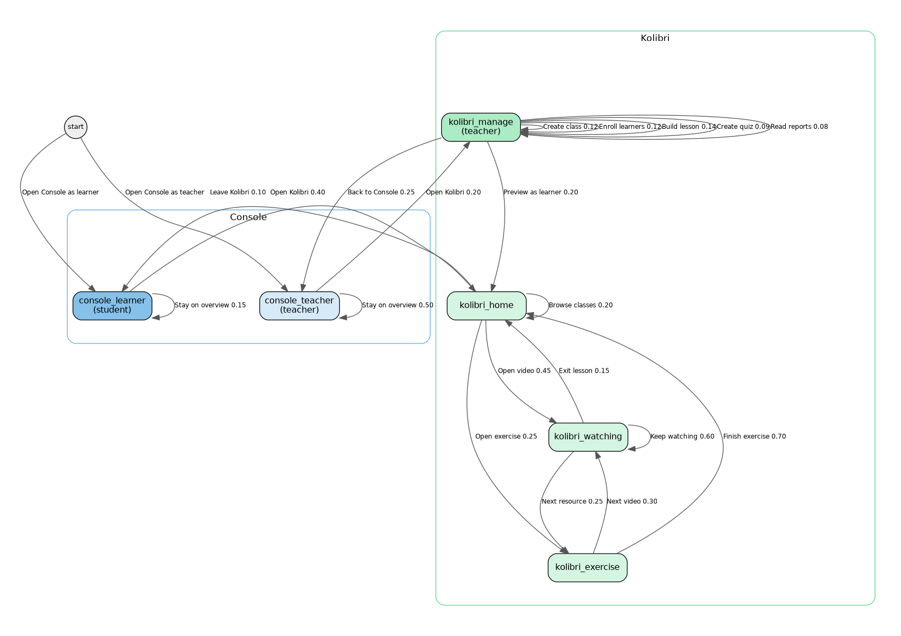
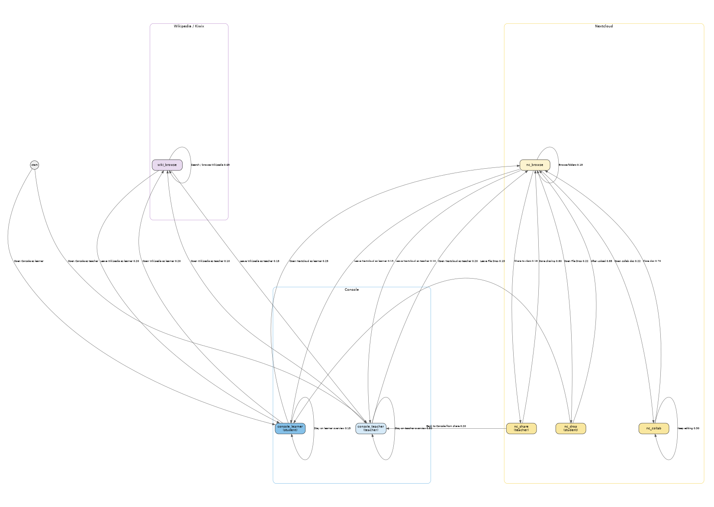
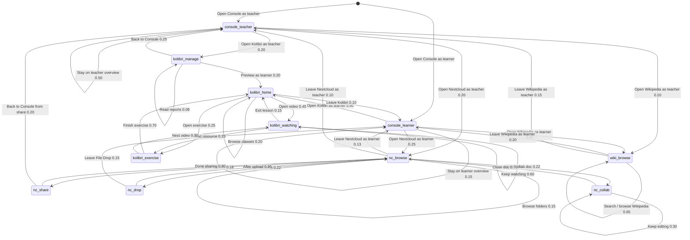

# Proposal: Multi-Engine Classroom

**Status:** Proposal draft for discussion — supersedes [`multi-engine-classroom-scenarios.md`](./multi-engine-classroom-scenarios.md) (2026-09-28).  
**Revision:** 2026-09-30e — Koen feedback: States heading; actions unique to departing state; action (not “UI labels”); plain Console wording; Typical clicks under UI Interactions.  
**Author:** Steve (Lead Bot), 2026-09-29 (rev. 2026-09-30e)  
**Audience:** Koen / IDEA leads  
**Companion capacity issue:** [idea#159](https://github.com/koenswings/idea/issues/159) — measure safe concurrent Kolibri video streams per instance

---

## Why this exists

Koen asked for a clean framing of **why a school runs more than one Engine**, how that looks with a small named fleet, what classroom scenarios matter, and how a Markov usage graph can drive realistic tests later.

This document is a **proposal draft**. Implementation, discovery protocol, auth, Playwright harnesses, fleet claim scripts, and Engine code changes are explicitly out of scope here (see final section). The Markov usage graph itself is a **concrete state/action model** for later tests — not labeled conceptual.

---

## Vision cite (this is already documented)

Prior drafting treated multi-Engine load distribution as an undocumented assumption. That was wrong.

It is already in the IDEA vision / solution description:

> All Appdockers on the same LAN will automatically find one another and when a new Appdocker device is added, the catalog of available apps is automatically extended with the apps docked onto the new device.  
> Performance is optimized by adding Appdockers and redistributing the apps over the Appdockers.

**Source:** [`agent-engine-dev/proposals/solution-description.md`](https://github.com/koenswings/agent-engine-dev/blob/main/proposals/solution-description.md)

Referenced from `idea/docs/grok-bot-setup.md` as the Engine vision and intent doc.

The multi-Engine classroom story below **extends** that vision into classroom roles and usage scenarios; it does not invent the load-spread principle.

---

## Why multi-engine (Koen's three reasons)

### 1. Distribute apps / load across Engines

The physical act is simple: **add an Engine** and **plug a demanding app into it**.

- Engines **autofind and connect** on the school LAN (vision: Appdockers find one another).
- The **integrated app list** looks the same whether the school has 1 Engine or N Engines.
- Users **never need to know** which Engine serves which app, or which Console they opened — any Console on any Engine can see the full picture.

This is the same physical metaphor as the rest of IDEA: capacity is improved by adding hardware and redistributing disks, not by asking teachers to become sysadmins.

### 2. Scale one app across Engines

Some apps hit a **per-instance / per-Pi limit**. Example: concurrent Kolibri video streams.

When one Kolibri instance cannot safely serve the whole class:

- Start a **second Kolibri instance** on another Engine.
- **Assign students** across instances (class A → instance 1, class B or half the cohort → instance 2).
- Same pattern later for Nextcloud video / heavy media.

Capacity baseline for Kolibri (**[idea#159](https://github.com/koenswings/idea/issues/159)**, idea01 Pi 5 / 4 GB). Multi-quality **planning** streams per instance (LAN measured SAFE ≥128 for all four; planning leaves Wi‑Fi / browser / Pi‑4 headroom):

| Quality | Resolution | Planning streams / instance |
|---|---|---:|
| low | 360p (640×360) | **64** |
| medium | 480p (854×480) | **32** |
| prior / typical lesson | 720p (1280×720) | **32** |
| high | 1080p (1920×1080) | **12** |

Default classroom planning figure remains **32 @ ~720p**; use 64 / 12 when content is known low / high. Load-test tooling: [agent-app-dev#9](https://github.com/koenswings/agent-app-dev/pull/9).

### 3. Per-class Engine with own instances — Console manages everything from anywhere

Each class (or teaching block) can have **its own Engine** hosting **class-only** app instances — e.g. Class 5A Nextcloud, Class 5A Kolibri content — without isolating operators.

**Any Console on any Engine** can manage **all apps across all Engines** simply. Teachers and operators are not trapped on “their” Pi’s Console; the mesh presents one school.

---

## Initial 3-engine setup (concrete sketch)

Design target first: a **named three-Engine school**, then generalise to N.

| Name | Role (story) | Typical disks / instances |
|---|---|---|
| **idea-A** | Shared / school golden hub | Shared apps everyone uses lightly: offline Wikipedia (Kiwix), school-wide Nextcloud “School Files”, maybe a small shared Kolibri channel library. Stable reference Engine. |
| **idea-B** | Class Engine — Grade 5A | Class-only Kolibri (Grade 5A lessons/quizzes), class Nextcloud (Group “Grade 5A”: view-only shares, File Drop, collaborative docs). |
| **idea-C** | Class Engine — Form 3 | Class-only Kolibri (Form 3), class Nextcloud (Group “Form 3”). When Grade 5A video load overflows idea-B, a second Kolibri instance for 5A can also land here (reason 2). |

**Classroom story:** Monde Primary (or any Marco site) starts with one Engine in the room. When video buffering and “limit to one group at a time” become the norm (field troubleshooting already warns about many devices), the school adds **idea-B** and **idea-C** as classroom Engines. Teachers still open any Console; students still join `appnet` and pick apps from one list. Operators dock demanding class disks onto B/C and leave shared services on A.

### Generalising to N

The three-Engine model is the **design target first**. N Engines later means:

- More class Engines (idea-D…), and/or
- More replicas of a hot app (extra Kolibri / Nextcloud instances) assigned by cohort.

Discovery, Console overview, and “users don’t pick an Engine” stay the same rules; only inventory and assignment grow.

---

## Initial scenario list (for discussion)

Discussable outcomes — **not** UI click scripts. Each item maps to Markov **states** / **actions** (and thus a UI Interaction) where the usage graph covers it; items that are operator-side or not yet in the graph are marked explicitly.

**Reason 1 — distribute apps / load**

- **S1 Add Engine, plug demanding app:** School adds idea-C; docks a heavy Kolibri (or Nextcloud media) disk onto it; app appears in every Console’s integrated list without renaming Consoles or teaching users a new hostname.
- **S2 Redistribute load:** Move or copy a demanding instance from idea-A onto idea-B so A stays responsive for shared services; app list and Open links remain coherent school-wide.
- **S3 Invisible Engine identity:** Student or teacher opens Console on idea-B or idea-C and sees the same app catalog/status as on idea-A.

**Reason 2 — scale one app**

- **S4 Kolibri stream ceiling:** Class exceeds safe concurrent streams on one instance → second Kolibri on another Engine; students assigned so neither instance exceeds the [idea#159](https://github.com/koenswings/idea/issues/159) planning N for that video quality (**64 @ 360p / 32 @ 480p–720p / 12 @ 1080p**).
- **S5 Nextcloud media twin:** Same idea for Nextcloud video / large file concurrent access — second instance + cohort assignment when one Pi is the bottleneck.

**Reason 3 — per-class Engine + Console-anywhere**

- **S6 Class-only content:** Grade 5A Kolibri/Nextcloud live only on idea-B; Form 3 only on idea-C; shared Wikipedia (Kiwix) stays on idea-A.
- **S7 Manage from the other room:** Teacher or operator on idea-A’s Console starts/stops, checks status, or prepares disks for apps that run on idea-B and idea-C.
- **S8 Cross-class share without moving rooms:** Teacher on idea-B Console shares a Nextcloud folder with Form 3’s group whose home instance is on idea-C (management is school-wide; data placement follows class Engines).

**Usage / field-aligned (Marco)**

- **S9 Kolibri teaching cycle:** Teacher builds class → enrolls learners → assigns lesson with videos → students watch/complete → quiz → teacher reads Reports (from Marco Kolibri presentations).
- **S10 Nextcloud classroom workflow:** Class groups; view-only material share; File Drop homework; collaborative doc; Talk for support (from Marco Nextcloud presentations). Field note: many devices → performance drop → prefer one group at a time unless multi-Engine capacity is in play.
- **S11 Offline Wikipedia:** Learner (or teacher) opens Kiwix from Console (idea-A), searches/browses articles, dwells, leaves.

**Coverage vs this usage graph** (after rewrite): see [Initial scenarios ↔ Markov coverage](#initial-scenarios--markov-coverage).

---

## Markov usage graph

### Idea

- **States** = usage places (what a person is doing in an app or Console), not disk-dock hardware states alone.
- **Actions** = labeled transitions with probabilities (initial guesses until field frequencies exist). Action names are Intent-style explaining names (e.g. **Open Kolibri as teacher**, **Stay on teacher overview**, **Create class**) — no cryptic IDs and no `*` wildcards on the graph.
- A **real test** = a **random walk** on this graph for some duration or step count. Each action expands into a **UI Interaction** with the **same Intent name** (forward link only).
- **Wiring rule for prose:** arrival / entry UI (login, open app, land on home) belongs on the **outgoing action of the state you leave**, not as content of the destination. Destination state sections describe only what you do **while in** that state (outgoing actions from there).
- Test instances of each app ship with **preloaded content**; legal actions are derived from that content (e.g. which lessons/videos exist, which folders/groups exist).
- Incorporate Marco’s file-sharing (students/teachers) and Kolibri classroom management, plus content-access actions for Kolibri, Nextcloud, and offline Wikipedia (Kiwix on idea-A).

**Operator Console Markov (separate):** managing/altering the multi-Engine setup (login, NetworkTree, dock/eject, install, start/stop, copy/move, Files/Backup/erase, operators, settings) lives in sibling [`multi-engine-operator.md`](./multi-engine-operator.md) with graph files `multi-engine-operator-markov.{dot,png,svg}`. This classroom usage graph stays usage-only.

### States

| State | Who | Colour | Meaning |
|---|---|---|---|
| `console_teacher` | Teacher | blue | School-wide Engine/app overview; opens apps as coach |
| `console_learner` | Student | mid-blue | Same unified app list; student opens an app to work |
| `kolibri_home` | Student or teacher | green | Kolibri signed in, Learn |
| `kolibri_watching` | Student | green | Playing an assigned lesson video |
| `kolibri_exercise` | Student | green | Doing an exercise in a lesson |
| `kolibri_manage` | Teacher | green (dark) | Classes, lessons, quizzes, Reports |
| `nc_browse` | Student or teacher | yellow | Nextcloud Files browse |
| `nc_share` | Teacher | yellow (dark) | View-only share to a class group |
| `nc_drop` | Student | yellow (dark) | Uploading to a File Drop |
| `nc_collab` | Student | yellow (dark) | Editing a shared collaborative doc |
| `wiki_browse` | Student or teacher | purple | Kiwix / offline Wikipedia on idea-A |

### Graph

The full state/action set is dense for one letter page, so the usage graph is shown as **two diagrams** (same states and actions; Console repeated as the shared hub). Combined source also kept: [`multi-engine-markov.dot`](./multi-engine-markov.dot) → [`multi-engine-markov.png`](./multi-engine-markov.png).

Every edge is labeled with the **same Intent / UI Interaction name** used in prose (plus ≈probability).

**Diagram A — Console + Kolibri** ([`multi-engine-markov-kolibri.dot`](./multi-engine-markov-kolibri.dot)):

**Diagram B — Console + Nextcloud + Wikipedia** ([`multi-engine-markov-files.dot`](./multi-engine-markov-files.dot)):

Same graph as Mermaid (editable)

### How states map to tests

Each Markov **state** is a coarse place someone can be. An **action** leaves that place for another (or stays via a self-loop). Inside a state, a real test does **not** invent a new state for every mouse click — that would explode the graph. Instead the harness expands the action into an **ordered UI Interaction** (login → sidebar → form → Save) taken from Marco’s classroom presentations. Create an extra state only when the action changes **who** is acting, **which app surface** they are on, or **resource pressure** (e.g. video stream vs browse). Probabilities below are still placeholders.

**Actions are unique to the state they depart from** — an action from state A cannot leave or affect another state; you only take actions listed on the current state. Example: from `console_teacher` you may only **Open Kolibri as teacher**, **Open Nextcloud as teacher**, **Open Wikipedia as teacher**, or **Stay on teacher overview**. Coaching actions (**Create class**, **Enroll learners**, …) exist only as actions **inside** `kolibri_manage`. Same pattern for Nextcloud/Wikipedia.

**Arrival UI rule:** login / open / land-on-home click sequences live on the **source state’s outgoing action** (and its UI Interaction). Destination state sections never re-list how you got there.

**Action** names match Marco’s field decks and quick-reference cards (`kolibri-classroom-setup`, `kolibri-lessons-and-quizzes`, `nextcloud-user-registration`, `nextcloud-classroom-use`, `quick-reference-kolibri.md`, `quick-reference-nextcloud.md`) — confirmed with Marco 2026-09-29. Any Engine’s Console shows the same school-wide app list (reason 1 / 3). Detailed CSS selectors wait for the Playwright harness.

---

## State: `console_teacher`

The teacher is on the **Engine / apps overview**: Engines present, apps docked, status. They are inspecting what is available on the network, not choosing a “home” Pi. **Operator-specific Console actions** (dock/eject disks, start/stop instances, install/move/backup/erase, operators/settings) are **not** on this usage graph — see [`multi-engine-operator.md`](./multi-engine-operator.md).

**While here:** scan the integrated app list (Running, etc.) and Engine rows; optionally refresh / wait while students work.

**Actions from this state:**

| Action | ≈p | Destination | UI Interaction |
|---|---:|---|---|
| **Open Kolibri as teacher** | 0.20 | `kolibri_manage` | [Open Kolibri as teacher](#open-kolibri-as-teacher) |
| **Open Nextcloud as teacher** | 0.20 | `nc_browse` | [Open Nextcloud as teacher](#open-nextcloud-as-teacher) |
| **Open Wikipedia as teacher** | 0.10 | `wiki_browse` | [Open Wikipedia as teacher](#open-wikipedia-as-teacher) |
| **Stay on teacher overview** | 0.50 | `console_teacher` | [Stay on teacher overview](#stay-on-teacher-overview) |

---

## State: `console_learner`

A student is on Console with the **same unified app list** as teachers (reason 1 / S3). They are not managing Engines — just picking Kolibri, Nextcloud, or Wikipedia.

**While here:** see integrated app list (class Kolibri/Nextcloud, Kiwix on idea-A, …); choose an app or dwell.

**Actions from this state:**

| Action | ≈p | Destination | UI Interaction |
|---|---:|---|---|
| **Open Kolibri as learner** | 0.40 | `kolibri_home` | [Open Kolibri as learner](#open-kolibri-as-learner) |
| **Open Nextcloud as learner** | 0.25 | `nc_browse` | [Open Nextcloud as learner](#open-nextcloud-as-learner) |
| **Open Wikipedia as learner** | 0.20 | `wiki_browse` | [Open Wikipedia as learner](#open-wikipedia-as-learner) |
| **Stay on learner overview** | 0.15 | `console_learner` | [Stay on learner overview](#stay-on-learner-overview) |

---

## State: `kolibri_manage`

The teacher is on Kolibri’s **facility / coaching** side (Classes, Lessons, Quizzes, Reports) — not the learner Learn tab. Coaching Intents are **actions inside this state** (self-loops or leave), not edges from `console_teacher`.

**While here:** left sidebar visible; coach classes / lessons / quizzes / reports, or preview Learn / leave to Console.

**Actions from this state:**

| Action | ≈p | Destination | UI Interaction |
|---|---:|---|---|
| **Create class** | 0.12 | `kolibri_manage` | [Create class](#create-class) |
| **Enroll learners** | 0.12 | `kolibri_manage` | [Enroll learners](#enroll-learners) |
| **Build lesson** | 0.14 | `kolibri_manage` | [Build lesson](#build-lesson) |
| **Create quiz** | 0.09 | `kolibri_manage` | [Create quiz](#create-quiz) |
| **Read reports** | 0.08 | `kolibri_manage` | [Read reports](#read-reports) |
| **Preview as learner** | 0.20 | `kolibri_home` | [Preview as learner](#preview-as-learner) |
| **Back to Console** | 0.25 | `console_teacher` | [Back to Console](#back-to-console) |

Composite walks (Teacher prepares Grade 5A lesson, Quiz and reports) chain several of these — see [Composite walks](#composite-walks).

---

## State: `kolibri_home`

A student (or teacher previewing) is on the **learner** side after login — Learn tab, enrolled classes, assigned lessons.

**While here:** browse classes / lessons / quizzes; open a video or exercise; or leave Kolibri.

**Actions from this state:**

| Action | ≈p | Destination | UI Interaction |
|---|---:|---|---|
| **Open video** | 0.45 | `kolibri_watching` | [Open video](#open-video) |
| **Open exercise** | 0.25 | `kolibri_exercise` | [Open exercise](#open-exercise) |
| **Browse classes** | 0.20 | `kolibri_home` | [Browse classes](#browse-classes) |
| **Leave Kolibri** | 0.10 | `console_learner` | [Leave Kolibri](#leave-kolibri) |

---

## State: `kolibri_watching`

Capacity-sensitive state (reason 2 / idea#159). Many concurrent walkers here is what forces a second Kolibri instance. Planning N depends on video quality: **64 @ 360p / 32 @ 480p–720p / 12 @ 1080p** (idea01 Pi 5 / 4 GB).

**While here:** video playing in-browser (no download); student may pause/seek; Kolibri records progress in the background.

**Actions from this state:**

| Action | ≈p | Destination | UI Interaction |
|---|---:|---|---|
| **Keep watching** | 0.60 | `kolibri_watching` | [Keep watching](#keep-watching) |
| **Next resource** | 0.25 | `kolibri_exercise` | [Next resource](#next-resource) |
| **Exit lesson** | 0.15 | `kolibri_home` | [Exit lesson](#exit-lesson) |

---

## State: `kolibri_exercise`

**While here:** exercise questions with immediate feedback; student answers and submits; Kolibri records started / completed / score.

**Actions from this state:**

| Action | ≈p | Destination | UI Interaction |
|---|---:|---|---|
| **Finish exercise** | 0.70 | `kolibri_home` | [Finish exercise](#finish-exercise) |
| **Next video** | 0.30 | `kolibri_watching` | [Next video](#next-video) |

*(Quiz-taking can reuse exercise-like clicks under Learn → Quizzes, or stay under `kolibri_home` until a distinct load profile justifies a `kolibri_quiz` state. See [Composite walks](#composite-walks).)*

---

## State: `nc_browse`

Hub for Marco’s classroom file workflow. **Files** app is the central UI (manual p.12 in Marco’s deck).

**While here:** browse folders (class materials, Drop Zone, school shares); start share / File Drop / collab; or leave to Console.

**Actions from this state:**

| Action | ≈p | Destination | UI Interaction |
|---|---:|---|---|
| **Share to class** | 0.18 | `nc_share` | [Share to class](#share-to-class) |
| **Open File Drop** | 0.22 | `nc_drop` | [Open File Drop](#open-file-drop) |
| **Open collab doc** | 0.22 | `nc_collab` | [Open collab doc](#open-collab-doc) |
| **Browse folders** | 0.15 | `nc_browse` | [Browse folders](#browse-folders) |
| **Leave Nextcloud as learner** | 0.13 | `console_learner` | [Leave Nextcloud as learner](#leave-nextcloud-as-learner) |
| **Leave Nextcloud as teacher** | 0.10 | `console_teacher` | [Leave Nextcloud as teacher](#leave-nextcloud-as-teacher) |

---

## State: `nc_share`

**While here:** Share dialog open on a folder; set internal group share to View only; finish or leave.

**Actions from this state:**

| Action | ≈p | Destination | UI Interaction |
|---|---:|---|---|
| **Done sharing** | 0.80 | `nc_browse` | [Done sharing](#done-sharing) |
| **Back to Console from share** | 0.20 | `console_teacher` | [Back to Console from share](#back-to-console-from-share) |

---

## State: `nc_drop`

**While here:** File Drop / file-request page open; upload file(s); then return to Files or leave to Console.

**Actions from this state:**

| Action | ≈p | Destination | UI Interaction |
|---|---:|---|---|
| **After upload** | 0.85 | `nc_browse` | [After upload](#after-upload) |
| **Leave File Drop** | 0.15 | `console_learner` | [Leave File Drop](#leave-file-drop) |

---

## State: `nc_collab`

**While here:** collaborative editor open on a shared doc; peer avatars / live cursors; edit or close.

**Actions from this state:**

| Action | ≈p | Destination | UI Interaction |
|---|---:|---|---|
| **Close doc** | 0.70 | `nc_browse` | [Close doc](#close-doc) |
| **Keep editing** | 0.30 | `nc_collab` | [Keep editing](#keep-editing) |

---

## State: `wiki_browse`

Shared service on **idea-A** (school golden hub). Light load relative to Kolibri video — still a first-class classroom usage state.

**While here:** Kiwix library / Wikipedia ZIM open; search or browse articles; leave to matching Console.

**Actions from this state:**

| Action | ≈p | Destination | UI Interaction |
|---|---:|---|---|
| **Search / browse Wikipedia** | 0.65 | `wiki_browse` | [Search / browse Wikipedia](#search--browse-wikipedia) |
| **Leave Wikipedia as learner** | 0.20 | `console_learner` | [Leave Wikipedia as learner](#leave-wikipedia-as-learner) |
| **Leave Wikipedia as teacher** | 0.15 | `console_teacher` | [Leave Wikipedia as teacher](#leave-wikipedia-as-teacher) |

---

## Initial scenarios ↔ Markov coverage

| Initial item | In usage graph? | States / actions | UI Interaction(s) |
|---|---|---|---|
| **S1** Add Engine, plug demanding app | **Partial** — usage asserts catalog equality; dock/install is operator | `console_teacher` / `console_learner` **Stay on … overview**, **Open Kolibri / Nextcloud / Wikipedia as …** | [Stay on teacher overview](#stay-on-teacher-overview), [Stay on learner overview](#stay-on-learner-overview); dock/install → operator graph |
| **S2** Redistribute load | **Not in usage graph yet** — copy/move is operator Console | — | Operator: Copy app / Move app ([`multi-engine-operator.md`](./multi-engine-operator.md)) |
| **S3** Invisible Engine identity | **Yes** | `console_teacher`, `console_learner` + open-app actions from any Engine’s Console | [Open Console as teacher](#open-console-as-teacher), [Open Console as learner](#open-console-as-learner), open-app UI Interactions |
| **S4** Kolibri stream ceiling | **Yes** (usage dwell); second instance start is operator | `kolibri_watching` **Keep watching** (N walkers) | [Keep watching](#keep-watching) |
| **S5** Nextcloud media twin | **Not in usage graph yet** — no Nextcloud video-watching state; twin instance is operator | — | Aspirational until NC media dwell state is designed; operator install/start for second instance |
| **S6** Class-only content | **Yes** (placement story; same states, class Engines) | Open Kolibri/Nextcloud/Wikipedia from Console toward class vs shared instances | Open-app UI Interactions; [Search / browse Wikipedia](#search--browse-wikipedia) |
| **S7** Manage from the other room | **Partial** — teacher open-app from idea-A Console **yes**; operator start/stop/disk **operator graph** | `console_teacher` **Open Nextcloud as teacher** / **Open Kolibri as teacher** while app runs on B/C | [Open Nextcloud as teacher](#open-nextcloud-as-teacher), [Open Kolibri as teacher](#open-kolibri-as-teacher); operator start/stop elsewhere |
| **S8** Cross-class share | **Yes** | `nc_browse` **Share to class** → `nc_share` | [Share to class](#share-to-class), [Done sharing](#done-sharing) |
| **S9** Kolibri teaching cycle | **Yes** | `kolibri_manage` coaching actions + learner path | [Create class](#create-class) … [Read reports](#read-reports), [Open video](#open-video), [Open exercise](#open-exercise); [Composite walks](#composite-walks) |
| **S10** Nextcloud classroom workflow | **Yes** (Talk optional / light) | `nc_browse`, `nc_share`, `nc_drop`, `nc_collab` | [Share to class](#share-to-class), [Open File Drop](#open-file-drop), [Open collab doc](#open-collab-doc); [Composite walks](#composite-walks) |
| **S11** Offline Wikipedia | **Yes** | `wiki_browse` **Search / browse Wikipedia** | [Search / browse Wikipedia](#search--browse-wikipedia) |

---

## UI Interactions

These are **ordered UI click sequences** that implement one graph **action**. Each has a single consistent Intent-style name (no cryptic IDs). Markov actions link **forward** to these names only; this chapter does **not** re-describe the Markov graph.

Preload content so every click target exists.

### Open Console as teacher

**Role:** teacher · **Engines:** any Console (idea-A / B / C equivalent).

1. Open Chromium (or any browser) on the school LAN → Console for any Engine (field habit today: hostname like `engine-1.local`; multi-Engine story: idea-A / idea-B / idea-C Consoles must be equivalent).
2. Land on Engine / apps overview (Running apps, Engine rows).

### Open Console as learner

**Role:** student · **Engines:** any Console.

1. Open browser on school LAN → any Engine’s Console.
2. Land on unified app list (same catalog as teachers).

### Stay on teacher overview

**Role:** teacher · Dwell on school-wide Console overview; refresh while students work; assert catalog visible without opening an app.

### Stay on learner overview

**Role:** student · Dwell on unified app list without opening an app yet.

### Open Kolibri as teacher

**Role:** teacher · Arrives in `kolibri_manage`.

1. From Console overview → click Kolibri (Running).
2. Kolibri login → type **teacher username** / **password** → Sign in.
3. Land on teacher home / facility UI (left sidebar visible) — ready for coaching actions.

### Open Kolibri as learner

**Role:** student · Arrives in `kolibri_home`.

1. From Console overview → click Kolibri (Running).
2. Kolibri login → **learner username** / **password** → Sign in.
3. Top menu **Learn** → see enrolled classes / assigned Lessons (and Quizzes if active).

### Open Nextcloud as teacher

**Role:** teacher · Arrives in `nc_browse`.

1. From Console overview → click Nextcloud (Running).
2. Nextcloud login → teacher username / password.
3. Open **Files** (default home) → ready to browse / share.

### Open Nextcloud as learner

**Role:** student · Arrives in `nc_browse`.

1. From Console overview → click Nextcloud (Running).
2. Nextcloud login → student username / password.
3. Open **Files** → class materials / Drop Zone / shared docs.

### Open Wikipedia as teacher

**Role:** teacher · Arrives in `wiki_browse`.

1. From Console overview → click **Kiwix** / Wikipedia app (Running on idea-A).
2. Kiwix library / Wikipedia ZIM opens in the browser.

### Open Wikipedia as learner

**Role:** student · Arrives in `wiki_browse`.

1. From Console overview → click **Kiwix** / Wikipedia app (Running on idea-A).
2. Kiwix library / Wikipedia ZIM opens in the browser.

**Typical clicks (Marco) for coaching actions:**

| Action | Clicks |
|---|---|
| Create class | Left sidebar **Classes** → **+ New class** → type name (e.g. `Grade 5A`) → **Save** |
| Enroll learners | Open class → **Learners** tab → **Enroll learners** → tick students → **Confirm** |
| Build lesson | Class → **Lessons** → **+ New lesson** (or open existing) → name → **Add resources** → pick video + exercise from **Library / Channels** → **Save** → set **Recipients** to the class → toggle **Visible** |
| Create quiz | Class → **Quizzes** → **+ New quiz** → **Add questions** from exercise channels → set count → **Finish** → toggle **Active** |
| Read reports | Left sidebar **Reports** → **Classes** → class → **Lessons** or **Quizzes** → open item → scan learner table |

### Create class

**Role:** teacher · *Requires already in `kolibri_manage`.*

1. Left sidebar **Classes** → **+ New class** → type name (e.g. `Grade 5A`) → **Save**.

### Enroll learners

**Role:** teacher · *Requires class (preload or Create class).*

1. Open class → **Learners** tab → **Enroll learners** → tick students → **Confirm**.

### Build lesson

**Role:** teacher

1. Class → **Lessons** → **+ New lesson** (or open existing) → name (e.g. `Week 1: Fractions Introduction`).
2. **Add resources** → Library/Channels → select **1 video** + **1 exercise** → **Save**.
3. Confirm **Recipients** = class → toggle lesson **Visible**.

### Create quiz

**Role:** teacher

1. Class → **Quizzes** → **+ New quiz** → **Add questions** from exercise channel → set count (e.g. 5–10) → **Finish** → toggle **Active**.

### Read reports

**Role:** teacher

1. Left sidebar **Reports** → **Classes** → class → **Lessons** or **Quizzes** → open item → scan learner table (scores / completion).

### Preview as learner

**Role:** teacher · Leaves coaching for Learn (`kolibri_home`).

1. From coaching UI, open learner view / Learn (or sign in as a test learner).
2. See assigned lessons as a student would.

### Back to Console

**Role:** teacher · Leaves Kolibri coaching for `console_teacher`.

1. Close / navigate away from Kolibri → Console overview visible again.

### Open video

**Role:** student · From Learn / lesson list.

1. Open class → open assigned lesson.
2. Click video resource → player starts (enters `kolibri_watching`).

### Open exercise

**Role:** student

1. Open class → open assigned lesson (or from lesson list).
2. Click exercise resource → exercise UI loads (enters `kolibri_exercise`).

### Browse classes

**Role:** student · Stay in `kolibri_home`.

1. On Learn, open / close classes, scan assigned Lessons and Quizzes without starting a resource.

### Leave Kolibri

**Role:** student · Returns to `console_learner`.

1. Leave Kolibri (close tab / navigate back) → Console unified app list.

### Keep watching

**Role:** student · Self-loop in `kolibri_watching`.

1. Continue playing / pause / seek; Kolibri records progress.
2. *Concurrency note (S4):* N walkers dwelling here = N streams; if N > planning N for that quality on idea-B, second Kolibri on idea-C is an **operator** action.

### Next resource

**Role:** student · Video → exercise in the same lesson.

1. Finish or leave video player → open the exercise resource in the lesson → `kolibri_exercise`.

### Exit lesson

**Role:** student · Returns to `kolibri_home`.

1. Exit lesson / back to Learn or class list.

### Finish exercise

**Role:** student · Returns to `kolibri_home`.

1. Answer remaining items → submit → return to Learn / class.

### Next video

**Role:** student · Exercise → another video.

1. From exercise (or lesson list) open the next video resource → `kolibri_watching`.

### Share to class

**Role:** teacher · Enters `nc_share`.

1. In Files, hover the folder (e.g. `Videos to watch`).
2. Click **Share** (person + icon).
3. Under **Internal shares**, type class group name (e.g. `Grade 5A`) → select group.
4. Set permission **View only**.

*(Group must already exist — Accounts → Groups → **+** — often a preload step.)*

### Done sharing

**Role:** teacher · Returns to `nc_browse`.

1. Close Share dialog → back in Files browse.

### Back to Console from share

**Role:** teacher · Leaves Nextcloud for `console_teacher`.

1. From Share / Files, leave Nextcloud → Console overview.

### Open File Drop

**Role:** student (teacher prep optional) · Enters `nc_drop`.

1. *(Teacher prep / preload, often outside the walk:)* `Drop Zone` → Share → public link **+** → **File request** → copy link.
2. Student: open the File Drop / file-request link.
3. See empty “Click or drop to upload” UI (cannot see others’ files).

### After upload

**Role:** student · Returns to `nc_browse`.

1. Choose file(s) / drop → upload completes → return to Files browse.

### Leave File Drop

**Role:** student · Returns to `console_learner`.

1. Leave File Drop page → Console.

### Open collab doc

**Role:** student (teacher create often preload) · Enters `nc_collab`.

1. *(Teacher create / preload:)* Files → **+ New** → **New Document** → name → pick template → Share with group → **Allow editing**.
2. Student: open shared file from Files → editor loads; peer **avatars** top-right.

### Close doc

**Role:** student · Returns to `nc_browse`.

1. Close editor → Files browse.

### Keep editing

**Role:** student · Self-loop in `nc_collab`.

1. Continue typing / collaborating; cursors move live.

### Browse folders

**Role:** student or teacher · Self-loop in `nc_browse`.

1. Navigate folders (class materials, Drop Zone, school shares) without starting share / drop / collab.

### Leave Nextcloud as learner

**Role:** student · Returns to `console_learner`.

1. Leave Nextcloud → Console unified app list.

### Leave Nextcloud as teacher

**Role:** teacher · Returns to `console_teacher`.

1. Leave Nextcloud → Console overview.

### Search / browse Wikipedia

**Role:** learner or teacher · Self-loop in `wiki_browse`.

1. Search box: type a topic → open an article.
2. Follow internal links / browse categories; dwell reading.

### Leave Wikipedia as learner

**Role:** student · Returns to `console_learner`.

1. Leave Kiwix → Console.

### Leave Wikipedia as teacher

**Role:** teacher · Returns to `console_teacher`.

1. Leave Kiwix → Console.

### Composite walks

Optional multi-action stories for discussion (not extra graph edges). Each step is a named UI Interaction above.

| Walk | Chain |
|---|---|
| Teacher prepares Grade 5A lesson | Open Kolibri as teacher → Create class *(skip if preloaded)* → Enroll learners → Build lesson → optional Read reports → Preview as learner or Back to Console |
| Student completes assigned lesson | Open Console as learner → Open Kolibri as learner → Open video → Keep watching → Next resource → Finish exercise → Leave Kolibri |
| Quiz and reports | Create quiz → *(students: Learn → Quizzes → Start → answer)* → Read reports |
| Teacher share File Drop and collab | Open Nextcloud as teacher → Share to class → *(prep File Drop / create collab, often preload)* → students: Open File Drop / Open collab doc |
| Class hits stream ceiling | N × (Open Kolibri as learner → Open video → Keep watching); second instance start is operator |

### How a walk becomes a test

1. Preload Kolibri with a class, enrolled learners, and a lesson that includes at least one video and one exercise (Marco Week 1–2 content shape).
2. Preload Nextcloud with class groups, a view-only materials folder, a File Drop folder, and one collaborative document (Marco classroom-use shape).
3. Preload / confirm Kiwix ZIM available on idea-A.
4. Sample a walk: e.g. `console_learner → kolibri_home → … → kolibri_watching` (N concurrent walkers = N “students” hitting video — bounded by idea#159 quality table), or `console_teacher → kolibri_manage` for coaching scripts.
5. Multi-Engine walks assign walkers to instances on idea-B vs idea-C when testing reason 2; Console actions may start on any Engine’s Console (reason 3).

Full YAML / runner design stays with the existing Markov duration-tests proposal ([`duration-tests.md`](./duration-tests.md), idea#85) when implementation starts — not here.

---

## Sources consulted

| Source | Use |
|---|---|
| `agent-engine-dev/proposals/solution-description.md` | Vision: autofind Appdockers; add Appdockers + redistribute apps for performance |
| [`multi-engine-classroom-scenarios.md`](./multi-engine-classroom-scenarios.md) (+ `.pdf`) | Prior draft — **superseded** (implementation-heavy; incorrectly framed multi-Engine as undocumented) |
| Marco / programme-manager: `presentations/kolibri-classroom-setup`, `kolibri-lessons-and-quizzes`, `nextcloud-user-registration`, `nextcloud-classroom-use`; `reference-cards/quick-reference-kolibri.md`, `quick-reference-nextcloud.md` | Exact **action** names / UI wording for Markov story + UI Interactions (Classes, Learn, Share, File request, …) |
| Marco field: `field/troubleshooting-guide.md` (via prior draft + local copy) | Many devices → performance drop; limit one group at a time |
| [`duration-tests.md`](./duration-tests.md) | Existing Markov duration-test design (implementation later) |
| idea#159 (+ multi-quality comment) | Kolibri concurrent stream capacity — planning 64/32/32/12 by quality |

---

## Out of scope for now

Flagged for later proposals / issues — **not** designed here:

- Implementation of multi-Engine discovery / peering changes
- Auth, operator roles, and student-assignment UX between Kolibri instances
- Playwright / Console e2e harness, fleet claim scripts, fixture disks
- Exact Engine APIs for “assign students across instances”
- Hardware power-cut, USB disk carry automation, golden-Pi rules
- PDF/print packaging of field guides
- ~~**Operator Console Markov graph**~~ — **done as sibling:** [`multi-engine-operator.md`](./multi-engine-operator.md) + `multi-engine-operator-markov.*` (kept separate from this usage graph)

When Koen agrees the shape, Steve can split follow-ups (Engine / Console / App Dev / Ops) without baking premature design into this doc.

---

## Ask of Koen

1. Confirm the **three reasons** match intent.  
2. Confirm **idea-A / idea-B / idea-C** as the named 3-Engine story (or rename).  
3. Confirm **`console_teacher`** + **`console_learner`** + **`wiki_browse`** and coaching actions only inside **`kolibri_manage`**.  
4. Confirm **UI Interactions** naming (action name = edge label = chapter heading) and arrival UI only on source actions.  
5. Prioritise which of S1–S11 to deepen next; review the separate Operator Console Markov ([`multi-engine-operator.md`](./multi-engine-operator.md)).  
6. Treat idea#159 quality table (64/32/32/12) as the capacity gate for reason-2 scenarios.
