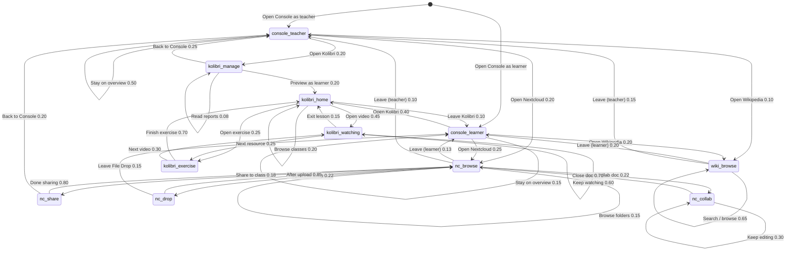

# Proposal: Multi-Engine Classroom

**Status:** Proposal draft for discussion — supersedes [`multi-engine-classroom-scenarios.md`](./multi-engine-classroom-scenarios.md) (2026-09-28).  
**Revision:** 2026-09-30c — Koen review: Markov chapter uses **states** / **actions** only; `console_teacher` rename; manage actions wired only inside `kolibri_manage`; Test Scenarios chapter separated; graph layout fixed for PDF.  
**Author:** Steve (Lead Bot), 2026-09-29 (rev. 2026-09-30c)  
**Audience:** Koen / IDEA leads  
**Companion capacity issue:** [idea#159](https://github.com/koenswings/idea/issues/159) — measure safe concurrent Kolibri video streams per instance

---

## Why this exists

Koen asked for a clean framing of **why a school runs more than one Engine**, how that looks with a small named fleet, what classroom scenarios matter, and how a Markov usage graph can drive realistic tests later.

This document is a **proposal draft**. Implementation, discovery protocol, auth, Playwright harnesses, fleet claim scripts, and Engine code changes are explicitly out of scope here (see final section). The Markov usage graph itself is a **concrete state/action model** for later tests — not labeled conceptual.

---

## Vision cite (this is already documented)

Prior drafting treated multi-Engine load distribution as an undocumented assumption. That was wrong.

It is already in the IDEA vision / solution description:

> All Appdockers on the same LAN will automatically find one another and when a new Appdocker device is added, the catalog of available apps is automatically extended with the apps docked onto the new device.  
> Performance is optimized by adding Appdockers and redistributing the apps over the Appdockers.

**Source:** [`agent-engine-dev/proposals/solution-description.md`](https://github.com/koenswings/agent-engine-dev/blob/main/proposals/solution-description.md)

Referenced from `idea/docs/grok-bot-setup.md` as the Engine vision and intent doc.

The multi-Engine classroom story below **extends** that vision into classroom roles and usage scenarios; it does not invent the load-spread principle.

---

## Why multi-engine (Koen's three reasons)

### 1. Distribute apps / load across Engines

The physical act is simple: **add an Engine** and **plug a demanding app into it**.

- Engines **autofind and connect** on the school LAN (vision: Appdockers find one another).
- The **integrated app list** looks the same whether the school has 1 Engine or N Engines.
- Users **never need to know** which Engine serves which app, or which Console they opened — any Console on any Engine can see the full picture.

This is the same physical metaphor as the rest of IDEA: capacity is improved by adding hardware and redistributing disks, not by asking teachers to become sysadmins.

### 2. Scale one app across Engines

Some apps hit a **per-instance / per-Pi limit**. Example: concurrent Kolibri video streams.

When one Kolibri instance cannot safely serve the whole class:

- Start a **second Kolibri instance** on another Engine.
- **Assign students** across instances (class A → instance 1, class B or half the cohort → instance 2).
- Same pattern later for Nextcloud video / heavy media.

Capacity baseline for Kolibri (**[idea#159](https://github.com/koenswings/idea/issues/159)**, idea01 Pi 5 / 4 GB). Multi-quality **planning** streams per instance (LAN measured SAFE ≥128 for all four; planning leaves Wi‑Fi / browser / Pi‑4 headroom):

| Quality | Resolution | Planning streams / instance |
|---|---|---:|
| low | 360p (640×360) | **64** |
| medium | 480p (854×480) | **32** |
| prior / typical lesson | 720p (1280×720) | **32** |
| high | 1080p (1920×1080) | **12** |

Default classroom planning figure remains **32 @ ~720p**; use 64 / 12 when content is known low / high. Load-test tooling: [agent-app-dev#9](https://github.com/koenswings/agent-app-dev/pull/9).

### 3. Per-class Engine with own instances — Console manages everything from anywhere

Each class (or teaching block) can have **its own Engine** hosting **class-only** app instances — e.g. Class 5A Nextcloud, Class 5A Kolibri content — without isolating operators.

**Any Console on any Engine** can manage **all apps across all Engines** simply. Teachers and operators are not trapped on “their” Pi’s Console; the mesh presents one school.

---

## Initial 3-engine setup (concrete sketch)

Design target first: a **named three-Engine school**, then generalise to N.

| Name | Role (story) | Typical disks / instances |
|---|---|---|
| **idea-A** | Shared / school golden hub | Shared apps everyone uses lightly: offline Wikipedia (Kiwix), school-wide Nextcloud “School Files”, maybe a small shared Kolibri channel library. Stable reference Engine. |
| **idea-B** | Class Engine — Grade 5A | Class-only Kolibri (Grade 5A lessons/quizzes), class Nextcloud (Group “Grade 5A”: view-only shares, File Drop, collaborative docs). |
| **idea-C** | Class Engine — Form 3 | Class-only Kolibri (Form 3), class Nextcloud (Group “Form 3”). When Grade 5A video load overflows idea-B, a second Kolibri instance for 5A can also land here (reason 2). |

**Classroom story:** Monde Primary (or any Marco site) starts with one Engine in the room. When video buffering and “limit to one group at a time” become the norm (field troubleshooting already warns about many devices), the school adds **idea-B** and **idea-C** as classroom Engines. Teachers still open any Console; students still join `appnet` and pick apps from one list. Operators dock demanding class disks onto B/C and leave shared services on A.

### Generalising to N

The three-Engine model is the **design target first**. N Engines later means:

- More class Engines (idea-D…), and/or
- More replicas of a hot app (extra Kolibri / Nextcloud instances) assigned by cohort.

Discovery, Console overview, and “users don’t pick an Engine” stay the same rules; only inventory and assignment grow.

---

## Initial scenario list (for discussion)

Discussable outcomes — **not** test scripts. Each item maps to Markov **states** / **actions** (and thus a Test Scenario) where the usage graph covers it; items that are operator-side or not yet in the graph are marked explicitly.

**Reason 1 — distribute apps / load**

- **S1 Add Engine, plug demanding app:** School adds idea-C; docks a heavy Kolibri (or Nextcloud media) disk onto it; app appears in every Console’s integrated list without renaming Consoles or teaching users a new hostname.
- **S2 Redistribute load:** Move or copy a demanding instance from idea-A onto idea-B so A stays responsive for shared services; app list and Open links remain coherent school-wide.
- **S3 Invisible Engine identity:** Student or teacher opens Console on idea-B or idea-C and sees the same app catalog/status as on idea-A.

**Reason 2 — scale one app**

- **S4 Kolibri stream ceiling:** Class exceeds safe concurrent streams on one instance → second Kolibri on another Engine; students assigned so neither instance exceeds the [idea#159](https://github.com/koenswings/idea/issues/159) planning N for that video quality (**64 @ 360p / 32 @ 480p–720p / 12 @ 1080p**).
- **S5 Nextcloud media twin:** Same idea for Nextcloud video / large file concurrent access — second instance + cohort assignment when one Pi is the bottleneck.

**Reason 3 — per-class Engine + Console-anywhere**

- **S6 Class-only content:** Grade 5A Kolibri/Nextcloud live only on idea-B; Form 3 only on idea-C; shared Wikipedia (Kiwix) stays on idea-A.
- **S7 Manage from the other room:** Teacher or operator on idea-A’s Console starts/stops, checks status, or prepares disks for apps that run on idea-B and idea-C.
- **S8 Cross-class share without moving rooms:** Teacher on idea-B Console shares a Nextcloud folder with Form 3’s group whose home instance is on idea-C (management is school-wide; data placement follows class Engines).

**Usage / field-aligned (Marco)**

- **S9 Kolibri teaching cycle:** Teacher builds class → enrolls learners → assigns lesson with videos → students watch/complete → quiz → teacher reads Reports (from Marco Kolibri presentations).
- **S10 Nextcloud classroom workflow:** Class groups; view-only material share; File Drop homework; collaborative doc; Talk for support (from Marco Nextcloud presentations). Field note: many devices → performance drop → prefer one group at a time unless multi-Engine capacity is in play.
- **S11 Offline Wikipedia:** Learner (or teacher) opens Kiwix from Console (idea-A), searches/browses articles, dwells, leaves.

**Coverage vs this usage graph** (after rewrite): see [Initial scenarios ↔ Markov coverage](#initial-scenarios--markov-coverage) at the end of the Markov chapter.

---

## Markov usage graph

### Idea

- **States** = usage places (what a person is doing in an app or Console), not disk-dock hardware states alone.
- **Actions** = labeled transitions with probabilities (initial guesses until field frequencies exist). Action names are Intent-style (e.g. **Open Kolibri**, **Stay on overview**, **Create class**) — no scenario IDs and no `*` wildcards on the graph.
- A **real test** = a **random walk** on this graph for some duration or step count. Each action may reference a **Test Scenario** by the same Intent name (forward link only).
- Test instances of each app ship with **preloaded content**; legal actions are derived from that content (e.g. which lessons/videos exist, which folders/groups exist).
- Incorporate Marco’s file-sharing (students/teachers) and Kolibri classroom management, plus content-access actions for Kolibri, Nextcloud, and offline Wikipedia (Kiwix on idea-A).

**Operator Console Markov (separate):** managing/altering the multi-Engine setup (login, NetworkTree, dock/eject, install, start/stop, copy/move, Files/Backup/erase, operators, settings) lives in sibling [`multi-engine-operator.md`](./multi-engine-operator.md) with graph files `multi-engine-operator-markov.{dot,png,svg}`. This classroom usage graph stays usage-only.

### States (final list)

| State | Who | Colour | Meaning |
|---|---|---|---|
| `console_teacher` | Teacher | blue | School-wide Engine/app overview; opens apps as coach |
| `console_learner` | Student | mid-blue | Same unified app list; student opens an app to work |
| `kolibri_home` | Student or teacher | green | Kolibri signed in, Learn |
| `kolibri_watching` | Student | green | Playing an assigned lesson video |
| `kolibri_exercise` | Student | green | Doing an exercise in a lesson |
| `kolibri_manage` | Teacher | green (dark) | Classes, lessons, quizzes, Reports |
| `nc_browse` | Student or teacher | yellow | Nextcloud Files browse |
| `nc_share` | Teacher | yellow (dark) | View-only share to a class group |
| `nc_drop` | Student | yellow (dark) | Uploading to a File Drop |
| `nc_collab` | Student | yellow (dark) | Editing a shared collaborative doc |
| `wiki_browse` | Student or teacher | purple | Kiwix / offline Wikipedia on idea-A |

### Graph

The full state/action set is dense for one letter page, so the usage graph is shown as **two diagrams** (same states and actions; Console repeated as the shared hub). Combined source also kept: [`multi-engine-markov.dot`](./multi-engine-markov.dot) → [`multi-engine-markov.png`](./multi-engine-markov.png).

**Diagram A — Console + Kolibri** ([`multi-engine-markov-kolibri.dot`](./multi-engine-markov-kolibri.dot)):

**Diagram B — Console + Nextcloud + Wikipedia** ([`multi-engine-markov-files.dot`](./multi-engine-markov-files.dot)):

Same graph as Mermaid (editable)

### How states map to tests

Each Markov **state** is a coarse place someone can be. An **action** leaves that place for another (or stays via a self-loop). Inside a state, a real test does **not** invent a new state for every mouse click — that would explode the graph. Instead the harness expands the action into an **ordered UI script** (login → sidebar → form → Save) taken from Marco’s classroom presentations. Create an extra state only when the action changes **who** is acting, **which app surface** they are on, or **resource pressure** (e.g. video stream vs browse). Probabilities below are still placeholders.

**Critical wiring rule:** actions that belong to an app state must **not** be edges from Console entry states. From `console_teacher` you may only **Open Kolibri** (enter `kolibri_manage`), **Open Nextcloud**, **Open Wikipedia**, or **Stay on overview**. Coaching actions (**Create class**, **Enroll learners**, …) exist only as actions **inside** `kolibri_manage`. Same pattern for Nextcloud/Wikipedia.

UI labels match Marco’s field decks and quick-reference cards (`kolibri-classroom-setup`, `kolibri-lessons-and-quizzes`, `nextcloud-user-registration`, `nextcloud-classroom-use`, `quick-reference-kolibri.md`, `quick-reference-nextcloud.md`) — confirmed with Marco 2026-09-29. Console steps assume the school-wide app overview any Engine’s Console shows (reason 1 / 3). Exact selectors belong in the Playwright harness later.

---

### State: `console_teacher`

The teacher opens a browser on the school LAN (or already has Console open) and lands on the **Engine / apps overview**: Engines present, apps docked, status. They are inspecting what is available on the network, not choosing a “home” Pi. **Operator-specific Console actions** (dock/eject disks, start/stop instances, install/move/backup/erase, operators/settings) are **not** on this usage graph — see [`multi-engine-operator.md`](./multi-engine-operator.md).

**Concrete UI (when a walk starts here):**

1. Open Chromium (or any browser) on the school LAN → Console for any Engine (field habit today: hostname like `engine-1.local`; multi-Engine story: idea-A / idea-B / idea-C Consoles must be equivalent).
2. Scan the integrated app list — apps show **Running** (etc.) — and Engine rows.
3. Optionally refresh / wait while students work.

**Actions from this state:**

| Action | ≈p | Destination | Test Scenario |
|---|---:|---|---|
| **Open Kolibri** | 0.20 | `kolibri_manage` | [Open Kolibri as teacher](#open-kolibri-as-teacher) |
| **Open Nextcloud** | 0.20 | `nc_browse` | [Open Nextcloud as teacher](#open-nextcloud-as-teacher) |
| **Open Wikipedia** | 0.10 | `wiki_browse` | [Browse offline Wikipedia](#browse-offline-wikipedia) |
| **Stay on overview** | 0.50 | `console_teacher` | [Stay on teacher overview](#stay-on-teacher-overview) |

*Test note:* opening an app is one action; the login form that follows belongs to the destination state’s script, not a separate Console state.

---

### State: `console_learner`

A student opens Console, sees the **same unified app list** as teachers (reason 1 / S3), and opens an app to start work. They are not managing Engines — just picking Kolibri, Nextcloud, or Wikipedia.

**Concrete UI:**

1. Open browser on school LAN → any Engine’s Console (idea-A / B / C equivalent).
2. See integrated app list (Kolibri class instance, Nextcloud class instance, Kiwix on idea-A, …).
3. Click one app → destination state’s login / home script runs.

**Actions from this state:**

| Action | ≈p | Destination | Test Scenario |
|---|---:|---|---|
| **Open Kolibri** | 0.40 | `kolibri_home` | [Student opens Console and starts work](#student-opens-console-and-starts-work) |
| **Open Nextcloud** | 0.25 | `nc_browse` | [Student opens Console and starts work](#student-opens-console-and-starts-work) |
| **Open Wikipedia** | 0.20 | `wiki_browse` | [Browse offline Wikipedia](#browse-offline-wikipedia) |
| **Stay on overview** | 0.15 | `console_learner` | [Stay on learner overview](#stay-on-learner-overview) |

---

### State: `kolibri_manage`

The teacher is on Kolibri’s **facility / coaching** side (Classes, Lessons, Quizzes, Reports) — not the learner Learn tab. Coaching Intents are **actions inside this state** (self-loops or stay-and-act), not edges from `console_teacher`.

**Entry UI (always, if not already signed in):**

1. Kolibri login page → type **teacher username** and **password** → Sign in.
2. Land on teacher home / facility UI (left sidebar visible).

**Actions from this state:**

| Action | ≈p | Destination | Test Scenario |
|---|---:|---|---|
| **Create class** | 0.12 | `kolibri_manage` | [Create class](#create-class) |
| **Enroll learners** | 0.12 | `kolibri_manage` | [Enroll learners](#enroll-learners) |
| **Build lesson** | 0.14 | `kolibri_manage` | [Build lesson](#build-lesson) |
| **Create quiz** | 0.09 | `kolibri_manage` | [Create quiz](#create-quiz) |
| **Read reports** | 0.08 | `kolibri_manage` | [Read reports](#read-reports) |
| **Preview as learner** | 0.20 | `kolibri_home` | [Preview as learner](#preview-as-learner) |
| **Back to Console** | 0.25 | `console_teacher` | — |

**Typical clicks (Marco) for coaching actions:**

| Action | Clicks |
|---|---|
| Create class | Left sidebar **Classes** → **+ New class** → type name (e.g. `Grade 5A`) → **Save** |
| Enroll learners | Open class → **Learners** tab → **Enroll learners** → tick students → **Confirm** |
| Build lesson | Class → **Lessons** → **+ New lesson** (or open existing) → name → **Add resources** → pick video + exercise from **Library / Channels** → **Save** → set **Recipients** to the class → toggle **Visible** |
| Create quiz | Class → **Quizzes** → **+ New quiz** → **Add questions** from exercise channels → set count → **Finish** → toggle **Active** |
| Read reports | Left sidebar **Reports** → **Classes** → class → **Lessons** or **Quizzes** → open item → scan learner table |

Composite walks (Teacher prepares Grade 5A lesson, Quiz and reports) chain several of these actions — see [Test Scenarios](#test-scenarios).

---

### State: `kolibri_home`

A student (or teacher previewing) is on the **learner** side after login.

**Entry UI:**

1. Kolibri login → **learner username** / **password** → Sign in.
2. Top menu **Learn**.
3. See enrolled classes → open class → see assigned **Lessons** (and **Quizzes** if active).

**Actions from this state:**

| Action | ≈p | Destination | Test Scenario |
|---|---:|---|---|
| **Open video** | 0.45 | `kolibri_watching` | [Student completes assigned lesson](#student-completes-assigned-lesson) |
| **Open exercise** | 0.25 | `kolibri_exercise` | [Student completes assigned lesson](#student-completes-assigned-lesson) |
| **Browse classes** | 0.20 | `kolibri_home` | — |
| **Leave Kolibri** | 0.10 | `console_learner` | — |

---

### State: `kolibri_watching`

Capacity-sensitive state (reason 2 / idea#159). Many concurrent walkers here is what forces a second Kolibri instance. Planning N depends on video quality: **64 @ 360p / 32 @ 480p–720p / 12 @ 1080p** (idea01 Pi 5 / 4 GB).

**UI while here:** video playing in-browser (no download); student may pause/seek; Kolibri records progress in the background.

**Actions from this state:**

| Action | ≈p | Destination | Test Scenario |
|---|---:|---|---|
| **Keep watching** | 0.60 | `kolibri_watching` | [Class hits stream ceiling](#class-hits-stream-ceiling) |
| **Next resource** | 0.25 | `kolibri_exercise` | [Student completes assigned lesson](#student-completes-assigned-lesson) |
| **Exit lesson** | 0.15 | `kolibri_home` | — |

---

### State: `kolibri_exercise`

**UI:** exercise questions with immediate feedback; student answers and submits; Kolibri records started / completed / score.

**Actions from this state:**

| Action | ≈p | Destination | Test Scenario |
|---|---:|---|---|
| **Finish exercise** | 0.70 | `kolibri_home` | [Student completes assigned lesson](#student-completes-assigned-lesson) |
| **Next video** | 0.30 | `kolibri_watching` | — |

*(Quiz-taking can reuse this state or stay inside `kolibri_home` → open **Quizzes** → **Start** → answer → submit; if quizzes become a distinct load profile later, split a `kolibri_quiz` state then. Mapped in [Quiz and reports](#quiz-and-reports).)*

---

### State: `nc_browse`

Hub for Marco’s classroom file workflow. **Files** app is the central UI (manual p.12 in Marco’s deck).

**Entry UI:**

1. Nextcloud login → username / password (teacher via `console_teacher`, student via `console_learner`).
2. Open **Files** (default home).
3. Browse folders (class materials, Drop Zone, school shares).

**Actions from this state:**

| Action | ≈p | Destination | Test Scenario |
|---|---:|---|---|
| **Share to class** | 0.18 | `nc_share` | [View-only share to class group](#view-only-share-to-class-group) |
| **Open File Drop** | 0.22 | `nc_drop` | [File Drop homework upload](#file-drop-homework-upload) |
| **Open collab doc** | 0.22 | `nc_collab` | [Collaborative document](#collaborative-document) |
| **Browse folders** | 0.15 | `nc_browse` | — |
| **Leave (learner)** | 0.13 | `console_learner` | — |
| **Leave (teacher)** | 0.10 | `console_teacher` | — |

---

### State: `nc_share`

**UI script (view-only materials):**

1. In Files, hover the folder (e.g. `Videos to watch`).
2. Click **Share** (person + icon).
3. Under **Internal shares**, type class group name (e.g. `Class2A` / `Grade 5A`) → select group.
4. Set permission **View only**.

Group must already exist (Accounts → Groups → **+** — often a preload step, not a graph state).

**Actions from this state:**

| Action | ≈p | Destination | Test Scenario |
|---|---:|---|---|
| **Done sharing** | 0.80 | `nc_browse` | [View-only share to class group](#view-only-share-to-class-group) |
| **Back to Console** | 0.20 | `console_teacher` | — |

---

### State: `nc_drop`

**Teacher prep (often preload, or expand inside a long `nc_browse` visit):** Share icon on `Drop Zone` → **+** beside Create public link → **File request** → copy link (clipboard) → optionally paste into Talk.

**Student UI (this state):**

1. Open the File Drop / file-request link.
2. See empty “Click or drop to upload” UI (cannot see others’ files).
3. Choose file(s) / drop → upload completes.

**Actions from this state:**

| Action | ≈p | Destination | Test Scenario |
|---|---:|---|---|
| **After upload** | 0.85 | `nc_browse` | [File Drop homework upload](#file-drop-homework-upload) |
| **Leave File Drop** | 0.15 | `console_learner` | — |

---

### State: `nc_collab`

**UI:**

1. (Teacher create, often preload:) Files → **+ New** → **New Document** → name → pick template → Share with group → **Allow editing**.
2. Student: open shared file from Files → editor loads; peer **avatars** top-right; cursors move live.

**Actions from this state:**

| Action | ≈p | Destination | Test Scenario |
|---|---:|---|---|
| **Close doc** | 0.70 | `nc_browse` | [Collaborative document](#collaborative-document) |
| **Keep editing** | 0.30 | `nc_collab` | [Collaborative document](#collaborative-document) |

---

### State: `wiki_browse`

Shared service on **idea-A** (school golden hub). Learners and teachers reach it from Console. Light load relative to Kolibri video — still a first-class classroom usage state.

**Entry UI:**

1. From Console, click **Kiwix** / Wikipedia app (Running on idea-A).
2. Kiwix library / Wikipedia ZIM opens in the browser.
3. Use search box or browse categories / random article.

**Actions from this state:**

| Action | ≈p | Destination | Test Scenario |
|---|---:|---|---|
| **Search / browse** | 0.65 | `wiki_browse` | [Browse offline Wikipedia](#browse-offline-wikipedia) |
| **Leave (learner)** | 0.20 | `console_learner` | — |
| **Leave (teacher)** | 0.15 | `console_teacher` | — |

---

### Initial scenarios ↔ Markov coverage

| Initial item | In usage graph? | States / actions | Test Scenario(s) |
|---|---|---|---|
| **S1** Add Engine, plug demanding app | **Partial** — usage asserts catalog equality; dock/install is operator | `console_teacher` / `console_learner` **Stay on overview**, **Open \*** | [Add Engine app appears everywhere](#add-engine-app-appears-everywhere); dock/install → operator graph |
| **S2** Redistribute load | **Not in usage graph yet** — copy/move is operator Console | — | Operator: Copy app / Move app ([`multi-engine-operator.md`](./multi-engine-operator.md)) |
| **S3** Invisible Engine identity | **Yes** | `console_teacher`, `console_learner` + open-app actions from any Engine’s Console | [Stay on teacher overview](#stay-on-teacher-overview), [Student opens Console and starts work](#student-opens-console-and-starts-work) |
| **S4** Kolibri stream ceiling | **Yes** (usage dwell); second instance start is operator | `kolibri_watching` **Keep watching** (N walkers) | [Class hits stream ceiling](#class-hits-stream-ceiling) |
| **S5** Nextcloud media twin | **Not in usage graph yet** — no Nextcloud video-watching state; twin instance is operator | — | Aspirational until NC media dwell state is designed; operator install/start for second instance |
| **S6** Class-only content | **Yes** (placement story; same states, class Engines) | Open Kolibri/Nextcloud/Wikipedia from Console toward class vs shared instances | [Student opens Console and starts work](#student-opens-console-and-starts-work), [Browse offline Wikipedia](#browse-offline-wikipedia) |
| **S7** Manage from the other room | **Partial** — teacher open-app from idea-A Console **yes**; operator start/stop/disk **operator graph** | `console_teacher` **Open Nextcloud** / **Open Kolibri** while app runs on B/C | [Manage class Nextcloud from another room](#manage-class-nextcloud-from-another-room); operator start/stop elsewhere |
| **S8** Cross-class share | **Yes** | `nc_browse` **Share to class** → `nc_share` | [View-only share to class group](#view-only-share-to-class-group) |
| **S9** Kolibri teaching cycle | **Yes** | `kolibri_manage` coaching actions + learner path | [Create class](#create-class) … [Read reports](#read-reports), [Student completes assigned lesson](#student-completes-assigned-lesson), [Quiz and reports](#quiz-and-reports) |
| **S10** Nextcloud classroom workflow | **Yes** (Talk optional / light) | `nc_browse`, `nc_share`, `nc_drop`, `nc_collab` | [View-only share…](#view-only-share-to-class-group), [File Drop…](#file-drop-homework-upload), [Collaborative document](#collaborative-document), [Teacher share File Drop and collab](#teacher-share-file-drop-and-collab) |
| **S11** Offline Wikipedia | **Yes** | `wiki_browse` **Search / browse** | [Browse offline Wikipedia](#browse-offline-wikipedia) |

---

## Test Scenarios

These are **test scripts**, not extra Markov states. Each has a single consistent Intent-style name (no IDs like `L-entry` / `K-manage-class`). Describe what the scenario does. Markov actions link **forward** to these names; this chapter does **not** re-describe the Markov graph.

Preload content so every click target exists.

### Student opens Console and starts work

**Role:** student · **Engines:** any Console; destination app may be on idea-A (Kiwix), idea-B (class Kolibri/Nextcloud), etc.

1. Browser → Console on school LAN (idea-A / B / C — same catalog).
2. Scan unified app list (Running apps).
3. Click **Kolibri** → learner login → land on Learn, **or**
4. Click **Nextcloud** → student login → land on Files, **or**
5. Click **Kiwix / Wikipedia** → land on Kiwix library.

### Stay on teacher overview

**Role:** teacher · Dwell on school-wide Console overview; refresh while students work; assert catalog visible without opening an app.

### Stay on learner overview

**Role:** student · Dwell on unified app list without opening an app yet.

### Open Kolibri as teacher

**Role:** teacher

1. From Console overview → click Kolibri (Running) → teacher login → facility / coaching UI.
2. Ready for coaching actions (Create class, Enroll learners, …).

### Open Nextcloud as teacher

**Role:** teacher

1. From Console overview → click Nextcloud → teacher login → Files.

### Create class

**Role:** teacher

1. In Kolibri coaching: left sidebar **Classes** → **+ New class** → type name (e.g. `Grade 5A`) → **Save**.

### Enroll learners

**Role:** teacher · *Requires class (preload or Create class).*

1. Open class → **Learners** tab → **Enroll learners** → tick students → **Confirm**.

### Build lesson

**Role:** teacher

1. Class → **Lessons** → **+ New lesson** (or open existing) → name (e.g. `Week 1: Fractions Introduction`).
2. **Add resources** → Library/Channels → select **1 video** + **1 exercise** → **Save**.
3. Confirm **Recipients** = class → toggle lesson **Visible**.

### Create quiz

**Role:** teacher

1. Class → **Quizzes** → **+ New quiz** → **Add questions** from exercise channel → set count (e.g. 5–10) → **Finish** → toggle **Active**.

### Read reports

**Role:** teacher

1. Left sidebar **Reports** → **Classes** → class → **Lessons** or **Quizzes** → open item → scan learner table (scores / completion).

### Preview as learner

**Role:** teacher

1. From coaching UI, open learner view / Learn (or sign in as a test learner).
2. See assigned lessons as a student would.

### Teacher prepares Grade 5A lesson

**Role:** teacher · **Engines:** Console on idea-A or idea-B; Kolibri on idea-B.  
**Composite:** Create class → Enroll learners → Build lesson (optional Read reports).

1. Open Kolibri as teacher for Grade 5A.
2. Run Create class *(skip if class preloaded)*.
3. Run Enroll learners.
4. Run Build lesson (video + exercise, Visible).
5. Optional: Read reports *(empty progress yet)*.
6. Either stay coaching, Preview as learner, or Back to Console.

### Student completes assigned lesson

**Role:** student · **Engine:** same Kolibri as teacher prep.

1. Student opens Console and starts work → Open Kolibri → login learner → Learn.
2. Open `Grade 5A` → open assigned lesson.
3. Click video resource → play through (or paced load-test equivalent).
4. Click exercise resource → answer items → submit.
5. Return to Learn / class, or leave to Console.

### Class hits stream ceiling

**Setup:** lesson with a video pre-visible; idea#159 planning N by quality — **64 @ 360p / 32 @ 480p–720p / 12 @ 1080p** (idea01 Pi 5 / 4 GB).  
**Concurrency:** N walkers dwell via **Keep watching** (still one state — concurrency is walker count).

1. N student walkers each reach the video player and **Keep watching**.
2. If N > planning N for that quality on idea-B’s Kolibri: start second Kolibri on idea-C *(operator)*; assign half the walkers to each instance (same lesson content shape).
3. Console on idea-A still lists both apps; teachers do not pick Engine by hostname (S3).

### Quiz and reports

1. Teacher: Create quiz (Active).
2. Students: class → **Quizzes** → **Start** → answer → submit *(exercise-like load or under home until a quiz state is justified)*.
3. Teacher: Read reports on that quiz → read scores / drill into a learner.

### View-only share to class group

**Role:** teacher

1. In Files, hover folder (e.g. `Videos to watch`) → **Share**.
2. Internal share to class group (e.g. `Grade 5A`) → permission **View only**.
3. Done → back to Files browse (or leave to Console).

### File Drop homework upload

**Role:** student (teacher prep optional)

1. *(Teacher prep / preload:)* `Drop Zone` → Share → public link **+** → **File request** → copy link.
2. Student: open File Drop link → upload file(s).
3. After upload → Files browse or leave to Console.

### Collaborative document

**Role:** student (teacher create often preload)

1. *(Teacher create / preload:)* **+ New** → **New Document** → share group with **Allow editing**.
2. Student: open shared file from Files → edit live → close → Files browse.

### Teacher share File Drop and collab

**Role:** teacher then students · **Engine:** class Nextcloud on idea-B.  
**Composite** for S10.

1. Open Nextcloud as teacher → Files.
2. *(Preload or once)* Profile → **Accounts** → Groups **+** → `Grade 5A`; **+ New account** students into that group.
3. View-only share on `Videos to watch`.
4. Prepare File Drop on `Drop Zone` *(Talk optional)*.
5. Create collab doc + share with editing.
6. Students: open shared folder; File Drop homework upload; Collaborative document.

### Manage class Nextcloud from another room

**Asserts reason 3 / S7 (teacher side).**

1. Teacher opens **Console on idea-A** while Grade 5A Nextcloud runs on idea-B.
2. Open that Nextcloud from the integrated list → same share / Files steps.
3. Assert: management works without walking to idea-B’s physical Console.

### Browse offline Wikipedia

**Role:** learner or teacher · **Engine:** Kiwix on idea-A.

1. Console → Open **Kiwix / Wikipedia**.
2. Search box: type a topic → open an article.
3. Follow internal links / browse categories; dwell reading.
4. Leave → matching Console (learner or teacher).

### Add Engine app appears everywhere

1. Operator on idea-A Console: note app list. *(Operator dock/start actions are **not** modelled in this usage graph — see [`multi-engine-operator.md`](./multi-engine-operator.md).)*
2. idea-C comes online with a docked Kolibri/Nextcloud (hardware/Ops outside this graph).
3. Refresh Console on idea-A **and** idea-B **and** a learner Console view: new app row present → Open works → enters `kolibri_manage` / `kolibri_home` / `nc_browse` as usual.
4. Assertion is catalog equality across Consoles (S1 usage side).

### How a walk becomes a test

1. Preload Kolibri with a class, enrolled learners, and a lesson that includes at least one video and one exercise (Marco Week 1–2 content shape).
2. Preload Nextcloud with class groups, a view-only materials folder, a File Drop folder, and one collaborative document (Marco classroom-use shape).
3. Preload / confirm Kiwix ZIM available on idea-A.
4. Sample a walk: e.g. `console_learner → kolibri_home → … → kolibri_watching` (N concurrent walkers = N “students” hitting video — bounded by idea#159 quality table), or `console_teacher → kolibri_manage` for coaching scripts.
5. Multi-Engine walks assign walkers to instances on idea-B vs idea-C when testing reason 2; Console actions may start on any Engine’s Console (reason 3).

Full YAML / runner design stays with the existing Markov duration-tests proposal ([`duration-tests.md`](./duration-tests.md), idea#85) when implementation starts — not here.

---

## Sources consulted

| Source | Use |
|---|---|
| `agent-engine-dev/proposals/solution-description.md` | Vision: autofind Appdockers; add Appdockers + redistribute apps for performance |
| [`multi-engine-classroom-scenarios.md`](./multi-engine-classroom-scenarios.md) (+ `.pdf`) | Prior draft — **superseded** (implementation-heavy; incorrectly framed multi-Engine as undocumented) |
| Marco / programme-manager: `presentations/kolibri-classroom-setup`, `kolibri-lessons-and-quizzes`, `nextcloud-user-registration`, `nextcloud-classroom-use`; `reference-cards/quick-reference-kolibri.md`, `quick-reference-nextcloud.md` | Exact UI labels for Markov story + scenarios (Classes, Learn, Share, File request, …) |
| Marco field: `field/troubleshooting-guide.md` (via prior draft + local copy) | Many devices → performance drop; limit one group at a time |
| [`duration-tests.md`](./duration-tests.md) | Existing Markov duration-test design (implementation later) |
| idea#159 (+ multi-quality comment) | Kolibri concurrent stream capacity — planning 64/32/32/12 by quality |

---

## Out of scope for now

Flagged for later proposals / issues — **not** designed here:

- Implementation of multi-Engine discovery / peering changes
- Auth, operator roles, and student-assignment UX between Kolibri instances
- Playwright / Console e2e harness, fleet claim scripts, fixture disks
- Exact Engine APIs for “assign students across instances”
- Hardware power-cut, USB disk carry automation, golden-Pi rules
- PDF/print packaging of field guides
- ~~**Operator Console Markov graph**~~ — **done as sibling:** [`multi-engine-operator.md`](./multi-engine-operator.md) + `multi-engine-operator-markov.*` (kept separate from this usage graph)

When Koen agrees the shape, Steve can split follow-ups (Engine / Console / App Dev / Ops) without baking premature design into this doc.

---

## Ask of Koen

1. Confirm the **three reasons** match intent.  
2. Confirm **idea-A / idea-B / idea-C** as the named 3-Engine story (or rename).  
3. Confirm **`console_teacher`** + **`console_learner`** + **`wiki_browse`** and coaching actions only inside **`kolibri_manage`**.  
4. Prioritise which of S1–S11 to deepen next; review the separate Operator Console Markov ([`multi-engine-operator.md`](./multi-engine-operator.md)).  
5. Treat idea#159 quality table (64/32/32/12) as the capacity gate for reason-2 scenarios.
