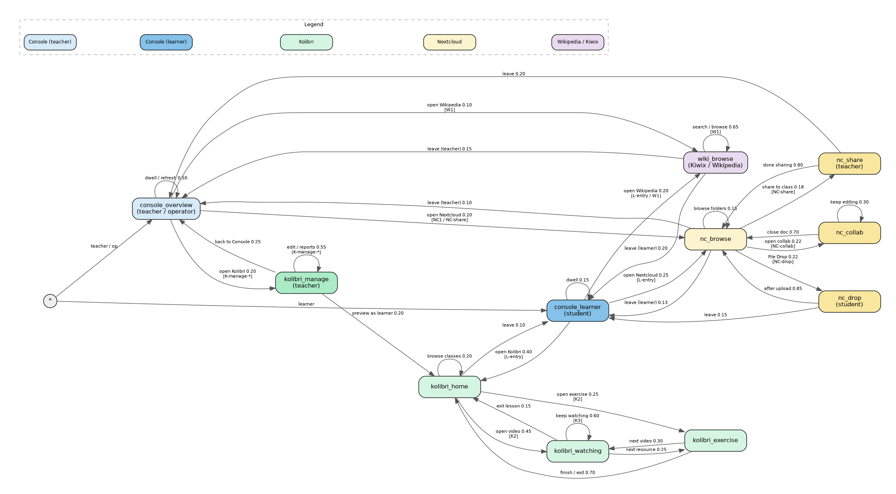
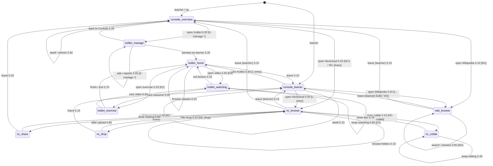

# Proposal: Multi-Engine Classroom (conceptual)

**Status:** Conceptual draft for discussion — supersedes [`multi-engine-classroom-scenarios.md`](./multi-engine-classroom-scenarios.md) (2026-09-28).  
**Revision:** 2026-09-30b — pointer to separate Operator Console Markov ([`multi-engine-operator.md`](./multi-engine-operator.md)). Usage Markov (Kolibri / Nextcloud / Wikipedia) unchanged.  
**Author:** Steve (Lead Bot), 2026-09-29 (rev. 2026-09-30b)  
**Audience:** Koen / IDEA leads  
**Companion capacity issue:** [idea#159](https://github.com/koenswings/idea/issues/159) — measure safe concurrent Kolibri video streams per instance

---

## Why this exists

Koen asked for a clean conceptual framing of **why a school runs more than one Engine**, how that looks with a small named fleet, what classroom scenarios matter, and how a Markov usage graph can drive realistic tests later.

This document stays **conceptual**. Implementation, discovery protocol, auth, Playwright harnesses, fleet claim scripts, and Engine code changes are explicitly out of scope here (see final section).

---

## Vision cite (this is already documented)

Prior drafting treated multi-Engine load distribution as an undocumented assumption. That was wrong.

It is already in the IDEA vision / solution description:

> All Appdockers on the same LAN will automatically find one another and when a new Appdocker device is added, the catalog of available apps is automatically extended with the apps docked onto the new device.  
> Performance is optimized by adding Appdockers and redistributing the apps over the Appdockers.

**Source:** [`agent-engine-dev/proposals/solution-description.md`](https://github.com/koenswings/agent-engine-dev/blob/main/proposals/solution-description.md)  
(local clones also under e.g. `/workspace/research/agent-engine-dev/proposals/solution-description.md`)

Referenced from `idea/docs/grok-bot-setup.md` as the Engine vision and intent doc.

The multi-Engine classroom story below **extends** that vision into classroom roles and usage scenarios; it does not invent the load-spread principle.

---

## Why multi-engine (Koen's three reasons)

### 1. Distribute apps / load across Engines

The physical act is simple: **add an Engine** and **plug a demanding app into it**.

- Engines **autofind and connect** on the school LAN (vision: Appdockers find one another).
- The **integrated app list** looks the same whether the school has 1 Engine or N Engines.
- Users **never need to know** which Engine serves which app, or which Console they opened — any Console on any Engine can see the full picture.

This is the same physical metaphor as the rest of IDEA: capacity is improved by adding hardware and redistributing disks, not by asking teachers to become sysadmins.

### 2. Scale one app across Engines

Some apps hit a **per-instance / per-Pi limit**. Example: concurrent Kolibri video streams.

When one Kolibri instance cannot safely serve the whole class:

- Start a **second Kolibri instance** on another Engine.
- **Assign students** across instances (class A → instance 1, class B or half the cohort → instance 2).
- Same pattern later for Nextcloud video / heavy media.

Capacity baseline for Kolibri (**[idea#159](https://github.com/koenswings/idea/issues/159)**, idea01 Pi 5 / 4 GB). Multi-quality **planning** streams per instance (LAN measured SAFE ≥128 for all four; planning leaves Wi‑Fi / browser / Pi‑4 headroom):

| Quality | Resolution | Planning streams / instance |
|---|---|---:|
| low | 360p (640×360) | **64** |
| medium | 480p (854×480) | **32** |
| prior / typical lesson | 720p (1280×720) | **32** |
| high | 1080p (1920×1080) | **12** |

Default classroom planning figure remains **32 @ ~720p**; use 64 / 12 when content is known low / high. Load-test tooling: [agent-app-dev#9](https://github.com/koenswings/agent-app-dev/pull/9).

### 3. Per-class Engine with own instances — Console manages everything from anywhere

Each class (or teaching block) can have **its own Engine** hosting **class-only** app instances — e.g. Class 5A Nextcloud, Class 5A Kolibri content — without isolating operators.

**Any Console on any Engine** can manage **all apps across all Engines** simply. Teachers and operators are not trapped on “their” Pi’s Console; the mesh presents one school.

---

## Initial 3-engine setup (concrete sketch)

Design target first: a **named three-Engine school**, then generalise to N.

| Name | Role (story) | Typical disks / instances |
|---|---|---|
| **idea-A** | Shared / school golden hub | Shared apps everyone uses lightly: offline Wikipedia (Kiwix), school-wide Nextcloud “School Files”, maybe a small shared Kolibri channel library. Stable reference Engine. |
| **idea-B** | Class Engine — Grade 5A | Class-only Kolibri (Grade 5A lessons/quizzes), class Nextcloud (Group “Grade 5A”: view-only shares, File Drop, collaborative docs). |
| **idea-C** | Class Engine — Form 3 | Class-only Kolibri (Form 3), class Nextcloud (Group “Form 3”). When Grade 5A video load overflows idea-B, a second Kolibri instance for 5A can also land here (reason 2). |

**Classroom story:** Monde Primary (or any Marco site) starts with one Engine in the room. When video buffering and “limit to one group at a time” become the norm (field troubleshooting already warns about many devices), the school adds **idea-B** and **idea-C** as classroom Engines. Teachers still open any Console; students still join `appnet` and pick apps from one list. Operators dock demanding class disks onto B/C and leave shared services on A.

### Generalising to N

The three-Engine model is the **design target first**. N Engines later means:

- More class Engines (idea-D…), and/or
- More replicas of a hot app (extra Kolibri / Nextcloud instances) assigned by cohort.

Discovery, Console overview, and “users don’t pick an Engine” stay the same rules; only inventory and assignment grow.

---

## Initial scenario list (for discussion)

Discussable outcomes — **not** test scripts. Named UI scripts that expand Markov nodes live under [Detailed UI scenarios](#detailed-ui-scenarios-expand-nodes-into-clicks).

**Reason 1 — distribute apps / load**

- **S1 Add Engine, plug demanding app:** School adds idea-C; docks a heavy Kolibri (or Nextcloud media) disk onto it; app appears in every Console’s integrated list without renaming Consoles or teaching users a new hostname.
- **S2 Redistribute load:** Move or copy a demanding instance from idea-A onto idea-B so A stays responsive for shared services; app list and Open links remain coherent school-wide.
- **S3 Invisible Engine identity:** Student or teacher opens Console on idea-B or idea-C and sees the same app catalog/status as on idea-A.

**Reason 2 — scale one app**

- **S4 Kolibri stream ceiling:** Class exceeds safe concurrent streams on one instance → second Kolibri on another Engine; students assigned so neither instance exceeds the [idea#159](https://github.com/koenswings/idea/issues/159) planning N for that video quality (**64 @ 360p / 32 @ 480p–720p / 12 @ 1080p**).
- **S5 Nextcloud media twin:** Same idea for Nextcloud video / large file concurrent access — second instance + cohort assignment when one Pi is the bottleneck.

**Reason 3 — per-class Engine + Console-anywhere**

- **S6 Class-only content:** Grade 5A Kolibri/Nextcloud live only on idea-B; Form 3 only on idea-C; shared Wikipedia (Kiwix) stays on idea-A.
- **S7 Manage from the other room:** Teacher or operator on idea-A’s Console starts/stops, checks status, or prepares disks for apps that run on idea-B and idea-C.
- **S8 Cross-class share without moving rooms:** Teacher on idea-B Console shares a Nextcloud folder with Form 3’s group whose home instance is on idea-C (management is school-wide; data placement follows class Engines).

**Usage / field-aligned (Marco)**

- **S9 Kolibri teaching cycle:** Teacher builds class → enrolls learners → assigns lesson with videos → students watch/complete → quiz → teacher reads Reports (from Marco Kolibri presentations). Scripts: `K-manage-*`, `K2`, `K4`.
- **S10 Nextcloud classroom workflow:** Class groups; view-only material share; File Drop homework; collaborative doc; Talk for support (from Marco Nextcloud presentations). Scripts: `NC-share`, `NC-drop`, `NC-collab`, `NC1`/`NC2`. Field note: many devices → performance drop → prefer one group at a time unless multi-Engine capacity is in play.
- **S11 Offline Wikipedia:** Learner (or teacher) opens Kiwix from Console (idea-A), searches/browses articles, dwells, leaves. Script: `W1`.

---

## Markov usage graph (conceptual)

### Idea

- **Nodes** = usage states (what a person is doing in an app or Console), not disk-dock hardware states alone.
- **Transitions** = actions with probabilities (initial guesses until field frequencies exist). Compact **scenario IDs** on edges (e.g. `[L-entry]`, `[K-manage-*]`, `[W1]`) mark where a transition is the **start** of a named UI script; the harness expands the destination node into ordered clicks.
- A **real test scenario** = a **random walk** on this graph for some duration or step count.
- Test instances of each app ship with **preloaded content**; legal actions are derived from that content (e.g. which lessons/videos exist, which folders/groups exist).
- Incorporate Marco’s file-sharing (students/teachers) and Kolibri classroom management, plus content-access actions for Kolibri, Nextcloud, and offline Wikipedia (Kiwix on idea-A).

**Operator Console Markov (separate):** managing/altering the multi-Engine setup (login, NetworkTree, dock/eject, install, start/stop, copy/move, Files/Backup/erase, operators, settings) lives in sibling [`multi-engine-operator.md`](./multi-engine-operator.md) with graph files `multi-engine-operator-markov.{dot,png,svg}`. This classroom usage graph is unchanged aside from this pointer.

### Example nodes (small set)

| Node | Who | Colour | Meaning | Scenario IDs that expand it |
|---|---|---|---|---|
| `console_overview` | Teacher / operator | blue | School-wide Engine/app status; opens apps as coach | entry for `K-manage-*`, `NC1`, `W1` (teacher) |
| `console_learner` | Student | mid-blue | Same unified app list; student opens an app to work | `L-entry` |
| `kolibri_home` | Student or teacher | green | Kolibri signed in, Learn | `K2` (learner start of lesson) |
| `kolibri_watching` | Student | green | Playing an assigned lesson video | `K2`, `K3` (capacity dwell) |
| `kolibri_exercise` | Student | green | Doing an exercise in a lesson | `K2` |
| `kolibri_manage` | Teacher | green (dark) | Classes, lessons, quizzes, Reports | `K-manage-class`, `K-manage-enroll`, `K-manage-lesson`, `K-manage-quiz`, `K-manage-reports` (+ composite `K1` / `K4`) |
| `nc_browse` | Student or teacher | yellow | Nextcloud Files browse | hub for `NC-share` / `NC-drop` / `NC-collab` / `NC1` |
| `nc_share` | Teacher | yellow (dark) | View-only share to a class group | `NC-share` |
| `nc_drop` | Student | yellow (dark) | Uploading to a File Drop | `NC-drop` |
| `nc_collab` | Student | yellow (dark) | Editing a shared collaborative doc | `NC-collab` |
| `wiki_browse` | Student or teacher | purple | Kiwix / offline Wikipedia on idea-A | `W1` |

### Example transitions (probabilities are placeholders)

Graphviz source: [`multi-engine-markov.dot`](./multi-engine-markov.dot). Rendered:

Same graph as Mermaid (editable)

### Story walkthrough (nodes → real clicks)

**How this maps to tests.** Each Markov **node** is a coarse place someone can be (learner Console, teacher Console, Kolibri coaching, watching a video, Wikipedia, …). A **transition** is leaving that place for another. Inside a node, a real test does **not** invent a new node for every mouse click — that would explode the graph. Instead the harness expands the node into an **ordered UI script** (login → sidebar → form → Save) taken from Marco’s classroom presentations. Create an extra node only when the action changes **who** is acting, **which app surface** they are on, or **resource pressure** (e.g. video stream vs browse). Probabilities below are still placeholders. Scenario IDs in `[brackets]` on edges/nodes name the scripts under [Detailed UI scenarios](#detailed-ui-scenarios-expand-nodes-into-clicks).

UI labels below match Marco’s field decks and quick-reference cards (`kolibri-classroom-setup`, `kolibri-lessons-and-quizzes`, `nextcloud-user-registration`, `nextcloud-classroom-use`, `quick-reference-kolibri.md`, `quick-reference-nextcloud.md`) — confirmed with Marco 2026-09-29. Console steps assume the school-wide app overview any Engine’s Console shows (reason 1 / 3). Exact selectors belong in the Playwright harness later — this doc names the human-visible controls.

#### `console_overview` — teacher / operator opens the Console

The teacher or operator opens a browser on the school LAN (or already has Console open) and lands on the **Engine / apps overview**: Engines present, apps docked, status. They are inspecting what is available on the network, not choosing a “home” Pi. **Operator-specific Console actions** (dock/eject disks, start/stop instances, install/move/backup/erase, operators/settings) are **not** on this usage graph — see the separate Operator Console Markov: [`multi-engine-operator.md`](./multi-engine-operator.md) (`O1`–`O18`, `multi-engine-operator-markov.*`).

**Concrete UI (when a walk starts here):**

1. Open Chromium (or any browser) on the school LAN → Console for any Engine (field habit today: hostname like `engine-1.local`; multi-Engine story: idea-A / idea-B / idea-C Consoles must be equivalent).
2. Scan the integrated app list — apps show **Running** (etc.) — and Engine rows.
3. Optionally refresh / wait while students work.

**Scenario IDs started from here:** `K-manage-*` (open Kolibri as teacher), `NC1` / `NC-share` (open Nextcloud), `W1` (open Wikipedia as teacher), plus dwell.

**From here the walk can:**

1. **Open Kolibri as teacher** (~0.20) `[K-manage-*]` — click the Kolibri app (Running) → **Sign in** on Kolibri → go to [`kolibri_manage`](#kolibri_manage--teacher-in-kolibri-coaching).
2. **Open Nextcloud** (~0.20) `[NC1 / NC-share]` — click the Nextcloud app → Log in → go to [`nc_browse`](#nc_browse--anyone-in-nextcloud-files).
3. **Open Wikipedia / Kiwix** (~0.10) `[W1]` — click the Kiwix / Wikipedia app (on idea-A) → go to [`wiki_browse`](#wiki_browse--kiwix--offline-wikipedia).
4. **Stay on overview** (~0.50) — refresh / dwell → remain on **`console_overview`**.

*Test note:* opening an app is one transition; the login form that follows belongs to the destination node’s script, not a separate Console node.

#### `console_learner` — student opens the Console

The **learner** entry that was missing from the earlier draft. A student opens Console, sees the **same unified app list** as teachers (reason 1 / S3), and opens an app to start work. They are not managing Engines — just picking Kolibri, Nextcloud, or Wikipedia.

**Concrete UI (walk starts here — scenario `L-entry`):**

1. Open browser on school LAN → any Engine’s Console (idea-A / B / C equivalent).
2. See integrated app list (Kolibri class instance, Nextcloud class instance, Kiwix on idea-A, …).
3. Click one app → destination node’s login / home script runs.

**Scenario IDs:** `L-entry` (this node + open-app transitions); destination scripts `K2` / `NC-drop` / `NC-collab` / `W1` continue after landing.

**From here the walk can:**

1. **Open Kolibri** (~0.40) `[L-entry]` → [`kolibri_home`](#kolibri_home--learner-on-kolibri-learn).
2. **Open Nextcloud** (~0.25) `[L-entry]` → [`nc_browse`](#nc_browse--anyone-in-nextcloud-files).
3. **Open Wikipedia / Kiwix** (~0.20) `[L-entry / W1]` → [`wiki_browse`](#wiki_browse--kiwix--offline-wikipedia).
4. **Dwell** (~0.15) → remain on **`console_learner`**.

#### `kolibri_manage` — teacher in Kolibri coaching

The teacher is on Kolibri’s **facility / coaching** side (Classes, Lessons, Quizzes, Reports) — not the learner Learn tab. This node **generalises** several coaching tasks; a single visit expands into **one** of the `K-manage-*` scripts below (create class, enroll, build lesson, quiz, reports). The graph does **not** add nodes for “click Learners tab” vs “click Save” — those are steps inside the script.

**Entry UI (always, if not already signed in):**

1. Kolibri login page → type **teacher username** and **password** → Sign in.
2. Land on teacher home / facility UI (left sidebar visible).

**Typical actions inside this node (pick one path per visit; stay in-node until done) — each row = one named scenario:**

| Intent | Clicks (Marco) | Scenario ID |
|---|---|---|
| Create class | Left sidebar **Classes** → **+ New class** → type name (e.g. `Grade 5A`) → **Save** | `K-manage-class` |
| Enroll learners | Open class → **Learners** tab → **Enroll learners** → tick students → **Confirm** | `K-manage-enroll` |
| Build / enrich lesson | Class → **Lessons** → **+ New lesson** (or open existing) → name → **Add resources** → pick video + exercise from **Library / Channels** → **Save** → set **Recipients** to the class → toggle **Visible** | `K-manage-lesson` |
| Create quiz | Class → **Quizzes** → **+ New quiz** → **Add questions** from exercise channels → set count → **Finish** → toggle **Active** | `K-manage-quiz` |
| Read progress | Left sidebar **Reports** → **Classes** → class → **Lessons** or **Quizzes** → open item → scan learner table | `K-manage-reports` |

**Scenario IDs that expand this node:** `K-manage-class`, `K-manage-enroll`, `K-manage-lesson`, `K-manage-quiz`, `K-manage-reports`. Composite walks: `K1` (class+enroll+lesson), `K4` (quiz+reports with learner take).

**From here the walk can leave to:**

1. **Preview as learner** (~0.20) — open learner view / Learn (or sign in as a test learner) → [`kolibri_home`](#kolibri_home--learner-on-kolibri-learn).
2. **Keep coaching** (~0.55) `[K-manage-*]` — another coaching intent from the table → stay on **`kolibri_manage`**.
3. **Back to Console** (~0.25) — leave Kolibri tab / return to Console URL → [`console_overview`](#console_overview--teacher--operator-opens-the-console).

#### `kolibri_home` — learner on Kolibri Learn

A student (or teacher previewing) is on the **learner** side after login.

**Entry UI:**

1. Kolibri login → **learner username** / **password** → Sign in. *(Reached via `L-entry` from `console_learner`, or teacher preview from `kolibri_manage`.)*
2. Top menu **Learn**.
3. See enrolled classes → open class → see assigned **Lessons** (and **Quizzes** if active).

**Scenario IDs:** `K2` (open video / exercise); learner half of `K4` (open quiz).

**From here:**

1. **Open a lesson video** (~0.45) `[K2]` — open lesson → click the **video** resource → player starts → [`kolibri_watching`](#kolibri_watching--student-in-the-video-player).
2. **Open an exercise** (~0.25) `[K2]` — open lesson → click an **exercise** resource → [`kolibri_exercise`](#kolibri_exercise--student-in-an-exercise).
3. **Browse only** (~0.20) — move between classes / lessons without starting a resource → stay on **`kolibri_home`**.
4. **Leave** (~0.10) → [`console_learner`](#console_learner--student-opens-the-console) (or close app).

#### `kolibri_watching` — student in the video player

Capacity-sensitive node (reason 2 / idea#159). Many concurrent walkers here is what forces a second Kolibri instance. Planning N depends on video quality: **64 @ 360p / 32 @ 480p–720p / 12 @ 1080p** (idea01 Pi 5 / 4 GB).

**UI while here:** video playing in-browser (no download); student may pause/seek; Kolibri records progress in the background.

**Scenario IDs:** `K2` (playthrough), `K3` (N walkers dwell for stream ceiling).

**From here:**

1. **Keep watching** (~0.60) `[K3]` → stay on **`kolibri_watching`**.
2. **Next resource** (~0.25) — leave player, open next lesson item (often exercise) → [`kolibri_exercise`](#kolibri_exercise--student-in-an-exercise).
3. **Exit lesson** (~0.15) — back to class / Learn → [`kolibri_home`](#kolibri_home--learner-on-kolibri-learn).

#### `kolibri_exercise` — student in an exercise

**UI:** exercise questions with immediate feedback; student answers and submits; Kolibri records started / completed / score.

**Scenario IDs:** `K2` (exercise half of lesson).

**From here:**

1. **Finish / exit** (~0.70) → [`kolibri_home`](#kolibri_home--learner-on-kolibri-learn).
2. **Next video** (~0.30) → [`kolibri_watching`](#kolibri_watching--student-in-the-video-player).

*(Quiz-taking can reuse this node or stay inside `kolibri_home` → open **Quizzes** → **Start** → answer → submit; if quizzes become a distinct load profile later, split a `kolibri_quiz` node then. Mapped in scenario `K4` / `K-manage-quiz`.)*

#### `nc_browse` — anyone in Nextcloud Files

Hub for Marco’s classroom file workflow. **Files** app is the central UI (manual p.12 in Marco’s deck).

**Entry UI:**

1. Nextcloud login → username / password (teacher via `console_overview`, student via `L-entry` / `console_learner`).
2. Open **Files** (default home).
3. Browse folders (class materials, Drop Zone, school shares).

**Scenario IDs started from here:** `NC-share`, `NC-drop`, `NC-collab` (and composite `NC1`).

**From here:**

1. **Share to class** (teacher, ~0.18) `[NC-share]` → [`nc_share`](#nc_share--teacher-sharing-a-folder).
2. **File Drop** (student on drop link, or teacher preparing drop, ~0.22) `[NC-drop]` → [`nc_drop`](#nc_drop--file-drop-upload).
3. **Open collab doc** (~0.22) `[NC-collab]` → [`nc_collab`](#nc_collab--live-document-editing).
4. **Keep browsing** (~0.15) → stay on **`nc_browse`**.
5. **Leave as learner** (~0.13) → [`console_learner`](#console_learner--student-opens-the-console).
6. **Leave as teacher** (~0.10) → [`console_overview`](#console_overview--teacher--operator-opens-the-console).

#### `nc_share` — teacher sharing a folder

**Matches table / scenario `NC-share` (view-only materials row of the Nextcloud classroom workflow).**

**UI script (view-only materials):**

1. In Files, hover the folder (e.g. `Videos to watch`).
2. Click **Share** (person + icon).
3. Under **Internal shares**, type class group name (e.g. `Class2A` / `Grade 5A`) → select group.
4. Set permission **View only**.

Group must already exist (Accounts → Groups → **+** — see scenario `NC1` preload; that admin path can stay a preload step, not a graph node).

**From here:**

1. **Done sharing** (~0.80) → [`nc_browse`](#nc_browse--anyone-in-nextcloud-files).
2. **Leave** (~0.20) → [`console_overview`](#console_overview--teacher--operator-opens-the-console).

#### `nc_drop` — File Drop upload

**Matches scenario `NC-drop`.**

**Teacher prep (often preload, or expand inside a long `nc_browse` visit):** Share icon on `Drop Zone` → **+** beside Create public link → **File request** → copy link (clipboard) → optionally paste into Talk.

**Student UI (this node):**

1. Open the File Drop / file-request link.
2. See empty “Click or drop to upload” UI (cannot see others’ files).
3. Choose file(s) / drop → upload completes.

**From here:**

1. **After upload** (~0.85) → [`nc_browse`](#nc_browse--anyone-in-nextcloud-files) (or close link).
2. **Leave** (~0.15) → [`console_learner`](#console_learner--student-opens-the-console).

#### `nc_collab` — live document editing

**Matches scenario `NC-collab`.**

**UI:**

1. (Teacher create, often preload:) Files → **+ New** → **New Document** → name → pick template → Share with group → **Allow editing**.
2. Student: open shared file from Files → editor loads; peer **avatars** top-right; cursors move live.

**From here:**

1. **Close doc** (~0.70) → [`nc_browse`](#nc_browse--anyone-in-nextcloud-files).
2. **Keep editing** (~0.30) → stay on **`nc_collab`**.

#### `wiki_browse` — Kiwix / offline Wikipedia

Shared service on **idea-A** (school golden hub). Learners and teachers reach it from Console (`L-entry` / `W1` from `console_learner`, or `W1` from `console_overview`). Light load relative to Kolibri video — still a first-class classroom usage state.

**Entry UI:**

1. From Console, click **Kiwix** / Wikipedia app (Running on idea-A).
2. Kiwix library / Wikipedia ZIM opens in the browser.
3. Use search box or browse categories / random article.

**Scenario IDs:** `W1`.

**From here:**

1. **Search / browse** (~0.65) `[W1]` — type a query, open articles, follow links, dwell reading → stay on **`wiki_browse`**.
2. **Leave as learner** (~0.20) → [`console_learner`](#console_learner--student-opens-the-console).
3. **Leave as teacher** (~0.15) → [`console_overview`](#console_overview--teacher--operator-opens-the-console).

---

### Detailed UI scenarios (expand nodes into clicks)

These are **test scripts**, not extra Markov nodes. Each script names the Markov node(s) it expands and, where relevant, the matching table row. A walker that lands on `kolibri_manage` for “build lesson” runs `K-manage-lesson`; N concurrent `kolibri_watching` walkers are `K3` (capacity). Preload content so every click target exists.

**Mapping summary**

| Scenario ID | Markov node(s) | Matches |
|---|---|---|
| `L-entry` | `console_learner` → `kolibri_home` / `nc_browse` / `wiki_browse` | Learner opens Console, picks an app |
| `K-manage-class` | `kolibri_manage` | Manage table: Create class |
| `K-manage-enroll` | `kolibri_manage` | Manage table: Enroll learners |
| `K-manage-lesson` | `kolibri_manage` | Manage table: Build / enrich lesson |
| `K-manage-quiz` | `kolibri_manage` | Manage table: Create quiz |
| `K-manage-reports` | `kolibri_manage` | Manage table: Read progress |
| `K1` | `console_overview` → `kolibri_manage` (chains class+enroll+lesson) | Composite of three manage rows |
| `K2` | `console_learner` → `kolibri_home` → `kolibri_watching` / `kolibri_exercise` | Student completes assigned lesson |
| `K3` | N× `kolibri_watching` dwell | Stream ceiling / S4 / idea#159 |
| `K4` | `kolibri_manage` (`K-manage-quiz` + `K-manage-reports`) + learner quiz take | Quiz + Reports |
| `NC-share` | `nc_browse` → `nc_share` | View-only share to class group |
| `NC-drop` | `nc_browse` → `nc_drop` | File Drop upload |
| `NC-collab` | `nc_browse` → `nc_collab` | Collaborative doc edit |
| `NC1` | `console_overview` → `nc_browse` + share/drop/collab | Composite S10 teacher→students |
| `NC2` | `console_overview` (idea-A) → class NC on idea-B | Manage from other room / S7 |
| `W1` | `console_*` → `wiki_browse` | Open Kiwix, search/browse, leave |
| `C1` | `console_overview` dwell / open-app | Add Engine, app appears everywhere / S1 |

#### Scenario `L-entry` — Student opens Console and starts work

**Role:** student · **Engines:** any Console; destination app may be on idea-A (Kiwix), idea-B (class Kolibri/Nextcloud), etc.  
**Markov:** `*` → `console_learner` → (`kolibri_home` \| `nc_browse` \| `wiki_browse`).

1. Browser → Console on school LAN (idea-A / B / C — same catalog).
2. Scan unified app list (Running apps).
3. Click **Kolibri** → learner login → land on `kolibri_home` *(continue with `K2`)*, **or**
4. Click **Nextcloud** → student login → land on `nc_browse` *(continue with `NC-drop` / `NC-collab`)*, **or**
5. Click **Kiwix / Wikipedia** → land on `wiki_browse` *(continue with `W1`)*.

#### Scenario `K-manage-class` — Create class

**Role:** teacher · **Markov:** `console_overview` → `kolibri_manage` (self-loop / visit).  
**Table row:** Create class.

1. Console → Open Kolibri (class instance on idea-B) → teacher login → `kolibri_manage`.
2. Left sidebar **Classes** → **+ New class** → type name (e.g. `Grade 5A`) → **Save**.
3. Stay on `kolibri_manage` or back to `console_overview`.

#### Scenario `K-manage-enroll` — Enroll learners

**Role:** teacher · **Markov:** `kolibri_manage`.  
**Table row:** Enroll learners. *Requires class (preload or `K-manage-class`).*

1. Open class → **Learners** tab → **Enroll learners** → tick students → **Confirm**.
2. Stay on `kolibri_manage` or leave to Console.

#### Scenario `K-manage-lesson` — Build lesson + assign

**Role:** teacher · **Markov:** `kolibri_manage`.  
**Table row:** Build / enrich lesson.

1. Class → **Lessons** → **+ New lesson** (or open existing) → name (e.g. `Week 1: Fractions Introduction`).
2. **Add resources** → Library/Channels → select **1 video** + **1 exercise** → **Save**.
3. Confirm **Recipients** = class → toggle lesson **Visible**.
4. Stay on `kolibri_manage`, preview as learner → `kolibri_home`, or back to Console.

#### Scenario `K-manage-quiz` — New quiz

**Role:** teacher · **Markov:** `kolibri_manage`.  
**Table row:** Create quiz.

1. Class → **Quizzes** → **+ New quiz** → **Add questions** from exercise channel → set count (e.g. 5–10) → **Finish** → toggle **Active**.
2. Stay on `kolibri_manage` (often followed by `K-manage-reports` after learners take it — see `K4`).

#### Scenario `K-manage-reports` — Read Reports

**Role:** teacher · **Markov:** `kolibri_manage`.  
**Table row:** Read progress.

1. Left sidebar **Reports** → **Classes** → class → **Lessons** or **Quizzes** → open item → scan learner table (scores / completion).
2. Stay on `kolibri_manage` or back to `console_overview`.

#### Scenario `K1` — Teacher prepares Grade 5A lesson (composite)

**Role:** teacher · **Engines:** Console on idea-A or idea-B; Kolibri on idea-B.  
**Markov:** `console_overview` → `kolibri_manage` (chains **`K-manage-class` → `K-manage-enroll` → `K-manage-lesson`**, optional `K-manage-reports`).

1. Console: open Kolibri for Grade 5A → transition `console_overview` → `kolibri_manage`.
2. Run `K-manage-class` *(skip if class preloaded)*.
3. Run `K-manage-enroll`.
4. Run `K-manage-lesson` (video + exercise, Visible).
5. Optional: `K-manage-reports` *(empty progress yet)*.
6. Either stay (`kolibri_manage` self-loop) or **preview as learner** → `kolibri_home`, or back to Console.

#### Scenario `K2` — Student completes assigned lesson

**Role:** student · **Engine:** same Kolibri as teacher prep.  
**Markov:** `console_learner` `[L-entry]` → `kolibri_home` → `kolibri_watching` / `kolibri_exercise`.

1. `L-entry`: Console → Open Kolibri → login learner credentials → `kolibri_home`.
2. **Learn** → open `Grade 5A` → open assigned lesson.
3. Click video resource → `kolibri_watching` (play through or paced load-test equivalent).
4. Click exercise resource → `kolibri_exercise` → answer items → submit.
5. Return to Learn / class → `kolibri_home`, or leave to `console_learner`.

#### Scenario `K3` — Class hits stream ceiling (reason 2 / S4)

**Setup:** lesson with a video pre-visible; idea#159 planning N by quality — **64 @ 360p / 32 @ 480p–720p / 12 @ 1080p** (idea01 Pi 5 / 4 GB).  
**Markov:** N walkers dwell in `kolibri_watching` (still one node — concurrency is walker count).

1. N student walkers each run `K2` steps 1–3 and **dwell** in `kolibri_watching`.
2. If N > planning N for that quality on idea-B’s Kolibri: start second Kolibri on idea-C; assign half the walkers to each instance (same lesson content shape).
3. Console on idea-A still lists both apps; teachers do not pick Engine by hostname (S3).

#### Scenario `K4` — Quiz + Reports

**Markov:** `kolibri_manage` (`K-manage-quiz` + later `K-manage-reports`) + short learner visit on `kolibri_home` / exercise-like load.

1. Teacher: run `K-manage-quiz` (Active).
2. Students (`kolibri_home` via `L-entry`): class → **Quizzes** → **Start** → answer → submit *(treat as exercise-like load or keep under home until a quiz node is justified)*.
3. Teacher: run `K-manage-reports` on that quiz → read scores / drill into a learner.

#### Scenario `NC-share` — View-only share to class group

**Role:** teacher · **Markov:** `nc_browse` → `nc_share` → `nc_browse`.  
**Matches:** Nextcloud classroom “share materials view-only” row.

1. In Files, hover folder (e.g. `Videos to watch`) → **Share**.
2. Internal share to class group (e.g. `Grade 5A`) → permission **View only**.
3. Done → back to `nc_browse` (or leave to `console_overview`).

#### Scenario `NC-drop` — File Drop homework upload

**Role:** student (teacher prep optional) · **Markov:** `nc_browse` → `nc_drop` → `nc_browse` / `console_learner`.  
**Matches:** File Drop / file-request row.

1. *(Teacher prep / preload:)* `Drop Zone` → Share → public link **+** → **File request** → copy link.
2. Student: open File Drop link → upload file(s) → `nc_drop`.
3. After upload → `nc_browse` or leave to `console_learner`.

#### Scenario `NC-collab` — Collaborative document

**Role:** student (teacher create often preload) · **Markov:** `nc_browse` → `nc_collab`.  
**Matches:** collaborative doc row.

1. *(Teacher create / preload:)* **+ New** → **New Document** → share group with **Allow editing**.
2. Student: open shared file from Files → edit live (`nc_collab`) → close → `nc_browse`.

#### Scenario `NC1` — Teacher share + File Drop + collab (S10 composite)

**Role:** teacher then students · **Engine:** class Nextcloud on idea-B.  
**Markov:** `console_overview` → `nc_browse` + `NC-share` / `NC-drop` / `NC-collab`.

1. Console → Open Nextcloud → `nc_browse` (teacher login).
2. *(Preload or once)* Profile → **Accounts** → Groups **+** → `Grade 5A`; **+ New account** students into that group.
3. Run `NC-share` on `Videos to watch`.
4. Prepare File Drop on `Drop Zone` *(Talk optional: top menu Talk → + conversation → share link)*.
5. Create collab doc + share with editing.
6. Students via `L-entry`: open shared folder (`nc_browse`); run `NC-drop`; run `NC-collab`.

#### Scenario `NC2` — Manage class Nextcloud from another room (S7)

**Markov:** `console_overview` on idea-A while class NC runs on idea-B.

1. Teacher opens **Console on idea-A** (`console_overview`) while Grade 5A Nextcloud runs on idea-B.
2. Open that Nextcloud from the integrated list → same `NC1` / `NC-share` steps.
3. Assert: management works without walking to idea-B’s physical Console (reason 3).

#### Scenario `W1` — Browse offline Wikipedia (Kiwix on idea-A)

**Role:** learner or teacher · **Engine:** Kiwix on idea-A.  
**Markov:** `console_learner` or `console_overview` → `wiki_browse` (self-loop) → leave to matching Console.

1. Console → Open **Kiwix / Wikipedia** → `wiki_browse`.
2. Search box: type a topic (e.g. class-related keyword) → open an article.
3. Follow internal links / browse categories; dwell reading (self-loop).
4. Leave → `console_learner` (student) or `console_overview` (teacher).

#### Scenario `C1` — Add Engine, app appears everywhere (S1)

1. Operator on idea-A Console: note app list. *(Operator dock/start actions are **not** modelled in this usage graph — see [`multi-engine-operator.md`](./multi-engine-operator.md) scenarios `O4` / `O9` / `O6`.)*
2. idea-C comes online with a docked Kolibri/Nextcloud (hardware/Ops outside Markov).
3. Refresh Console on idea-A **and** idea-B **and** a learner Console view: new app row present → Open works → enters `kolibri_manage` / `kolibri_home` / `nc_browse` as usual.
4. No new Markov nodes — still `console_overview` / `console_learner` dwell / open-app transitions; assertion is catalog equality across Consoles.

### How a walk becomes a test

1. Preload Kolibri with a class, enrolled learners, and a lesson that includes at least one video and one exercise (Marco Week 1–2 content shape).
2. Preload Nextcloud with class groups, a view-only materials folder, a File Drop folder, and one collaborative document (Marco classroom-use shape).
3. Preload / confirm Kiwix ZIM available on idea-A.
4. Sample a walk: e.g. `console_learner → kolibri_home → … → kolibri_watching` (N concurrent walkers = N “students” hitting video — bounded by idea#159 quality table), or `console_overview → kolibri_manage` for coaching scripts.
5. Multi-Engine walks assign walkers to instances on idea-B vs idea-C when testing reason 2; Console actions may start on any Engine’s Console (reason 3).

Full YAML / runner design stays with the existing Markov duration-tests proposal ([`duration-tests.md`](./duration-tests.md), idea#85) when implementation starts — not here.

---

## Sources consulted

| Source | Use |
|---|---|
| `agent-engine-dev/proposals/solution-description.md` | Vision: autofind Appdockers; add Appdockers + redistribute apps for performance |
| [`multi-engine-classroom-scenarios.md`](./multi-engine-classroom-scenarios.md) (+ `.pdf`) | Prior draft — **superseded** (implementation-heavy; incorrectly framed multi-Engine as undocumented) |
| Marco / programme-manager: `presentations/kolibri-classroom-setup`, `kolibri-lessons-and-quizzes`, `nextcloud-user-registration`, `nextcloud-classroom-use`; `reference-cards/quick-reference-kolibri.md`, `quick-reference-nextcloud.md` | Exact UI labels for Markov story + scenarios (Classes, Learn, Share, File request, …) |
| Marco field: `field/troubleshooting-guide.md` (via prior draft + local copy) | Many devices → performance drop; limit one group at a time |
| [`duration-tests.md`](./duration-tests.md) | Existing Markov duration-test design (implementation later) |
| idea#159 (+ multi-quality comment) | Kolibri concurrent stream capacity — planning 64/32/32/12 by quality |

---

## Out of scope for now

Flagged for later proposals / issues — **not** designed here:

- Implementation of multi-Engine discovery / peering changes
- Auth, operator roles, and student-assignment UX between Kolibri instances
- Playwright / Console e2e harness, fleet claim scripts, fixture disks
- Exact Engine APIs for “assign students across instances”
- Hardware power-cut, USB disk carry automation, golden-Pi rules
- PDF/print packaging of field guides
- ~~**Operator Console Markov graph**~~ — **done as sibling:** [`multi-engine-operator.md`](./multi-engine-operator.md) + `multi-engine-operator-markov.*` (kept separate from this usage graph)

When Koen agrees the conceptual shape, Steve can split follow-ups (Engine / Console / App Dev / Ops) without baking premature design into this doc.

---

## Ask of Koen

1. Confirm the **three reasons** match intent.  
2. Confirm **idea-A / idea-B / idea-C** as the named 3-Engine story (or rename).  
3. Confirm **learner Console** (`console_learner`) + **Wikipedia** (`wiki_browse`) + **`K-manage-*` ↔ manage table** wiring.  
4. Prioritise which of S1–S11 to deepen next; review the separate Operator Console Markov ([`multi-engine-operator.md`](./multi-engine-operator.md)).  
5. Treat idea#159 quality table (64/32/32/12) as the capacity gate for reason-2 scenarios.
