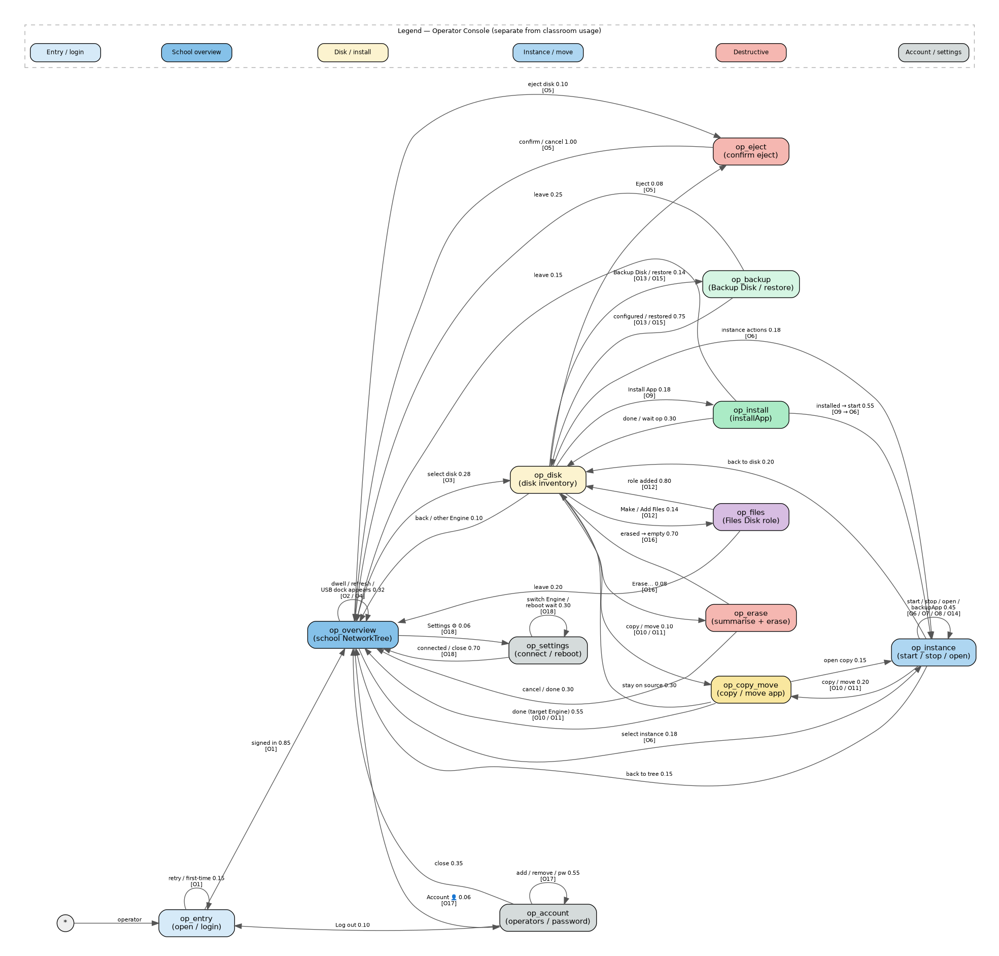
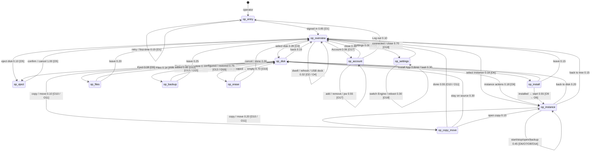

# Proposal: Multi-Engine Operator Console Markov (separate)

**Status:** Conceptual draft for discussion — companion to [`multi-engine-classroom.md`](./multi-engine-classroom.md).  
**Revision:** 2026-09-30 — first operator Console graph (manage / alter multi-Engine setup).  
**Author:** Steve (Lead Bot), 2026-09-30  
**Audience:** Koen / IDEA leads  
**Scope boundary:** This graph is **only** authenticated operator manage/alter flows. Classroom learner/teacher **usage** (Kolibri / Nextcloud / Wikipedia) stays in the classroom doc and its Markov — do not mix the graphs.

---

## Why this exists

The classroom usage Markov models people **using** apps. Operators also **manage and alter** the school’s Engines: dock/eject disks, install apps, start/stop instances, redistribute load across idea-A / idea-B / idea-C, back up, erase, and manage operator accounts.

Koen’s vision already says any Console can manage all Engines’ apps. This document inventories **what the Console UI and Engine commands actually offer today**, then builds a separate Markov graph so later tests can walk operator flows without bloating the classroom usage graph.

---

## Vision cite (same as classroom)

> Performance is optimized by adding Appdockers and redistributing the apps over the Appdockers.

**Source:** [`agent-engine-dev/proposals/solution-description.md`](https://github.com/koenswings/agent-engine-dev/blob/main/proposals/solution-description.md)

Physical metaphor: **dock a disk** (USB) onto an Engine; Console **ejects** safely before unplug. Redistribution is **moveApp / copyApp** (and/or eject + dock elsewhere), not a separate “claim Engine” Console button.

---

## Feature inventory (research — do not invent)

Inventoried from local clones `/workspace/agent-console-dev` and `/workspace/agent-engine-dev` (commands, components, docs). Only these land on the graph.

### Console dual mode

| Mode | Who | Login? | UI |
|---|---|---|---|
| User | students, teachers | No | `AppBrowser` — open running apps |
| **Operator** | IT / ops | Yes | `NetworkTree` + disk/instance management |

Sources: `agent-console-dev/README.md`, `docs/ARCHITECTURE.md`, `proposals/console-user-management.md`.

### Auth / operators (shipped)

| Feature | UI | Notes |
|---|---|---|
| First-time setup | `FirstTimeSetup` | When `userDB` empty — create first admin |
| Log in | `LoginForm` / Account 👤 | Username + password (bcrypt in `userDB`) |
| Log out | Account screen | Returns to user mode |
| Add / remove operators | `OperatorManagement` | Via Account → Manage Operators |
| Change password | Account / Settings → Account | Min 8 characters |

### School / multi-Engine overview (shipped)

| Feature | UI | Notes |
|---|---|---|
| Network tree | `NetworkTree` | Engines + docked disks; role badges app / backup / files / empty / upgrade |
| Select Engine / disk | tree selection | Filters `InstanceList` / shows `DiskView` or `EmptyDiskPanel` |
| Engine discovery / connect | `ConnectionManagement` / Settings | Auto-discover hostnames; manual hostname; switch connected Engine |
| Reboot Engine | NetworkTree reboot control | Sends `reboot` |
| Operation progress / cancel | `OperationProgress` | `cancelOperation` |
| History / command log | `HistoryPanel` / `CommandHistory` | Observe traces |

### Disk roles & actions (shipped)

| Disk role | Configure / act | Commands |
|---|---|---|
| **Empty** | Make Files Disk; Make Backup Disk; Install App; Erase | `createFilesDisk`, `createBackupDisk`, `installApp`, `summariseDisk`/`eraseDisk` |
| **App** | Start/Stop/Open instances; Backup; Copy/Move; Add Files; Erase; Eject | `startInstance`, `stopInstance`, `backupApp`, `copyApp`, `moveApp`, `createFilesDisk`, `eraseDisk`, `ejectDisk` |
| **Backup** | Restore panel; (pure backup: no eject) | `restoreApp`; `createBackupDisk` already done |
| **Files** | Share name / availability text; eject rules | `createFilesDisk` (add role); mount into opted-in apps is Engine-side |
| **Upgrade** | Badge only in tree | Upgrade ops appear in `operationDB` when an Upgrade Disk is processed — **no separate Console “Upgrade” button** inventoried |
| **System** | No eject / no erase | Protected |

### Instance actions (shipped — `InstanceRow`)

- **Start** / **Stop** / **Open ↗**
- **Backup** (picker when Backup Disks exist) → `backupApp`
- **Copy** / **Move** (drag-drop desktop; `MobileCopyMoveSheet` on mobile) → `copyApp` / `moveApp`

### Dock / eject (shipped + physical)

| Action | Where | Notes |
|---|---|---|
| **Physical dock** | USB plug into Engine | Disk appears in shared store / NetworkTree — **not a Console click** |
| **Eject** | NetworkTree / disk → `EjectConfirm` | `ejectDisk <diskId>` — stops instances, unmounts; then operator unplugs |
| Undock (store) | Result of eject / physical removal | No separate “Undock” button beyond Eject |

### Explicitly **not** Console UI today (flagged)

| Item | Status |
|---|---|
| **Claim Engine / pool claim** | **Not** a Console feature. Fleet claim scripts are test/Ops infra (`PI_FLEET.md`); classroom doc already lists them out of scope. **Omitted from graph.** |
| Dedicated **uninstall / removeApp** button | **No** Console command helper. Removing an app’s instances is via **erase disk** (or stop + leave Stopped). Do not invent a remove-app node. |
| **buildEngine** provisioning | Engine CLI / Ops — not daily Console Markov. |
| Automatic “redistribute wizard” | Vision text only; Console redistribution = **moveApp / copyApp** + physical re-dock. |

**Confidence:** High for commands in `src/store/commands.ts` and panels under `src/components/` listed above. Medium for Upgrade Disk operator *workflow* (badge + operation kinds exist; no dedicated upgrade click script). Low/N/A for claim — confirmed absent from Console.

---

## Markov operator graph (conceptual)

### Idea

- **Nodes** = coarse operator places in the Console (not one node per click).
- **Transitions** = manage actions with placeholder probabilities + scenario IDs `O1`… on edges.
- Click scripts under [Detailed UI scenarios](#detailed-ui-scenarios-expand-nodes-into-clicks) expand nodes.
- **Separate files** from classroom usage: [`multi-engine-operator-markov.dot`](./multi-engine-operator-markov.dot) (+ png/svg). Classroom graph untouched except a pointer.

### Nodes

| Node | Meaning | Scenario IDs |
|---|---|---|
| `op_entry` | Open Console, connect/discover, Log in or first-time setup | `O1` |
| `op_overview` | Operator NetworkTree — idea-A/B/C, disks, status (hub) | `O2`, `O4` (USB dock appears) |
| `op_disk` | Selected disk — EmptyDiskPanel or DiskView inventory | `O3` |
| `op_eject` | Eject confirm dialog | `O5` |
| `op_instance` | Start / Stop / Open / on-demand Backup on an instance | `O6`, `O7`, `O8`, `O14` |
| `op_install` | Install App onto a disk | `O9` |
| `op_copy_move` | Copy or Move app to another disk (possibly other Engine) | `O10`, `O11` |
| `op_files` | Make / Add Files Disk role | `O12` |
| `op_backup` | Configure Backup Disk; Restore from Backup Disk | `O13`, `O15` |
| `op_erase` | Summarise + typed confirm erase | `O16` |
| `op_account` | Operators list / add / remove / change password / logout | `O17` |
| `op_settings` | Settings: Engine Connection, reboot, About | `O18` |

### Transitions (probabilities are placeholders)

Graphviz: [`multi-engine-operator-markov.dot`](./multi-engine-operator-markov.dot). Rendered:

Same graph as Mermaid (editable)

---

## Story walkthrough (nodes → real clicks)

**How this maps to tests.** Each Markov **node** is a coarse place an operator can be. Inside a node, the harness expands into an **ordered UI script** — no node-per-click. Scenario IDs in `[brackets]` on edges name the scripts below. Probabilities are placeholders.

UI labels match Console components (`NetworkTree`, `EmptyDiskPanel`, `DiskView`, `InstanceRow`, `EjectConfirm`, `EraseDialog`, `AccountScreen`, `SettingsPanel`). Exact Playwright selectors belong in a later harness.

Multi-Engine story: operator may open Console on **any** of idea-A / idea-B / idea-C; after login the NetworkTree shows the **school mesh** (shared store). Commands are sent to the Engine that owns the target disk (`dockedTo`).

#### `op_entry` — open Console / sign in

Operator opens a browser (or Chrome extension) on the school LAN, lands on user-mode AppBrowser if already connected, then elevates to operator mode.

**Concrete UI (scenario `O1`):**

1. Open Console URL for any Engine (e.g. idea-A) — or Settings → connect via discovery / hostname.
2. If `userDB` empty → **First-time setup**: create admin username + password → lands in operator mode.
3. Else: status bar **👤 Account** (or Log in) → Username / Password → **Log in**.
4. UI switches to operator layout: **NetworkTree** (left) + instances/disk detail → [`op_overview`](#op_overview--school-networktree).

#### `op_overview` — school NetworkTree

Hub state. Operator sees Engines (idea-A / B / C), disks with role badges, instance status. Dwells, refreshes mentally as CRDT updates arrive, or reacts when a USB disk is docked.

**Typical actions:**

1. **Dwell / refresh** (~0.32) — watch status dots; wait for a new disk after physical USB dock (`O2` / `O4`).
2. **Select a disk** → [`op_disk`](#op_disk--disk-inventory) (`O3`).
3. **Select / act on instance** → [`op_instance`](#op_instance--start--stop--open--backup) (`O6`).
4. **Eject** control on a disk → [`op_eject`](#op_eject--confirm-eject) (`O5`).
5. **👤 Account** → [`op_account`](#op_account--operators--password) (`O17`).
6. **⚙ Settings** → [`op_settings`](#op_settings--connect--reboot) (`O18`).

*Physical dock (`O4`):* plug SSD into idea-B (or C); disk row appears under that Engine; select it → `op_disk`. Not a Console button.

#### `op_disk` — disk inventory

Empty disk → `EmptyDiskPanel` cards. App/Backup/Files disk → `DiskView` sections (Apps, Backups, Files).

**Branch by panel:**

| Action | → node | ID |
|---|---|---|
| **Install App** | `op_install` | `O9` |
| **Make this a Files Disk** / **Add Files** | `op_files` | `O12` |
| **Make this a Backup Disk** / open Backups restore | `op_backup` | `O13` / `O15` |
| Instance Start/Stop/Open/Backup | `op_instance` | `O6`… |
| Copy / Move instance | `op_copy_move` | `O10` / `O11` |
| **Erase this disk…** | `op_erase` | `O16` |
| **Eject** | `op_eject` | `O5` |

#### `op_eject` — confirm eject

**Scenario `O5`:** Eject control → `EjectConfirm` → confirm → `ejectDisk` → disk undocks in tree → operator may physically unplug → back to `op_overview`.

#### `op_instance` — start / stop / open / backup

**Scenarios `O6` / `O7` / `O8` / `O14`:** On `InstanceRow`: **Start**, **Stop**, **Open ↗**, **Backup** (disk picker). Stay in-node for several toggles; leave to copy/move, disk, or overview.

#### `op_install` — installApp

**Scenario `O9`:** Empty (or eligible) disk → **Install App** → pick app from catalog → optional name → Install → wait `OperationProgress` → often **Start** (`O6`).

#### `op_copy_move` — redistribute

**Scenarios `O10` (copy) / `O11` (move):** Drag instance to another App Disk (possibly on another Engine in the tree) or use mobile sheet **Copy** / **Move**. Vision “redistribute apps over Appdockers” = these commands (+ eject/dock). Target disk must be docked to the Engine that receives the command.

#### `op_files` — Files Disk role

**Scenario `O12`:** **Make this a Files Disk** (empty) or **Add Files** (app/backup disk) → share name (default `School Files`) → `createFilesDisk`. Optional erase-then-files path uses `op_erase` first.

#### `op_backup` — Backup Disk / restore

**Scenarios `O13` / `O15`:** Empty → **Make this a Backup Disk** (mode: on-demand / immediate / scheduled + link instances). On a Backup Disk section → pick archive → target App Disk → **Restore** (`restoreApp`). On-demand `backupApp` from an instance can also start from `op_instance` (`O14`).

#### `op_erase` — erase

**Scenario `O16`:** **Erase this disk…** → `EraseDialog` → Engine `summariseDisk` → type exact label → `eraseDisk` → disk becomes empty → often return to `op_disk` EmptyDiskPanel.

#### `op_account` — operators / password

**Scenario `O17`:** 👤 → Manage Operators (add / remove) / change password / **Log out** → `op_entry`.

#### `op_settings` — connect / reboot

**Scenario `O18`:** ⚙ → Engine Connection (discover / Connect / manual hostname) / Account tab / About. Reboot from NetworkTree may be modelled as leaving overview into a wait on settings/overview self-loop after `reboot`.

---

## Detailed UI scenarios (expand nodes into clicks)

These are **test scripts**, not extra Markov nodes. Preload: three Engines visible in store (idea-A/B/C), at least one empty USB disk, one App Disk with a Stopped instance, one Backup Disk when testing restore.

| Scenario ID | Markov node(s) | Matches |
|---|---|---|
| `O1` | `*` → `op_entry` → `op_overview` | Connect + login / first-time |
| `O2` | `op_overview` | Inspect school tree (dwell) |
| `O3` | `op_overview` → `op_disk` | Select disk inventory |
| `O4` | `op_overview` (self) → `op_disk` | Physical USB dock appears |
| `O5` | `op_overview` / `op_disk` → `op_eject` → `op_overview` | Eject confirm |
| `O6` | → `op_instance` | Start instance |
| `O7` | `op_instance` | Stop instance |
| `O8` | `op_instance` | Open app (ops check) |
| `O9` | `op_disk` → `op_install` | Install App |
| `O10` | → `op_copy_move` | Copy app to another disk |
| `O11` | → `op_copy_move` | Move app (redistribute) |
| `O12` | `op_disk` → `op_files` | Make / Add Files Disk |
| `O13` | `op_disk` → `op_backup` | Make Backup Disk |
| `O14` | `op_instance` | On-demand backupApp |
| `O15` | `op_disk` → `op_backup` | Restore from Backup Disk |
| `O16` | `op_disk` → `op_erase` | Erase disk |
| `O17` | `op_overview` → `op_account` | Manage operators / password |
| `O18` | `op_overview` → `op_settings` | Settings / switch Engine / reboot |

#### Scenario `O1` — Operator opens Console and signs in

**Role:** operator · **Engines:** any Console (idea-A / B / C).  
**Markov:** `*` → `op_entry` → `op_overview`.

1. Browser → Console on school LAN.
2. If needed: Settings → discover / Connect to an Engine.
3. 👤 → username / password → Log in (or First-time setup).
4. Assert: NetworkTree visible with multiple Engines when mesh is up.

#### Scenario `O2` — Inspect school overview

**Markov:** `op_overview` self-loop.

1. Expand idea-A, idea-B, idea-C in NetworkTree.
2. Note disk badges (app / backup / files / empty) and instance status dots.
3. Dwell (CRDT updates) without changing selection.

#### Scenario `O3` — Select disk inventory

**Markov:** `op_overview` → `op_disk`.

1. Click an empty disk under idea-B → EmptyDiskPanel cards visible.
2. Or click an App Disk → DiskView Apps / Files / etc.

#### Scenario `O4` — Physical dock appears

**Markov:** `op_overview` (USB event) → select new disk → `op_disk`.

1. From `op_overview`, note disk list.
2. *(Hardware / fleet harness)* Plug formatted or unformatted SSD into idea-C.
3. Wait until new disk row appears under idea-C → select it → `op_disk`.

#### Scenario `O5` — Eject disk

**Markov:** → `op_eject` → `op_overview`.

1. On a non-system, non-pure-backup disk with device: Eject.
2. Confirm in `EjectConfirm`.
3. Assert: disk undocked / removed from that Engine’s docked list; instances stopped.

#### Scenario `O6` — Start instance

**Markov:** → `op_instance`.

1. Select Stopped instance on idea-B App Disk.
2. **Start** → wait until Running (or Error + History).
3. Optional: **Open ↗** (`O8`).

#### Scenario `O7` — Stop instance

**Markov:** `op_instance`.

1. On Running instance → **Stop** → Stopped / Docked as applicable.

#### Scenario `O8` — Open app (ops check)

**Markov:** `op_instance`.

1. Running instance → **Open ↗** → app URL loads (smoke only; deep app use is classroom graph).

#### Scenario `O9` — Install App

**Markov:** `op_disk` → `op_install` → often `op_instance`.

1. Empty disk on idea-C → **Install App** → pick Kolibri (or Nextcloud) → Install.
2. Wait operation → **Start** (`O6`).
3. Assert: instance appears in every Console’s catalog (classroom S1 / reason 1).

#### Scenario `O10` — Copy app

**Markov:** → `op_copy_move`.

1. From instance on idea-B App Disk, Copy to App Disk on idea-C (drag or mobile sheet).
2. Wait `copyApp` operation → new InstanceID on target.

#### Scenario `O11` — Move app (redistribute)

**Markov:** → `op_copy_move`.

1. Move demanding Kolibri from idea-A disk to idea-B disk (same InstanceID).
2. Assert: backup links intact; source cleaned; catalog still unified.

#### Scenario `O12` — Make / Add Files Disk

**Markov:** `op_disk` → `op_files`.

1. Empty disk → **Make this a Files Disk** → share name `School Files` (or custom) → submit.
2. Or App Disk → **Add Files** → same.
3. Assert: `files` badge; availability text updates when opted-in apps run.

#### Scenario `O13` — Make Backup Disk

**Markov:** `op_disk` → `op_backup`.

1. Empty disk → **Make this a Backup Disk** → mode on-demand → select instance(s) → Configure.
2. Assert: `backup` badge.

#### Scenario `O14` — On-demand backup

**Markov:** `op_instance`.

1. Running (or eligible) instance → **Backup** → pick Backup Disk → `backupApp`.
2. Watch OperationProgress; cancel only if testing cancel path.

#### Scenario `O15` — Restore from Backup Disk

**Markov:** `op_disk` → `op_backup`.

1. Select Backup Disk → Restore panel → pick instance archive → target App Disk → confirm Restore.

#### Scenario `O16` — Erase disk

**Markov:** `op_disk` → `op_erase` → `op_disk` (empty).

1. **Erase this disk…** → wait summary → type exact label → confirm.
2. Assert: disk `empty`; prior instances gone from store for that disk.

#### Scenario `O17` — Manage operators

**Markov:** `op_overview` → `op_account`.

1. 👤 → Manage Operators → Add operator / Remove / Change password.
2. Optional: Log out → `op_entry`.

#### Scenario `O18` — Settings / switch Engine / reboot

**Markov:** `op_overview` → `op_settings`.

1. ⚙ → Engine Connection → Connect to another discovered Engine (or manual hostname).
2. Optional: NetworkTree **Reboot** on a selected Engine → wait reconnect → `op_overview`.

### Composite walks (multi-Engine alter)

| Walk | Story | Scenario chain |
|---|---|---|
| Add capacity | New empty disk on idea-C → install Kolibri → start | `O4` → `O9` → `O6` |
| Redistribute load | Move heavy instance idea-B → idea-C | `O3` → `O11` |
| Safe disk carry | Eject on idea-B → (unplug) → dock on idea-A | `O5` → `O4` → `O3` |
| Files for Nextcloud | Make Files Disk on idea-A → start Nextcloud | `O12` → `O6` |
| Backup drill | Make Backup Disk → backupApp → restore elsewhere | `O13` → `O14` → `O15` |

---

## Relation to classroom doc

| Document | Graph | Audience |
|---|---|---|
| [`multi-engine-classroom.md`](./multi-engine-classroom.md) | `multi-engine-markov.*` | Learners + teachers **using** Kolibri / Nextcloud / Wikipedia |
| **This file** | `multi-engine-operator-markov.*` | Operators **managing** Engines / disks / instances |

Classroom scenarios S1 / S7 mention operator dock/start only as story context; their scripts stay usage-side. Operator click paths live here (`O*`).

---

## Sources consulted

| Source | Use |
|---|---|
| `agent-console-dev/src/store/commands.ts` | Full Console→Engine command surface |
| `agent-console-dev/src/components/*` | NetworkTree, EmptyDiskPanel, DiskView, InstanceRow, EjectConfirm, EraseDialog, AccountScreen, OperatorManagement, SettingsPanel, RestorePanel, MobileCopyMoveSheet |
| `agent-console-dev/docs/ARCHITECTURE.md` | Dual-mode UI, auth, discovery |
| `agent-console-dev/src/store/diskRoles.ts` | Role badges, eject rules, Files availability |
| `agent-engine-dev/docs/COMMANDS.md` | Engine command semantics (install/start/stop/eject/erase/files/backup/copy/move/reboot) |
| `agent-engine-dev/proposals/solution-description.md` | Vision: autofind + redistribute |
| `agent-engine-dev/proposals/install-app.md`, `copy-move-app.md`, `backup-disk.md` | Merged proposal behaviour |
| `PI_FLEET.md` | Confirms fleet claim is **test infra**, not Console UI |
| [`multi-engine-classroom.md`](./multi-engine-classroom.md) | Conventions for nodes / scenario IDs / story walkthrough |

---

## Out of scope / speculative

- Playwright harness wiring (later; same duration-tests family as classroom).
- **Claim Engine** Console UX — **does not exist**; do not add without a real design.
- Automatic redistribute wizard beyond copy/move + physical dock.
- Upgrade Disk one-click Console flow (badge + operation kinds only — **speculative** as a dedicated scenario until UI confirms).
- `buildEngine` provisioning walks.
- Messaging Koen — parent/Steve owns review handoff.

---

## Ask of Koen

1. Confirm operator graph stays **separate** from classroom usage Markov.  
2. Confirm node coarseness (12 nodes) and scenario IDs `O1`–`O18`.  
3. Confirm omission of **claim Engine** from the graph (not Console UI).  
4. Prioritise which composite walks (add capacity / redistribute / eject-carry / backup drill) to deepen first.
