# Proposal: Multi-Engine Operator Console Markov

**Status:** Proposal draft for discussion — companion to [`multi-engine-classroom.md`](./multi-engine-classroom.md).  
**Revision:** 2026-09-30c — Koen review: Markov chapter uses **states** / **actions** only; Intent action names; overview edges are honest open-surface actions (no Install/Erase from overview); Test Scenarios chapter separated; graph layout fixed for PDF.  
**Author:** Steve (Lead Bot), 2026-09-30 (rev. 2026-09-30c)  
**Audience:** Koen / IDEA leads  
**Scope boundary:** This graph is **only** authenticated operator manage/alter flows. Classroom learner/teacher **usage** (Kolibri / Nextcloud / Wikipedia) stays in the classroom doc and its Markov — do not mix the graphs.

---

## Why this exists

The classroom usage Markov models people **using** apps. Operators also **manage and alter** the school’s Engines: dock/eject disks, install apps, start/stop instances, redistribute load across idea-A / idea-B / idea-C, back up, erase, and manage operator accounts.

Koen’s vision already says any Console can manage all Engines’ apps. This document inventories **what the Console UI and Engine commands actually offer today**, then builds a separate Markov graph so later tests can walk operator flows without bloating the classroom usage graph.

---

## Vision cite (same as classroom)

> Performance is optimized by adding Appdockers and redistributing the apps over the Appdockers.

**Source:** [`agent-engine-dev/proposals/solution-description.md`](https://github.com/koenswings/agent-engine-dev/blob/main/proposals/solution-description.md)

Physical metaphor: **dock a disk** (USB) onto an Engine; Console **ejects** safely before unplug. Redistribution is **moveApp / copyApp** (and/or eject + dock elsewhere), not a separate “claim Engine” Console button.

---

## Feature inventory (research — do not invent)

Inventoried from local clones `/workspace/agent-console-dev` and `/workspace/agent-engine-dev` (commands, components, docs). Only these land on the graph.

### Console dual mode

| Mode | Who | Login? | UI |
|---|---|---|---|
| User | students, teachers | No | `AppBrowser` — open running apps |
| **Operator** | IT / ops | Yes | `NetworkTree` + disk/instance management |

Sources: `agent-console-dev/README.md`, `docs/ARCHITECTURE.md`, `proposals/console-user-management.md`.

### Auth / operators (shipped)

| Feature | UI | Notes |
|---|---|---|
| First-time setup | `FirstTimeSetup` | When `userDB` empty — create first admin |
| Log in | `LoginForm` / Account 👤 | Username + password (bcrypt in `userDB`) |
| Log out | Account screen | Returns to user mode |
| Add / remove operators | `OperatorManagement` | Via Account → Manage Operators |
| Change password | Account / Settings → Account | Min 8 characters |

### School / multi-Engine overview (shipped)

| Feature | UI | Notes |
|---|---|---|
| Network tree | `NetworkTree` | Engines + docked disks; role badges app / backup / files / empty / upgrade |
| Select Engine / disk | tree selection | Filters `InstanceList` / shows `DiskView` or `EmptyDiskPanel` |
| Engine discovery / connect | `ConnectionManagement` / Settings | Auto-discover hostnames; manual hostname; switch connected Engine |
| Reboot Engine | NetworkTree reboot control | Sends `reboot` |
| Operation progress / cancel | `OperationProgress` | `cancelOperation` |
| History / command log | `HistoryPanel` / `CommandHistory` | Observe traces |

### Disk roles & actions (shipped)

| Disk role | Configure / act | Commands |
|---|---|---|
| **Empty** | Make Files Disk; Make Backup Disk; Install App; Erase | `createFilesDisk`, `createBackupDisk`, `installApp`, `summariseDisk`/`eraseDisk` |
| **App** | Start/Stop/Open instances; Backup; Copy/Move; Add Files; Erase; Eject | `startInstance`, `stopInstance`, `backupApp`, `copyApp`, `moveApp`, `createFilesDisk`, `eraseDisk`, `ejectDisk` |
| **Backup** | Restore panel; (pure backup: no eject) | `restoreApp`; `createBackupDisk` already done |
| **Files** | Share name / availability text; eject rules | `createFilesDisk` (add role); mount into opted-in apps is Engine-side |
| **Upgrade** | Badge only in tree | Upgrade ops appear in `operationDB` when an Upgrade Disk is processed — **no separate Console “Upgrade” button** inventoried |
| **System** | No eject / no erase | Protected |

### Instance actions (shipped — `InstanceRow`)

- **Start** / **Stop** / **Open ↗**
- **Backup** (picker when Backup Disks exist) → `backupApp`
- **Copy** / **Move** (drag-drop desktop; `MobileCopyMoveSheet` on mobile) → `copyApp` / `moveApp`

### Dock / eject (shipped + physical)

| Action | Where | Notes |
|---|---|---|
| **Physical dock** | USB plug into Engine | Disk appears in shared store / NetworkTree — **not a Console click** |
| **Eject** | NetworkTree / disk → `EjectConfirm` | `ejectDisk <diskId>` — stops instances, unmounts; then operator unplugs |
| Undock (store) | Result of eject / physical removal | No separate “Undock” button beyond Eject |

### Explicitly **not** Console UI today (flagged)

| Item | Status |
|---|---|
| **Claim Engine / pool claim** | **Not** a Console feature. Fleet claim scripts are test/Ops infra (`PI_FLEET.md`); classroom doc already lists them out of scope. **Omitted from graph.** |
| Dedicated **uninstall / removeApp** button | **No** Console command helper. Removing an app’s instances is via **erase disk** (or stop + leave Stopped). Do not invent a remove-app state. |
| **buildEngine** provisioning | Engine CLI / Ops — not daily Console Markov. |
| Automatic “redistribute wizard” | Vision text only; Console redistribution = **moveApp / copyApp** + physical re-dock. |

**Confidence:** High for commands in `src/store/commands.ts` and panels under `src/components/` listed above. Medium for Upgrade Disk operator *workflow* (badge + operation kinds exist; no dedicated upgrade click script). Low/N/A for claim — confirmed absent from Console.

---

## Markov operator graph

### Idea

- **States** = coarse operator places in the Console (not one state per click).
- **Actions** = manage transitions with placeholder probabilities. Intent-style names only (e.g. **Open disk inventory**, **Erase disk**, **Start instance**) — no scenario IDs and no `*` wildcards on the graph.
- Click scripts under [Test Scenarios](#test-scenarios) expand actions. Forward link from action → scenario name only.
- **Separate files** from classroom usage: [`multi-engine-operator-markov.dot`](./multi-engine-operator-markov.dot) (+ png/svg).

**Wiring rule:** actions belong to the state where they happen. From `op_overview` you **Open disk inventory** (enter `op_disk`) — you do **not** **Erase disk** or **Install App** as edges from overview. Those fire only from `op_disk` (or the dedicated erase/install states they enter).

### States (final list)

| State | Meaning |
|---|---|
| `op_entry` | Open Console, connect/discover, Log in or first-time setup |
| `op_overview` | Operator NetworkTree — idea-A/B/C, disks, status (hub) |
| `op_disk` | Selected disk — EmptyDiskPanel or DiskView inventory |
| `op_eject` | Eject confirm dialog |
| `op_instance` | Start / Stop / Open / on-demand Backup on an instance |
| `op_install` | Install App onto a disk |
| `op_copy_move` | Copy or Move app to another disk (possibly other Engine) |
| `op_files` | Make / Add Files Disk role |
| `op_backup` | Configure Backup Disk; Restore from Backup Disk |
| `op_erase` | Summarise + typed confirm erase |
| `op_account` | Operators list / add / remove / change password / logout |
| `op_settings` | Settings: Engine Connection, reboot, About |

### Graph

The operator graph is shown as **two diagrams** so every Intent label stays readable on a letter page (same states and actions; `op_overview` / `op_disk` repeated as hubs). Combined source also kept: [`multi-engine-operator-markov.dot`](./multi-engine-operator-markov.dot) → [`multi-engine-operator-markov.png`](./multi-engine-operator-markov.png).

**Diagram A — Auth, school hub, Account, Settings** ([`multi-engine-operator-markov-hub.dot`](./multi-engine-operator-markov-hub.dot)):

**Diagram B — Disk inventory and deep actions** ([`multi-engine-operator-markov-disk.dot`](./multi-engine-operator-markov-disk.dot)):

```mermaid
stateDiagram-v2
    [*] --> op_entry: Open Console as operator

    op_entry --> op_overview: Sign in 0.85
    op_entry --> op_entry: Retry login / first-time setup 0.15

    op_overview --> op_disk: Open disk inventory 0.28
    op_overview --> op_instance: Open instance controls 0.18
    op_overview --> op_eject: Eject disk 0.10
    op_overview --> op_account: Open Account 0.06
    op_overview --> op_settings: Open Settings 0.06
    op_overview --> op_overview: Stay on overview 0.20
    op_overview --> op_overview: Notice USB dock 0.12

    op_disk --> op_install: Install App 0.18
    op_disk --> op_files: Make Files Disk 0.08
    op_disk --> op_files: Add Files role 0.06
    op_disk --> op_backup: Make Backup Disk 0.08
    op_disk --> op_backup: Restore from Backup 0.06
    op_disk --> op_instance: Open instance controls 0.18
    op_disk --> op_copy_move: Copy app 0.05
    op_disk --> op_copy_move: Move app 0.05
    op_disk --> op_erase: Erase disk 0.08
    op_disk --> op_eject: Eject disk 0.08
    op_disk --> op_overview: Back to overview 0.10

    op_eject --> op_overview: Confirm eject 0.70
    op_eject --> op_overview: Cancel eject 0.30

    op_erase --> op_disk: Confirm erase 0.70
    op_erase --> op_overview: Cancel erase 0.30

    op_files --> op_disk: Files role added 0.80
    op_files --> op_overview: Back to overview 0.20

    op_backup --> op_disk: Backup configured / restored 0.75
    op_backup --> op_overview: Back to overview 0.25

    op_install --> op_instance: Start after install 0.55
    op_install --> op_disk: Stay on disk 0.30
    op_install --> op_overview: Back to overview 0.15

    op_instance --> op_instance: Start instance 0.15
    op_instance --> op_instance: Stop instance 0.12
    op_instance --> op_instance: Open app 0.10
    op_instance --> op_instance: Backup instance 0.08
    op_instance --> op_copy_move: Copy app 0.10
    op_instance --> op_copy_move: Move app 0.10
    op_instance --> op_disk: Back to disk 0.20
    op_instance --> op_overview: Back to overview 0.15

    op_copy_move --> op_overview: Done redistribute 0.55
    op_copy_move --> op_disk: Stay on source disk 0.30
    op_copy_move --> op_instance: Open copied instance 0.15

    op_account --> op_account: Add operator 0.20
    op_account --> op_account: Remove operator 0.15
    op_account --> op_account: Change password 0.20
    op_account --> op_overview: Close Account 0.35
    op_account --> op_entry: Log out 0.10

    op_settings --> op_overview: Close Settings 0.50
    op_settings --> op_settings: Switch Engine 0.25
    op_settings --> op_settings: Reboot Engine 0.25
```

Same graph as Mermaid (editable)

Multi-Engine story: operator may open Console on **any** of idea-A / idea-B / idea-C; after login the NetworkTree shows the **school mesh** (shared store). Commands are sent to the Engine that owns the target disk (`dockedTo`).

UI labels match Console components (`NetworkTree`, `EmptyDiskPanel`, `DiskView`, `InstanceRow`, `EjectConfirm`, `EraseDialog`, `AccountScreen`, `SettingsPanel`). Exact Playwright selectors belong in a later harness.

---

### State: `op_entry`

Operator opens a browser (or Chrome extension) on the school LAN, lands on user-mode AppBrowser if already connected, then elevates to operator mode.

**Concrete UI:**

1. Open Console URL for any Engine (e.g. idea-A) — or Settings → connect via discovery / hostname.
2. If `userDB` empty → **First-time setup**: create admin username + password → lands in operator mode.
3. Else: status bar **👤 Account** (or Log in) → Username / Password → **Log in**.
4. UI switches to operator layout: **NetworkTree** (left) + instances/disk detail → `op_overview`.

**Actions from this state:**

| Action | ≈p | Destination | Test Scenario |
|---|---:|---|---|
| **Sign in** | 0.85 | `op_overview` | [Operator opens Console and signs in](#operator-opens-console-and-signs-in) |
| **Retry login / first-time setup** | 0.15 | `op_entry` | [Operator opens Console and signs in](#operator-opens-console-and-signs-in) |

---

### State: `op_overview`

Hub state. Operator sees Engines (idea-A / B / C), disks with role badges, instance status. Dwells, refreshes mentally as CRDT updates arrive, or reacts when a USB disk is docked.

**Actions from this state** (open surfaces only — not Install / Erase / Files / Backup):

| Action | ≈p | Destination | Test Scenario |
|---|---:|---|---|
| **Open disk inventory** | 0.28 | `op_disk` | [Select disk inventory](#select-disk-inventory) |
| **Open instance controls** | 0.18 | `op_instance` | [Start instance](#start-instance) |
| **Eject disk** | 0.10 | `op_eject` | [Eject disk](#eject-disk) |
| **Open Account** | 0.06 | `op_account` | [Manage operators](#manage-operators) |
| **Open Settings** | 0.06 | `op_settings` | [Settings switch Engine reboot](#settings-switch-engine-reboot) |
| **Stay on overview** | 0.20 | `op_overview` | [Inspect school overview](#inspect-school-overview) |
| **Notice USB dock** | 0.12 | `op_overview` | [Physical dock appears](#physical-dock-appears) |

*Physical dock:* plug SSD into idea-B (or C); disk row appears under that Engine; then **Open disk inventory** → `op_disk`. Not a Console button.

---

### State: `op_disk`

Empty disk → `EmptyDiskPanel` cards. App/Backup/Files disk → `DiskView` sections (Apps, Backups, Files). **Deep actions belong here.**

**Actions from this state:**

| Action | ≈p | Destination | Test Scenario |
|---|---:|---|---|
| **Install App** | 0.18 | `op_install` | [Install App](#install-app) |
| **Make Files Disk** | 0.08 | `op_files` | [Make or Add Files Disk](#make-or-add-files-disk) |
| **Add Files role** | 0.06 | `op_files` | [Make or Add Files Disk](#make-or-add-files-disk) |
| **Make Backup Disk** | 0.08 | `op_backup` | [Make Backup Disk](#make-backup-disk) |
| **Restore from Backup** | 0.06 | `op_backup` | [Restore from Backup Disk](#restore-from-backup-disk) |
| **Open instance controls** | 0.18 | `op_instance` | [Start instance](#start-instance) |
| **Copy app** | 0.05 | `op_copy_move` | [Copy app](#copy-app) |
| **Move app** | 0.05 | `op_copy_move` | [Move app](#move-app) |
| **Erase disk** | 0.08 | `op_erase` | [Erase disk](#erase-disk) |
| **Eject disk** | 0.08 | `op_eject` | [Eject disk](#eject-disk) |
| **Back to overview** | 0.10 | `op_overview` | — |

---

### State: `op_eject`

**UI:** Eject control → `EjectConfirm` → confirm → `ejectDisk` → disk undocks in tree → operator may physically unplug.

**Actions from this state:**

| Action | ≈p | Destination | Test Scenario |
|---|---:|---|---|
| **Confirm eject** | 0.70 | `op_overview` | [Eject disk](#eject-disk) |
| **Cancel eject** | 0.30 | `op_overview` | [Eject disk](#eject-disk) |

---

### State: `op_instance`

On `InstanceRow`: Start, Stop, Open ↗, Backup (disk picker). Stay in-state for several toggles; leave to copy/move, disk, or overview.

**Actions from this state:**

| Action | ≈p | Destination | Test Scenario |
|---|---:|---|---|
| **Start instance** | 0.15 | `op_instance` | [Start instance](#start-instance) |
| **Stop instance** | 0.12 | `op_instance` | [Stop instance](#stop-instance) |
| **Open app** | 0.10 | `op_instance` | [Open app ops check](#open-app-ops-check) |
| **Backup instance** | 0.08 | `op_instance` | [On-demand backup](#on-demand-backup) |
| **Copy app** | 0.10 | `op_copy_move` | [Copy app](#copy-app) |
| **Move app** | 0.10 | `op_copy_move` | [Move app](#move-app) |
| **Back to disk** | 0.20 | `op_disk` | — |
| **Back to overview** | 0.15 | `op_overview` | — |

---

### State: `op_install`

**UI:** Empty (or eligible) disk → **Install App** → pick app from catalog → optional name → Install → wait `OperationProgress` → often **Start**.

**Actions from this state:**

| Action | ≈p | Destination | Test Scenario |
|---|---:|---|---|
| **Start after install** | 0.55 | `op_instance` | [Install App](#install-app) |
| **Stay on disk** | 0.30 | `op_disk` | [Install App](#install-app) |
| **Back to overview** | 0.15 | `op_overview` | — |

---

### State: `op_copy_move`

Vision “redistribute apps over Appdockers” = **Copy app** / **Move app** (+ eject/dock). Target disk must be docked to the Engine that receives the command.

**Actions from this state:**

| Action | ≈p | Destination | Test Scenario |
|---|---:|---|---|
| **Done redistribute** | 0.55 | `op_overview` | [Copy app](#copy-app) / [Move app](#move-app) |
| **Stay on source disk** | 0.30 | `op_disk` | — |
| **Open copied instance** | 0.15 | `op_instance` | — |

---

### State: `op_files`

**UI:** **Make this a Files Disk** (empty) or **Add Files** (app/backup disk) → share name (default `School Files`) → `createFilesDisk`. Optional erase-then-files path uses `op_erase` first.

**Actions from this state:**

| Action | ≈p | Destination | Test Scenario |
|---|---:|---|---|
| **Files role added** | 0.80 | `op_disk` | [Make or Add Files Disk](#make-or-add-files-disk) |
| **Back to overview** | 0.20 | `op_overview` | — |

---

### State: `op_backup`

Empty → **Make this a Backup Disk** (mode: on-demand / immediate / scheduled + link instances). On a Backup Disk section → pick archive → target App Disk → **Restore**. On-demand `backupApp` from an instance can also start from `op_instance`.

**Actions from this state:**

| Action | ≈p | Destination | Test Scenario |
|---|---:|---|---|
| **Backup configured / restored** | 0.75 | `op_disk` | [Make Backup Disk](#make-backup-disk) / [Restore from Backup Disk](#restore-from-backup-disk) |
| **Back to overview** | 0.25 | `op_overview` | — |

---

### State: `op_erase`

**UI:** **Erase this disk…** → `EraseDialog` → Engine `summariseDisk` → type exact label → `eraseDisk` → disk becomes empty → often return to `op_disk` EmptyDiskPanel.

**Actions from this state:**

| Action | ≈p | Destination | Test Scenario |
|---|---:|---|---|
| **Confirm erase** | 0.70 | `op_disk` | [Erase disk](#erase-disk) |
| **Cancel erase** | 0.30 | `op_overview` | [Erase disk](#erase-disk) |

---

### State: `op_account`

👤 → Manage Operators (add / remove) / change password / **Log out**.

**Actions from this state:**

| Action | ≈p | Destination | Test Scenario |
|---|---:|---|---|
| **Add operator** | 0.20 | `op_account` | [Manage operators](#manage-operators) |
| **Remove operator** | 0.15 | `op_account` | [Manage operators](#manage-operators) |
| **Change password** | 0.20 | `op_account` | [Manage operators](#manage-operators) |
| **Close Account** | 0.35 | `op_overview` | — |
| **Log out** | 0.10 | `op_entry` | [Manage operators](#manage-operators) |

---

### State: `op_settings`

⚙ → Engine Connection (discover / Connect / manual hostname) / Account tab / About. Reboot from NetworkTree may be modelled as a self-loop here after `reboot`.

**Actions from this state:**

| Action | ≈p | Destination | Test Scenario |
|---|---:|---|---|
| **Close Settings** | 0.50 | `op_overview` | [Settings switch Engine reboot](#settings-switch-engine-reboot) |
| **Switch Engine** | 0.25 | `op_settings` | [Settings switch Engine reboot](#settings-switch-engine-reboot) |
| **Reboot Engine** | 0.25 | `op_settings` | [Settings switch Engine reboot](#settings-switch-engine-reboot) |

---

## Test Scenarios

These are **test scripts**, not extra Markov states. Each has a single consistent Intent-style name. Describe what the scenario does. Markov actions link **forward** to these names; this chapter does **not** re-describe the Markov graph.

Preload: three Engines visible in store (idea-A/B/C), at least one empty USB disk, one App Disk with a Stopped instance, one Backup Disk when testing restore.

### Operator opens Console and signs in

**Role:** operator · **Engines:** any Console (idea-A / B / C).

1. Browser → Console on school LAN.
2. If needed: Settings → discover / Connect to an Engine.
3. 👤 → username / password → Log in (or First-time setup).
4. Assert: NetworkTree visible with multiple Engines when mesh is up.

### Inspect school overview

1. Expand idea-A, idea-B, idea-C in NetworkTree.
2. Note disk badges (app / backup / files / empty) and instance status dots.
3. Dwell (CRDT updates) without changing selection.

### Select disk inventory

1. Click an empty disk under idea-B → EmptyDiskPanel cards visible.
2. Or click an App Disk → DiskView Apps / Files / etc.

### Physical dock appears

1. From overview, note disk list.
2. *(Hardware / fleet harness)* Plug formatted or unformatted SSD into idea-C.
3. Wait until new disk row appears under idea-C → Open disk inventory on it.

### Eject disk

1. On a non-system, non-pure-backup disk with device: Eject.
2. Confirm in `EjectConfirm` (or cancel).
3. Assert: disk undocked / removed from that Engine’s docked list; instances stopped.

### Start instance

1. Select Stopped instance on idea-B App Disk.
2. **Start** → wait until Running (or Error + History).
3. Optional: **Open ↗**.

### Stop instance

1. On Running instance → **Stop** → Stopped / Docked as applicable.

### Open app ops check

1. Running instance → **Open ↗** → app URL loads (smoke only; deep app use is classroom graph).

### Install App

1. Empty disk on idea-C → **Install App** → pick Kolibri (or Nextcloud) → Install.
2. Wait operation → **Start**.
3. Assert: instance appears in every Console’s catalog (classroom S1 / reason 1).

### Copy app

1. From instance on idea-B App Disk, Copy to App Disk on idea-C (drag or mobile sheet).
2. Wait `copyApp` operation → new InstanceID on target.

### Move app

1. Move demanding Kolibri from idea-A disk to idea-B disk (same InstanceID).
2. Assert: backup links intact; source cleaned; catalog still unified.

### Make or Add Files Disk

1. Empty disk → **Make this a Files Disk** → share name `School Files` (or custom) → submit.
2. Or App Disk → **Add Files** → same.
3. Assert: `files` badge; availability text updates when opted-in apps run.

### Make Backup Disk

1. Empty disk → **Make this a Backup Disk** → mode on-demand → select instance(s) → Configure.
2. Assert: `backup` badge.

### On-demand backup

1. Running (or eligible) instance → **Backup** → pick Backup Disk → `backupApp`.
2. Watch OperationProgress; cancel only if testing cancel path.

### Restore from Backup Disk

1. Select Backup Disk → Restore panel → pick instance archive → target App Disk → confirm Restore.

### Erase disk

1. From disk inventory: **Erase this disk…** → wait summary → type exact label → confirm.
2. Assert: disk `empty`; prior instances gone from store for that disk.

### Manage operators

1. 👤 → Manage Operators → Add operator / Remove / Change password.
2. Optional: Log out → back to entry.

### Settings switch Engine reboot

1. ⚙ → Engine Connection → Connect to another discovered Engine (or manual hostname).
2. Optional: NetworkTree **Reboot** on a selected Engine → wait reconnect → overview.

### Composite walks (multi-Engine alter)

| Walk | Story | Scenario chain |
|---|---|---|
| Add capacity | New empty disk on idea-C → install Kolibri → start | Physical dock appears → Install App → Start instance |
| Redistribute load | Move heavy instance idea-B → idea-C | Select disk inventory → Move app |
| Safe disk carry | Eject on idea-B → (unplug) → dock on idea-A | Eject disk → Physical dock appears → Select disk inventory |
| Files for Nextcloud | Make Files Disk on idea-A → start Nextcloud | Make or Add Files Disk → Start instance |
| Backup drill | Make Backup Disk → backupApp → restore elsewhere | Make Backup Disk → On-demand backup → Restore from Backup Disk |

---

## Relation to classroom doc

| Document | Graph | Audience |
|---|---|---|
| [`multi-engine-classroom.md`](./multi-engine-classroom.md) | `multi-engine-markov.*` | Learners + teachers **using** Kolibri / Nextcloud / Wikipedia |
| **This file** | `multi-engine-operator-markov.*` | Operators **managing** Engines / disks / instances |

Classroom scenarios S1 / S7 mention operator dock/start only as story context; their usage scripts stay usage-side. Operator click paths live here.

---

## Sources consulted

| Source | Use |
|---|---|
| `agent-console-dev/src/store/commands.ts` | Full Console→Engine command surface |
| `agent-console-dev/src/components/*` | NetworkTree, EmptyDiskPanel, DiskView, InstanceRow, EjectConfirm, EraseDialog, AccountScreen, OperatorManagement, SettingsPanel, RestorePanel, MobileCopyMoveSheet |
| `agent-console-dev/docs/ARCHITECTURE.md` | Dual-mode UI, auth, discovery |
| `agent-console-dev/src/store/diskRoles.ts` | Role badges, eject rules, Files availability |
| `agent-engine-dev/docs/COMMANDS.md` | Engine command semantics (install/start/stop/eject/erase/files/backup/copy/move/reboot) |
| `agent-engine-dev/proposals/solution-description.md` | Vision: autofind + redistribute |
| `agent-engine-dev/proposals/install-app.md`, `copy-move-app.md`, `backup-disk.md` | Merged proposal behaviour |
| `PI_FLEET.md` | Confirms fleet claim is **test infra**, not Console UI |
| [`multi-engine-classroom.md`](./multi-engine-classroom.md) | Conventions for states / actions / Test Scenarios |

---

## Out of scope / speculative

- Playwright harness wiring (later; same duration-tests family as classroom).
- **Claim Engine** Console UX — **does not exist**; do not add without a real design.
- Automatic redistribute wizard beyond copy/move + physical dock.
- Upgrade Disk one-click Console flow (badge + operation kinds only — **speculative** as a dedicated scenario until UI confirms).
- `buildEngine` provisioning walks.
- Messaging Koen — parent/Steve owns review handoff.

---

## Ask of Koen

1. Confirm operator graph stays **separate** from classroom usage Markov.  
2. Confirm state coarseness (12 states) and Intent action names.  
3. Confirm omission of **claim Engine** from the graph (not Console UI).  
4. Prioritise which composite walks (add capacity / redistribute / eject-carry / backup drill) to deepen first.
